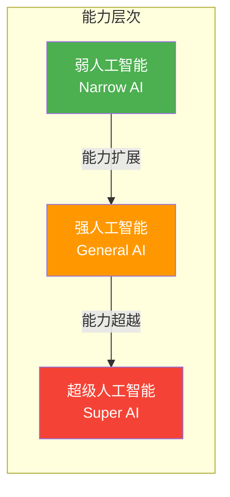

# 第一章：走进人工智能世界

## 1.3 AI 的主要类型与分类

人工智能是一个涵盖广泛的领域，可以从多个维度进行分类。理解这些分类有助于把握不同 AI 技术的特点和应用范围。

### 1.3.1 按能力水平分类

根据 AI 系统的能力范围和通用程度，可以将其分为三个层次：

**弱人工智能（Narrow AI / Weak AI）**

弱人工智能，也称为"狭义人工智能"，是指在特定任务或领域表现出智能行为的 AI 系统。这是目前所有商用 AI 的类型。

典型特征：
- 专注于单一或有限的任务集合
- 无法将能力迁移到其他领域
- 依赖大量领域特定的训练数据
- 不具备自我意识或真正的理解能力

示例：
- AlphaGo 能够在围棋上击败世界冠军，但无法下象棋
- 图像识别系统可以准确识别人脸，但无法理解图像的深层含义
- 智能客服可以回答特定领域的问题，但无法进行开放式对话

尽管被称为"弱"人工智能，这类系统在其专长领域往往能够超越人类表现。

**强人工智能（General AI / Strong AI）**

强人工智能，也称为"通用人工智能"（AGI），指具备人类水平的全面智能的 AI 系统。这类 AI 能够在任何智力任务上表现出与人类相当或更高的能力，能够学习新技能、适应新环境、进行抽象推理。

预期特征：
- 能够执行人类可以完成的任何智力任务
- 具备学习和适应任意新领域的能力
- 可以在不同任务间迁移知识和技能
- 可能具有某种形式的自我意识

截至 2026 年，AGI 尚未实现。主流 AI 研究机构对 AGI 的实现时间预测差异很大，从几年到几十年不等。ChatGPT、Claude 等大语言模型展现了令人印象深刻的通用能力，但仍属于弱人工智能的范畴。

**超级人工智能（Artificial Superintelligence）**

超级人工智能是一个假设性概念，指在所有领域都远超人类智能水平的 AI。这包括科学创造力、社会智慧、通用推理等方面。

这一概念更多出现在哲学讨论和科幻作品中，距离现实还有相当距离。

下图展示了三种 AI 类型的能力范围对比：

### 1.3.2 按学习方式分类

根据 AI 系统获取知识和改进性能的方式，可分为以下类型：

**基于规则的 AI**

早期 AI 系统主要采用这种方式，由人类专家手动编写规则。典型代表是专家系统。

特点：
- 规则由人类明确定义
- 行为完全可预测和可解释
- 难以处理规则未覆盖的情况
- 维护成本随规则增长而急剧上升

**机器学习 AI**

机器学习系统通过从数据中学习模式来获取知识，无需显式编程每条规则。

主要范式：
- **监督学习**：从带标签的数据中学习（如学习识别猫和狗的图片）
- **无监督学习**：从无标签数据中发现结构（如客户分群）
- **强化学习**：通过与环境交互获得反馈来学习（如训练游戏 AI）

**深度学习 AI**

深度学习是机器学习的子集，使用多层神经网络来学习数据的复杂表示。当前最先进的 AI 系统（如 GPT、DALL-E）都基于深度学习。

### 1.3.3 按功能领域分类

AI 技术广泛应用于不同功能领域：

**计算机视觉**

让计算机"看懂"图像和视频的技术。应用包括：
- 人脸识别与身份验证
- 自动驾驶中的环境感知
- 医学影像分析
- 工业质检

**自然语言处理**

让计算机理解和生成人类语言的技术。应用包括：
- 智能对话助手
- 机器翻译
- 情感分析
- 文本摘要和生成

**语音技术**

涵盖语音识别（将语音转为文字）和语音合成（将文字转为语音）。应用包括：
- 语音助手（Siri、小爱同学等）
- 语音输入法
- 有声书制作
- 实时口译

**推荐系统**

预测用户偏好并提供个性化建议的技术。应用包括：
- 电商商品推荐
- 内容平台个性化推荐
- 音乐和视频推荐
- 社交网络好友推荐

**决策智能**

辅助或自动进行复杂决策的技术。应用包括：
- 金融风控
- 医疗诊断辅助
- 供应链优化
- 智能调度

### 1.3.4 生成式 AI 与判别式 AI

这是近年来越来越重要的一种分类方式：

**判别式 AI**

判别式模型学习区分不同类别或预测特定输出。给定输入，它们判断输入属于哪个类别或预测相应的输出值。

示例：
- 垃圾邮件分类器（判断邮件是否为垃圾邮件）
- 图像分类器（判断图像中是猫还是狗）
- 信用评分模型（预测贷款违约风险）

**生成式 AI**

生成式模型学习数据的深层结构和分布，能够创造新的、原创的内容。这正是当前 AI 热潮的核心。

示例：
- ChatGPT、Claude（生成文本）
- DALL-E、Midjourney、Stable Diffusion（生成图像）
- Suno、Udio（生成音乐）
- Sora（生成视频）

生成式 AI 的突破性在于它不仅能够分析和理解，更能够创造——这一能力曾被认为是人类独有的。

理解 AI 的不同类型和分类，有助于在实际应用中选择合适的技术方案，也有助于更准确地评估 AI 系统的能力边界。
