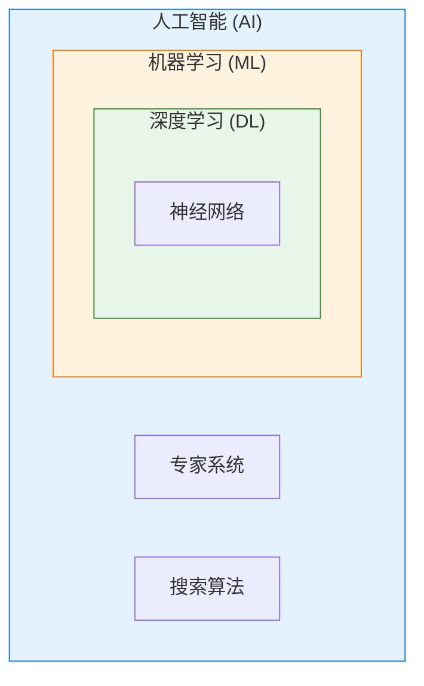

# 第二章：AI 核心概念速览

## 2.1 人工智能、机器学习与深度学习

在 AI 领域，有三个最常被提及的术语：人工智能（AI）、机器学习（ML）和深度学习（DL）。这三者经常被混用，但实际上它们之间存在明确的层级关系。

### 2.1.1 三者的包含关系

可以将这三个概念理解为一组"俄罗斯套娃"：

- **人工智能**是最外层，是一个广泛的学科领域
- **机器学习**嵌套在 AI 内部，是实现 AI 的主要方法之一
- **深度学习**嵌套在机器学习内部，是机器学习的一个特殊分支



这种包含关系意味着：
- 所有的深度学习都是机器学习，但并非所有机器学习都是深度学习
- 所有的机器学习都属于 AI，但 AI 还包括其他非机器学习的方法

### 2.1.2 人工智能：智能机器的追求

人工智能是最宽泛的概念，涵盖所有让机器表现出智能行为的技术和方法。

**AI 的实现途径**

实现 AI 有多种途径，机器学习只是其中之一：

1. **基于规则的方法**：由专家手工编写规则，如早期的专家系统。例如，医疗诊断专家系统将医生的诊断经验编码为"如果...则..."的规则。

2. **搜索与优化方法**：通过搜索可能的解空间找到最优解。国际象棋程序深蓝就大量使用了搜索算法。

3. **机器学习方法**：让机器从数据中自动学习规律。这是当今 AI 的主流方法。

4. **混合方法**：结合多种技术的优势。现代 AI 系统往往综合运用多种方法。

**一个类比**

如果把 AI 比作"做菜"这个大目标，那么：
- 基于规则的方法就像严格按照菜谱一步步操作
- 搜索算法就像尝试不同的食材搭配，找到最佳组合
- 机器学习就像一个学徒，通过观察厨师做菜来学会厨艺

### 2.1.3 机器学习：从数据中学习

机器学习是 AI 的一个子领域，其核心思想是让计算机从数据中自动学习规律，而非由人类程序员显式编程每条规则。

**机器学习的定义**

1959 年，阿瑟·塞缪尔（Arthur Samuel）给出了经典定义：机器学习是"让计算机无需被显式编程就能学习的研究领域"。

更具体地说，如果一个程序在某类任务 T 上的性能 P，随着经验 E 的积累而改善，那么这个程序就是在学习。

**一个直观的例子**

考虑垃圾邮件过滤器：

传统编程方法：
```
如果 邮件包含"免费" 且 邮件包含"立即" 则 标记为垃圾邮件
如果 邮件来自未知发件人 且 包含链接 则 标记为垃圾邮件
...（继续添加规则）
```

这种方法的问题是：需要人工预想所有可能的情况，而垃圾邮件发送者会不断变换手法来绕过规则。

机器学习方法：
```
输入: 大量已标记的邮件样本（正常邮件 + 垃圾邮件）
处理: 算法自动学习区分两类邮件的特征
输出: 一个能够预测新邮件类别的模型
```

这种方法的优势是：
- 不需要人工编写每条规则
- 可以发现人类难以察觉的复杂模式
- 随着新数据的积累，模型可以持续改进

**机器学习的主要类型**

机器学习根据学习方式的不同，主要分为三大类：

| 类型 | 特点 | 典型应用 |
|------|------|----------|
| 监督学习 | 从带标签的数据中学习 | 图像分类、垃圾邮件检测 |
| 无监督学习 | 从无标签的数据中发现模式 | 客户分群、异常检测 |
| 强化学习 | 通过与环境交互获得反馈 | 游戏 AI、机器人控制 |

这三类学习方式将在第四章详细介绍。

### 2.1.4 深度学习：神经网络的力量

深度学习是机器学习的一个分支，使用多层神经网络来学习数据的复杂表示。"深度"指的是网络层数多（深），而非其他含义。

**为什么需要深度学习**

传统机器学习方法需要人工设计"特征"——告诉模型应该关注数据的哪些方面。例如，要识别图片中的猫，需要人工定义猫的特征（有尖耳朵、有胡须、有尾巴等）。

这种"特征工程"既费时又困难，而且对于复杂任务（如理解自然语言）几乎不可能完成。

深度学习的突破在于：**让模型自动从原始数据中学习特征**。给模型输入大量猫的图片，它会自动学会识别猫的各种特征，无需人工定义。

**深度学习的工作原理（类比）**

可以把深度学习理解为"层层提炼"的过程：

以图像识别为例：
- 第 1 层：识别边缘和简单纹理
- 第 2 层：组合边缘形成基本形状（圆形、三角形）
- 第 3 层：组合形状形成物体部件（眼睛、鼻子、耳朵）
- 第 4 层：组合部件形成完整物体（猫、狗、人脸）

每一层都在前一层的基础上学习更高级、更抽象的特征。这就是"深度"的含义——通过多层处理，逐步提取越来越复杂的特征。

**深度学习的成功要素**

深度学习在 2012 年后取得突破性进展，主要得益于三个因素的成熟：

1. **大数据**：互联网产生了海量数据用于训练
2. **算力**：GPU 提供了强大的并行计算能力
3. **算法**：更好的网络结构和训练技术

这三者缺一不可，共同推动了深度学习革命。

### 2.1.5 三者的关系总结

| 概念 | 范围 | 特点 | 代表技术 |
|------|------|------|----------|
| 人工智能 | 最广 | 追求让机器表现智能 | 专家系统、搜索算法、机器学习等 |
| 机器学习 | 中等 | 从数据中自动学习 | 决策树、支持向量机、随机森林等 |
| 深度学习 | 最窄 | 使用深层神经网络 | CNN、RNN、Transformer 等 |

当前最先进的 AI 应用（如 ChatGPT、图像生成、自动驾驶）几乎都是基于深度学习技术。但这并不意味着其他方法没有价值——在特定场景下，简单的机器学习模型可能比深度学习更合适（更快、更易解释、数据要求更低）。

理解这三者的关系和各自特点，有助于在实际应用中选择合适的技术方案。
