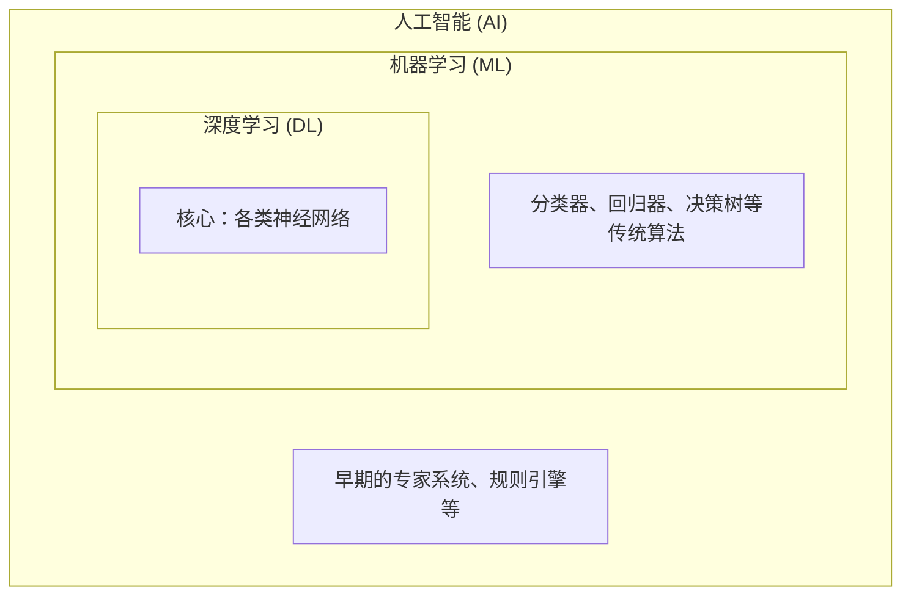

## 2.1 智能的套娃

**AI、机器学习与深度学习**。别被这三个高大上的词绕晕了——它们其实是“一层包一层”的关系：AI 是大圈，机器学习是小圈，深度学习是核心。

### 2.1.1 名字越长，技术越新？

在 AI 的新闻里，你一会儿听到“人工智能”，一会儿听到“机器学习”，一会儿又是“深度学习”。

很多人以为这是三种不同的东西，或者认为名字越长越厉害。

其实，这是一个巨大的误解。

它们的关系就像是 **套娃**：
1.  最外层的大娃娃叫 **AI（人工智能）** —— 这是一个 **愿景**（让机器像人）。
2.  中间层的娃娃叫 **ML（机器学习）** —— 这是一个 **手段**（不用规则，用数据）。
3.  最里层的娃娃叫 **DL（深度学习）** —— 这是一个 **具体的工具**（用神经网络）。

可以通过下面的示意图来直观理解它们层层包含的关系：

图 2-1：AI、ML 与 DL 的“套娃”包含关系

所以，当我们说 ChatGPT 是“深度学习”时，它自然也是“机器学习”，更是“人工智能”。

### 2.1.2 拆开第一层娃娃：从 AI 到 ML

我们在[第一章](../01_ai_intro/README.md)说过，早期的 AI 是靠人手写规则（Expert Systems）。

那就像是给机器人写好了“操作手册”。
*   见到红灯 -> 停。
*   见到绿灯 -> 行。

但从 1980 年代开始，人们发现规则写不完，于是发明了 **“机器学习”（Machine Learning）**。

这相当于不再写手册了，而是给机器人看 10 万小时的开车视频，让它自己悟出红绿灯的规律。

**这一次进化，是从“授人以鱼”（给规则）变成了“授人以渔”（给数据）。**

### 2.1.3 拆开第二层娃娃：从 ML 到 DL

机器学习里有很多方法，比如“决策树”、“贝叶斯”等等。它们都很优秀，但有一个共同的瓶颈：**虽然不用写规则了，但还得告诉机器关注哪里。**

比如认猫，你得告诉算法：关注“耳朵”是不是尖的，关注“胡须”长不长。这些“耳朵”、“胡须”叫 **特征**。发现和选择合适特征的过程叫 **“特征工程”**。长期以来，特征工程是机器学习领域最核心的技术。

人们曾试图用人工神经网络来自动解决特征工程的问题，但是受限于计算能力，一直只能用浅层网络来处理一些简单的任务。

直到 2012 年，**“深度学习”（Deep Learning）** 横空出世，多层人工神经网络取得了突破。

人工神经网络的灵感来自人脑的神经元。它最大的本事是：**我什么都不需要你告诉我，我自己找特征**。它会自动发现，原来“瞳孔的形状”比“耳朵的形状”更能区分猫。

**这一次进化，是从“半自动”（人找特征）变成了“全自动”（端到端学习）。**

### 2.1.4 为什么深度学习成了主角？

明明机器学习有那么多门派，为什么现在一提起 AI，大家讨论的几乎全是深度学习？核心原因可以归结为以下两点。

**第一，“胃口大，没有天花板”**

传统的机器学习算法像是一个容量有限的杯子。给它 1 万条数据，它学得很好；但给它 100 万条数据时，杯子就满了，它的准确率基本就不再明显提升了。

而深度学习的神经网络，像是一块可以不断吸水的巨大海绵。给它 1 亿条数据，它变聪明；给它 100 亿条数据并配上强大的算力，它还能继续变强。这种“大数据+大算力”就能“大力出奇迹”的特质，极其适合当前的数据爆炸时代。

**第二，擅长破解“非结构化数据”**

我们日常生活中的绝大部分信息，比如照片、声音、文章，形式上都是杂乱无章的，在计算机眼中这被称为“非结构化数据”。传统算法面对这些数据极其头疼，高度依赖专家去手动提取特征。而如前所述，深度学习具备“全自动找规律”的本事，可以直接吞下原始的图片或文字，自己去理解画面和语义。

正因为**数据喂得多就能一直变强**，且**能直接搞定复杂的图文和声音**，深度学习最终脱颖而出，成为了推动当下这波 AI 浪潮的绝对核心。

理解了这个嵌套关系，后续章节里再遇到这些名词时你就不会头大了。接下来，我们来看看驱动这一切的原料——数据。

### 2.1.5 思考题

当你在一篇文章里看到“某某公司用 AI/ML/DL 做了一个产品”时，你能不能用“套娃”的方式判断：
1) 它更像是在说愿景（AI）、手段（ML）还是具体技术路线（DL）？  
2) 这个产品最可能依赖的“数据”是什么？
