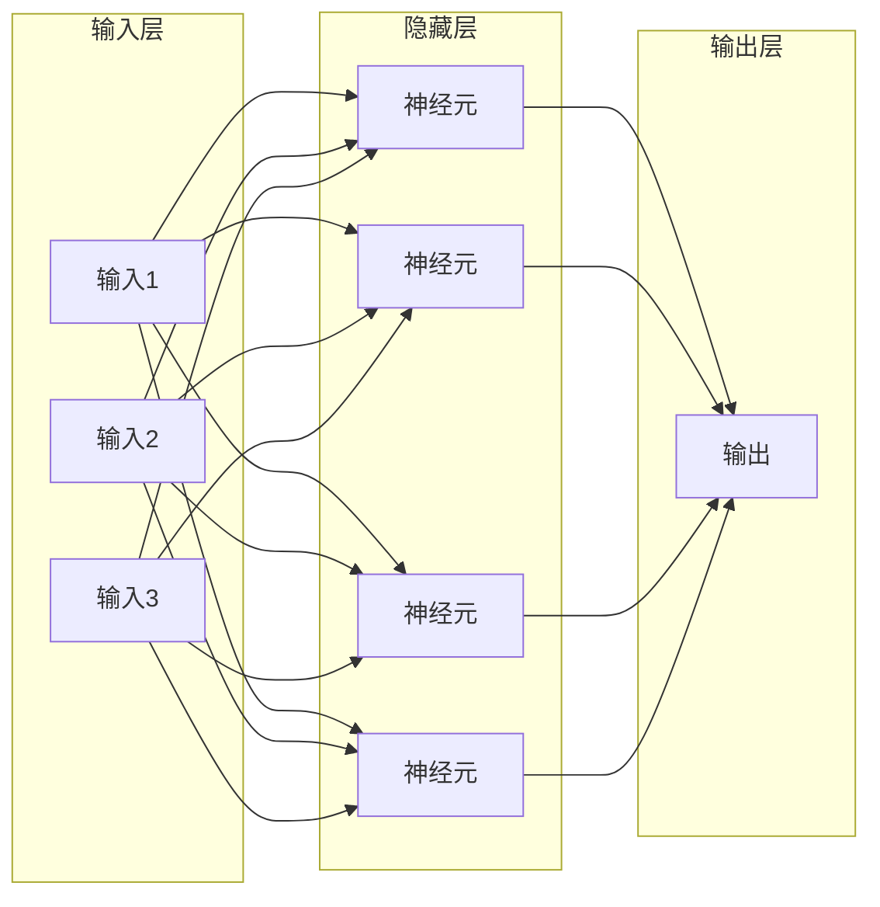

# 第二章：AI 核心概念速览

## 2.3 算法与模型基础

如果数据是燃料，那么算法就是引擎——它决定了如何从数据中提取知识，构建能够执行特定任务的模型。

### 2.3.1 算法与模型的概念

**什么是算法**

算法是解决特定问题的一系列明确定义的步骤或规则。在日常生活中，菜谱就是一种算法——它告诉你做一道菜需要哪些步骤、每步如何操作。

在机器学习中，算法是从数据中学习模式的方法。例如：
- 决策树算法：学习一系列"如果-那么"规则
- 神经网络算法：学习数据的层级表示
- 支持向量机算法：学习最优的分类边界

**什么是模型**

模型是算法作用于特定数据后的产物——它是算法"学到的东西"的具体表现形式。

一个类比：
- 算法 → 学习方法（如"通过背诵学习英语单词"）
- 训练数据 → 学习材料（如"一本英语词汇书"）
- 模型 → 学习成果（如"你记住的那些单词"）

同一个算法在不同数据上训练，会得到不同的模型。例如，同样的神经网络架构：
- 在猫狗图片上训练 → 得到猫狗分类模型
- 在 X 光片上训练 → 得到肺炎检测模型

### 2.3.2 机器学习算法的分类

根据学习任务的类型，机器学习算法可以分为几大类：

**分类算法**

用于将数据划分到预定义的类别中。

应用示例：
- 邮件分类（垃圾邮件/正常邮件）
- 图像识别（识别图片中的物体类别）
- 疾病诊断（阳性/阴性）

常见算法：决策树、随机森林、支持向量机、神经网络

**回归算法**

用于预测连续数值。

应用示例：
- 房价预测
- 销售额预测
- 温度预测

常见算法：线性回归、多项式回归、神经网络

**聚类算法**

用于发现数据中的自然分组，无需预定义类别。

应用示例：
- 客户分群
- 文档主题发现
- 异常检测

常见算法：K-means、层次聚类、DBSCAN

**降维算法**

用于减少数据的维度，同时保留关键信息。

应用示例：
- 数据可视化
- 特征压缩
- 噪声过滤

常见算法：PCA（主成分分析）、t-SNE、自编码器

### 2.3.3 神经网络基础

神经网络是深度学习的核心，也是当前最强大的 AI 算法家族。

**灵感来源**

神经网络的设计灵感来自人脑的神经系统。人脑由约 860 亿个神经元组成，通过突触相互连接。每个神经元接收其他神经元的信号，进行处理后再传递给下一个神经元。

人工神经网络模拟了这种结构，但大大简化了：每个"人工神经元"接收多个输入，进行加权求和和非线性变换后，输出一个值。

**神经网络的结构**

一个典型的神经网络包含三类层：

- **输入层**：接收原始数据
- **隐藏层**：对数据进行变换和特征提取（深度学习 = 多个隐藏层）
- **输出层**：产生最终结果

**权重与偏置**

神经网络中的"知识"存储在连接的权重（weights）和偏置（biases）中。训练过程就是不断调整这些参数，使模型的输出接近期望的结果。

**激活函数**

激活函数为神经网络引入非线性，使其能够学习复杂的模式。常见的激活函数包括：
- ReLU：最常用，计算简单高效
- Sigmoid：输出范围 0-1，常用于二分类
- Tanh：输出范围 -1 到 1
- Softmax：输出概率分布，用于多分类

### 2.3.4 模型的参数与超参数

在机器学习中，需要区分两类重要的"参数"：

**模型参数**

模型参数是模型在训练过程中学习得到的值。例如：
- 线性回归中的斜率和截距
- 神经网络中的权重和偏置

这些参数决定了模型如何从输入生成输出。模型参数的数量是衡量模型规模的重要指标——GPT-4 拥有超过万亿个参数。

**超参数**

超参数是在训练前人工设定的值，控制学习过程本身。例如：
- 学习率：每次更新参数的步长大小
- 批量大小：每次训练使用的样本数
- 网络层数：神经网络的深度
- 隐藏单元数：每层神经元的数量
- 正则化系数：防止过拟合的强度

超参数的选择对模型性能有很大影响，通常需要通过实验来确定最佳值。

### 2.3.5 常见的深度学习架构

不同任务适合不同的网络架构：

**全连接网络（FCN）**

最基础的神经网络形式，每层的所有神经元与下一层的所有神经元相连接。适用于结构化数据处理。

**卷积神经网络（CNN）**

专门设计用于处理图像数据。通过卷积操作提取局部特征，具有参数共享和平移不变性。

应用：图像分类、目标检测、图像分割

**循环神经网络（RNN）与 LSTM**

专门设计用于处理序列数据。具有"记忆"功能，能够利用之前的信息处理当前输入。

应用：语言模型、时间序列预测、语音识别

**Transformer**

革命性的架构，基于"注意力机制"。能够并行处理序列，捕捉长距离依赖关系。GPT、BERT、Claude 等大语言模型都基于 Transformer。

应用：自然语言处理、多模态学习、已扩展到视觉和其他领域

这些架构将在后续章节中详细介绍。
