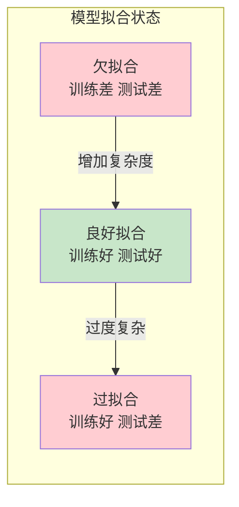

# 第二章：AI 核心概念速览

## 2.4 训练、推理与评估

机器学习模型的生命周期可以概括为三个核心阶段：训练、推理和评估。理解这些过程，有助于把握 AI 系统从"学习"到"应用"的完整流程。

### 2.4.1 训练：教会模型学习

训练是机器学习最核心的过程，是模型从数据中学习知识的阶段。

**训练的基本流程**

1. **数据准备**：收集、清洗、标注数据，划分训练集/验证集/测试集
2. **模型初始化**：选择网络架构，随机初始化参数
3. **前向传播**：将输入数据通过模型，得到预测结果
4. **计算损失**：比较预测结果与真实标签的差异
5. **反向传播**：计算损失相对于各参数的梯度
6. **参数更新**：按照梯度方向调整参数，减小损失
7. **重复迭代**：重复 3-6 步骤，直到模型收敛或达到预设条件

**损失函数**

损失函数（Loss Function）量化了模型预测与真实值之间的差距。训练的目标就是最小化这个损失。

常见损失函数：
- 均方误差（MSE）：用于回归问题
- 交叉熵损失：用于分类问题
- 对比损失：用于表示学习

损失函数的选择取决于任务类型和具体需求。

**优化器**

优化器（Optimizer）决定了如何根据梯度更新模型参数。

常见优化器：
- SGD（随机梯度下降）：最基础的优化方法
- Adam：结合了动量和自适应学习率，使用最广泛
- AdamW：Adam 的变体，加入了权重衰减

**Epoch、Batch 与迭代**

- **Epoch**：整个训练集被完整训练一次称为一个 Epoch
- **Batch**：由于内存限制，每次训练使用数据的一个子集（batch）
- **Iteration**：一个 batch 的训练称为一次迭代

例如：如果有 10,000 个样本，batch size 为 100，那么一个 epoch 包含 100 次迭代。

### 2.4.2 推理：应用已学知识

推理（Inference）是使用训练好的模型对新数据进行预测的过程。这是 AI 系统在实际应用中的主要工作模式。

**训练 vs 推理**

| 方面 | 训练阶段 | 推理阶段 |
|------|----------|----------|
| 目的 | 学习知识，调整参数 | 应用知识，做出预测 |
| 数据 | 大量已标注数据 | 新的未见数据 |
| 计算 | 前向 + 反向传播 | 仅前向传播 |
| 资源需求 | 非常高（GPU 集群） | 相对较低 |
| 频率 | 一次或定期 | 持续进行 |

**推理优化**

为了让模型在实际应用中更高效，常采用以下优化技术：

- **模型压缩**：减少模型大小和参数量
  - 剪枝：移除不重要的连接
  - 量化：降低参数精度（如 32 位浮点 → 8 位整数）
  - 知识蒸馏：用小模型学习大模型的行为

- **硬件加速**：利用专用硬件加速推理
  - GPU：并行处理大量计算
  - TPU：Google 设计的专用张量处理单元
  - NPU：手机和边缘设备上的神经网络处理单元

- **批处理**：将多个请求打包处理，提高吞吐量

**端侧推理 vs 云端推理**

- **云端推理**：请求发送到云服务器处理
  - 优点：可使用更大更强的模型
  - 缺点：依赖网络，有延迟和隐私顾虑

- **端侧推理**：在手机、电脑等设备本地处理
  - 优点：低延迟、保护隐私、离线可用
  - 缺点：受设备计算能力限制

2025-2026 年的趋势是更多 AI 能力向端侧下沉，如手机上的实时翻译、图像增强等。

### 2.4.3 评估：衡量模型表现

如何知道一个模型训练得好不好？需要通过客观的评估指标来衡量。

**分类任务的评估指标**

```
              预测为正    预测为负
实际为正       TP          FN
实际为负       FP          TN
```

基于混淆矩阵，可以计算：

- **准确率（Accuracy）**：整体预测正确的比例
  - 公式：(TP + TN) / (TP + TN + FP + FN)
  - 局限：在类别不平衡时可能误导

- **精确率（Precision）**：预测为正的样本中，真正为正的比例
  - 公式：TP / (TP + FP)
  - 适用：当误报代价高时（如垃圾邮件检测）

- **召回率（Recall）**：实际为正的样本中，被正确预测为正的比例
  - 公式：TP / (TP + FN)
  - 适用：当漏报代价高时（如疾病筛查）

- **F1 分数**：精确率和召回率的调和平均
  - 公式：2 × (Precision × Recall) / (Precision + Recall)
  - 适用：需要平衡精确率和召回率时

**回归任务的评估指标**

- **均方误差（MSE）**：预测值与真实值差异的平方的平均值
- **均方根误差（RMSE）**：MSE 的平方根，与原始数据同量纲
- **平均绝对误差（MAE）**：预测值与真实值差异的绝对值的平均

**生成任务的评估**

生成式 AI 的评估更具挑战性：

- **自动指标**
  - BLEU：用于机器翻译，比较 n-gram 重叠
  - ROUGE：用于文本摘要
  - FID：用于图像生成，比较特征分布

- **人工评估**
  - 流畅性、准确性、相关性的人工打分
  - A/B 测试比较不同模型
  - 众包评估

### 2.4.4 过拟合与欠拟合

训练模型时最常遇到的两个问题是过拟合和欠拟合。

**欠拟合（Underfitting）**

模型过于简单，无法捕捉数据中的规律。

表现：
- 训练集上的表现就不好
- 模型预测能力差

原因及解决：
- 模型复杂度不够 → 使用更复杂的模型
- 训练时间不足 → 增加训练轮数
- 特征信息不够 → 增加特征

**过拟合（Overfitting）**

模型过于复杂，"死记硬背"了训练数据，无法泛化到新数据。

表现：
- 训练集上表现很好
- 验证集/测试集上表现明显下降

原因及解决：
- 模型过于复杂 → 简化模型结构
- 训练数据太少 → 收集更多数据
- 训练时间过长 → 早停（Early Stopping）
- 其他技术 → 正则化、Dropout、数据增强



**验证集的作用**

验证集在防止过拟合中起着关键作用：

1. 在训练过程中监控验证集表现
2. 当验证集表现开始下降时停止训练（早停）
3. 基于验证集表现选择最佳超参数

这就是为什么要将数据分成训练集、验证集和测试集——验证集用于调优，测试集用于最终评估。

### 2.4.5 模型的持续优化

模型部署后并非一劳永逸，需要持续监控和优化。

**模型监控**

- 跟踪线上推理性能（延迟、吞吐量）
- 监控预测质量的变化
- 检测数据分布漂移

**模型更新**

- 用新数据定期重新训练
- 增量/在线学习
- A/B 测试评估新版本

现代 AI 系统越来越强调 MLOps（机器学习运维），将软件工程的最佳实践应用到 AI 系统的开发和运维中。
