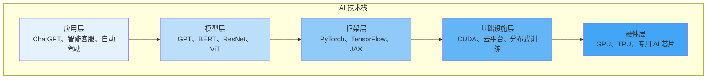

# 第三章：AI 技术生态与工具全景

## 3.1 AI 技术栈概览

AI 系统的构建涉及从底层硬件到上层应用的多个技术层次。理解这个技术栈，有助于把握 AI 技术的整体架构。

### 3.1.1 技术栈的层次结构

AI 技术栈可以分为五个主要层次：

每一层都为上层提供支持，形成完整的技术栈。下面逐层介绍。

### 3.1.2 硬件层

AI 计算需要强大的硬件支持，尤其是深度学习对算力的需求极高。

**GPU（图形处理器）**

GPU 最初为图形渲染设计，但其并行计算能力非常适合神经网络运算。NVIDIA 是 AI GPU 领域的主导者。

主流 AI GPU：
- NVIDIA H100/H200：数据中心级，用于训练大模型
- NVIDIA RTX 4090：消费级，可用于小规模训练和研究
- AMD Instinct MI300：NVIDIA 的竞争对手

**TPU（张量处理单元）**

TPU 是 Google 设计的专用 AI 芯片，针对矩阵运算高度优化。目前已发展到第五代（TPU v5）。

特点：
- 专为 TensorFlow 优化（也支持其他框架）
- 通过 Google Cloud 提供服务
- 在特定任务上比 GPU 更高效

**专用 AI 芯片**

越来越多的公司开发专用 AI 芯片：

- **训练芯片**：
  - Google TPU
  - NVIDIA H100
  - 华为昇腾 910

- **推理芯片**：
  - NVIDIA L4/T4
  - Intel Habana Gaudi
  - 苹果 Neural Engine
  - 高通骁龙 NPU

- **边缘 AI 芯片**：
  - NVIDIA Jetson
  - Intel Neural Compute Stick
  - 地平线征程芯片

### 3.1.3 基础设施层

基础设施层提供了高效运行 AI 工作负载所需的软件和平台支持。

**CUDA 与底层库**

CUDA 是 NVIDIA 提供的并行计算平台，是深度学习基础设施的核心：
- cuDNN：深度神经网络加速库
- cuBLAS：线性代数运算库
- NCCL：多 GPU 通信库

**分布式训练**

训练大模型需要跨多个 GPU 甚至多台机器：
- 数据并行：将数据分发到多个设备
- 模型并行：将模型分割到多个设备
- 流水线并行：按阶段在不同设备处理

**容器与编排**

- Docker：打包 AI 环境，确保可复现性
- Kubernetes：管理大规模 AI 集群
- NVIDIA NGC：预配置的 AI 容器镜像

### 3.1.4 框架层

深度学习框架是开发者构建模型的主要工具。

**主流框架对比**

| 框架 | 开发者 | 特点 | 适用场景 |
|------|--------|------|----------|
| PyTorch | Meta | 动态图，灵活易调试 | 研究、快速原型 |
| TensorFlow | Google | 静态图，部署成熟 | 生产部署 |
| JAX | Google | 函数式，自动微分 | 高性能研究 |
| PaddlePaddle | 百度 | 国产，中文生态 | 国内企业应用 |

PyTorch 已成为研究领域的事实标准，但 TensorFlow 在生产部署方面仍有优势。JAX 则在需要极致性能的场景日益流行。

**高层封装库**

在基础框架之上，还有更高层次的封装：
- Hugging Face Transformers：预训练语言模型
- Keras：简化模型构建的高层 API
- Lightning：结构化的 PyTorch 训练代码
- FastAI：快速入门的高层封装

### 3.1.5 模型层

模型层包含各种预训练模型和模型架构。

**基础模型（Foundation Models）**

基础模型是在海量数据上预训练的大规模模型，可以适配各种下游任务：

文本领域：
- GPT 系列（OpenAI）
- Claude（Anthropic）
- Gemini（Google）
- LLaMA（Meta）
- 通义千问（阿里巴巴）
- 文心一言（百度）

视觉领域：
- ViT（Vision Transformer）
- CLIP（文本-图像对齐）
- SAM（Segment Anything）

多模态：
- GPT-4V/4o（文本+图像+语音）
- Gemini（原生多模态）
- Claude 3.5（文本+图像）

**模型即服务**

许多公司通过 API 提供模型服务：
- OpenAI API
- Anthropic API
- Google Gemini API
- Azure OpenAI Service

开发者无需自己训练或部署模型，直接调用即可。

### 3.1.6 应用层

应用层是用户直接接触的产品和服务：

**消费级应用**
- ChatGPT：通用对话助手
- Claude：写作和分析助手
- Midjourney：图像生成
- GitHub Copilot：编程辅助

**企业级应用**
- 智能客服系统
- 文档处理和分析
- 商业智能和决策支持
- 自动化流程

**垂直行业应用**
- 医疗诊断辅助
- 金融风控
- 自动驾驶
- 智能制造

理解技术栈的层次结构，有助于根据需求选择合适的切入点。对于大多数开发者，框架层是最常接触的；对于业务用户，应用层和模型层（通过 API）是主要接口。
