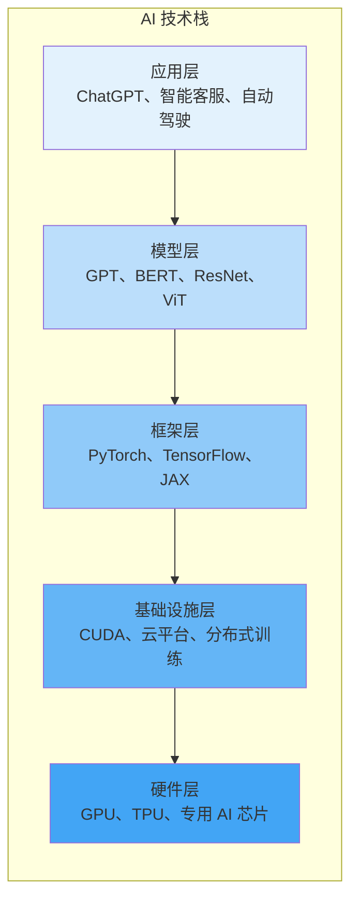

# 第三章：AI 技术生态与工具全景

## 3.1 AI 技术栈概览

AI 系统的构建涉及从底层硬件到上层应用的多个技术层次。理解这个技术栈，有助于把握 AI 技术的整体架构。

### 3.1.1 技术栈的层次结构

AI 技术栈可以分为五个主要层次：

每一层都为上层提供支持，形成完整的技术栈。下面逐层介绍。

### 3.1.2 应用层

应用层是用户直接接触的产品和服务，也是 AI 价值的最终体现。

**消费级应用**
- **ChatGPT**：通用对话助手
- **Claude**：写作和分析助手
- **Midjourney**：图像生成
- **GitHub Copilot**：编程辅助

**企业级应用**
- 智能客服系统
- 文档处理和分析
- 商业智能和决策支持
- 自动化流程

**垂直行业应用**
- 医疗诊断辅助
- 金融风控
- 自动驾驶
- 智能制造

### 3.1.3 模型层

模型层包含各种预训练模型和模型架构，是 AI 的"大脑"。

**基础模型（Foundation Models）**

基础模型是在海量数据上预训练的大规模模型，可以适配各种下游任务：

文本领域：
- GPT 系列（OpenAI）
- Claude（Anthropic）
- Gemini（Google）
- LLaMA（Meta）
- 通义千问（阿里巴巴）
- 文心一言（百度）

视觉领域：
- ViT（Vision Transformer）
- CLIP（文本-图像对齐）
- SAM（Segment Anything）

多模态：
- GPT-4V/4o（文本+图像+语音）
- Gemini（原生多模态）
- Claude 3.5（文本+图像）

**模型即服务**

许多公司通过 API 提供模型服务，开发者无需自己训练或部署模型，直接调用即可：
- OpenAI API
- Anthropic API
- Google Gemini API
- Azure OpenAI Service

### 3.1.4 框架层

深度学习框架是开发者构建模型的主要工具，相当于建筑师的"CAD 软件"。

**主流框架对比**

| 框架 | 开发者 | 特点 | 适用场景 |
|------|--------|------|----------|
| **PyTorch** | Meta | 动态图，灵活易调试 | 研究、快速原型，当前最主流 |
| **TensorFlow** | Google | 静态图，部署成熟 | 生产部署，工业界存量大 |
| **JAX** | Google | 函数式，自动微分 | 高性能研究，前沿探索 |
| **PaddlePaddle** | 百度 | 国产，中文生态 | 国内企业应用 |

**高层封装库**

在基础框架之上，还有更高层次的封装，让开发更简单：
- **Hugging Face Transformers**：调用预训练模型的标准库
- **Keras**：简化模型构建的高层 API
- **Lightning**：让 PyTorch 代码更结构化
- **FastAI**：面向初学者的极简封装

### 3.1.5 基础设施层

基础设施层提供了高效运行 AI 工作负载所需的"系统软件"。

**CUDA 与底层库**

NVIDIA 的 CUDA 生态是深度学习的基石：
- **cuDNN**：深度神经网络加速库
- **cuBLAS**：线性代数运算库
- **NCCL**：多 GPU 通信库

**分布式训练**

训练大模型需要跨多台机器协作：
- **数据并行**：数据切分，模型复制
- **模型并行**：模型切分，分布在不同 GPU
- **流水线并行**：按层切分，流水线执行

**容器与编排**

- **Docker**：打包 AI 环境，确保哪里都能跑
- **Kubernetes (K8s)**：管理成百上千个 AI 容器
- **NVIDIA NGC**：预置好驱动和库的容器镜像

### 3.1.6 硬件层

AI 计算需要强大的物理算力支持，这是所有上层建筑的地基。

**GPU（图形处理器）**

GPU 的并行计算能力让它成为了 AI 计算的绝对主力。
- **数据中心级**：NVIDIA B200/B100（Blackwell 架构，训练万亿参数模型标配）
- **消费级**：NVIDIA RTX 5090（个人炼丹首选，大显存优势明显）
- **竞争对手**：AMD Instinct MI400

**TPU（张量处理单元）**

Google 专为 AI 设计的芯片：
- 专为 TensorFlow/JAX 优化
- 最新 TPU v6 已大规模部署
- 性价比在特定任务上优于 GPU

**端侧/边缘芯片**

让 AI 能在手机和汽车上运行：
- **手机**：高通骁龙 8 Gen 5、苹果 A19 Pro（内置强大 NPU）
- **汽车**：NVIDIA Thor、地平线征程 6
- **推理卡**：NVIDIA L40S

理解技术栈的层次结构，有助于根据需求选择合适的切入点。对于大多数开发者，框架层是最常接触的；对于业务用户，应用层和模型层（通过 API）是主要接口。
