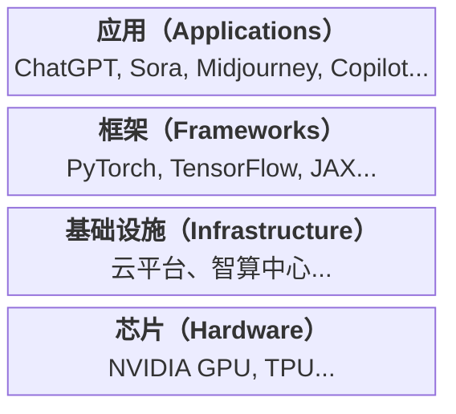

## 3.1 盖房子的艺术

> 从显卡地基到应用装修

### 3.1.1 那个著名的“倒金字塔”

如果我们把 AI 行业画成一张图，它是一个巨大的倒金字塔：
*   最底层最窄，也是最硬的，是 **芯片（Hardware）**，比如 NVIDIA GPU、TPU 等。
*   往上一层是 **基础设施（Infrastructure）**，比如云平台、智算中心等。
*   再往上是 **框架（Frameworks）**，比如 PyTorch、TensorFlow、JAX 等。
*   最上面最宽的，是 **应用（Applications）**，比如 ChatGPT、Sora、Midjourney、Copilot 等。

图 3-1：AI 行业倒金字塔结构

越到底层，门槛越高，玩家越少（显卡基本就是 NVIDIA 一家独大）。

越到上层，机会越多，也是我们普通人最应该关注的地方。

### 3.1.2 芯片：昂贵的地基

想象一下，你要盖一栋摩天大楼。**GPU（显卡）** 就是这栋楼的 **地基**。

没有地基，再好的图纸也变不成房子。

现在 AI 最大的瓶颈就是“缺地基”。谁手里有显卡，谁就有盖楼的资格。

### 3.1.3 框架：建筑师的 CAD

有了地基，我们怎么画图纸？

这就需要 **PyTorch** 或 **TensorFlow** 这样的 **深度学习框架**。

它们就像是建筑师用的 CAD 软件。

以前的程序员要手写数学公式（相当于用手画图），现在用框架，一行代码就能调用复杂的神经网络（相当于 CAD 里拖拽一个模块）。

### 3.1.4 模型：预制板

现在盖房子很少一砖一瓦砌了，都是用 **预制板**（Pre-trained Models）。

OpenAI 训练好的大语言模型（LLM，以 GPT 系列为例），就是一块超级巨大的、功能万能的预制板。

开发者不需要从头训练，直接把这块板子拿来，稍微装修一下（微调），就能变成客服系统、写作助手、翻译软件。

### 3.1.5 思考题

现在的 AI 创业，有两条路：
1.  **造轮子**：去研发新的芯片、新的框架（风险极大，回报极高）。
2.  **造车**：利用现有的芯片和框架，去做一个好用的 App（风险较小，竞争激烈）。

如果你有 1000 万创业资金，你会选哪条路？为什么？
