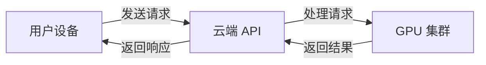
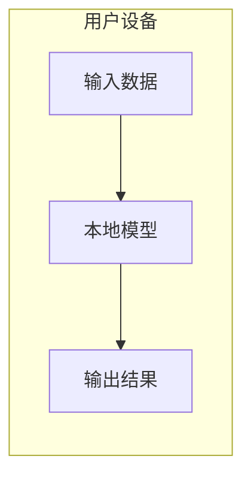
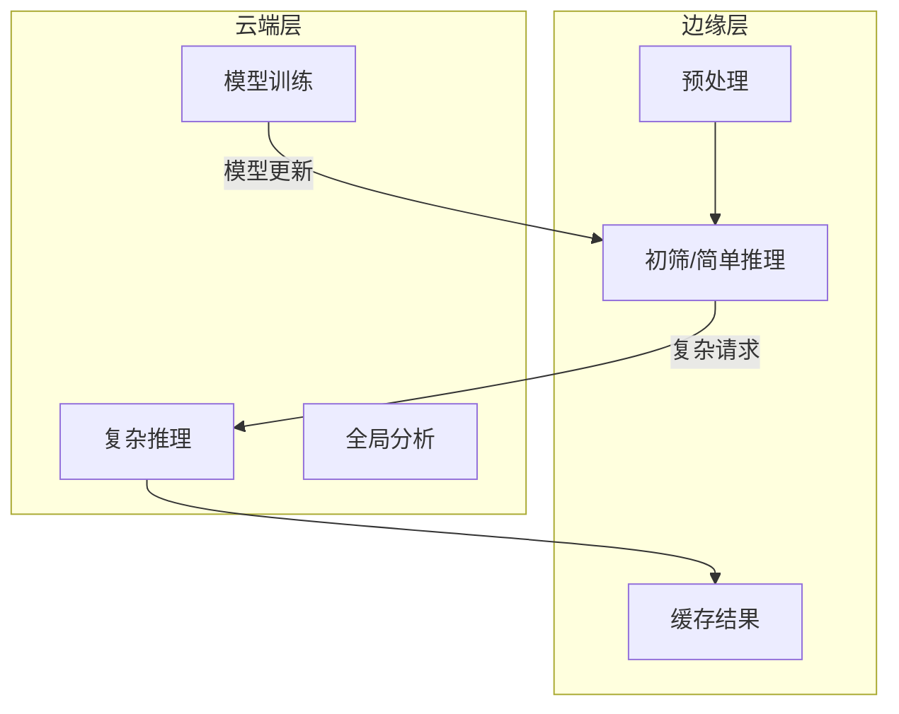

# 第三章：AI 技术生态与工具全景

## 3.4 云端 AI 与边缘 AI

AI 的运行位置正在发生深刻变化。传统上，AI 计算主要在云端大规模服务器上进行；如今，越来越多的 AI 能力正在向边缘设备迁移。理解这两种模式的特点和适用场景，对于 AI 系统的设计和部署至关重要。

### 3.4.1 云端 AI

云端 AI 指在云服务器上运行的 AI 系统，用户通过网络访问服务。

**工作模式**

**优势**

- **强大算力**：可使用最新最强的硬件
- **大规模模型**：可运行参数量巨大的模型
- **集中管理**：统一更新和维护
- **弹性扩展**：按需调整计算资源
- **无需本地投资**：降低硬件采购成本

**劣势**

- **网络依赖**：需要稳定的网络连接
- **延迟**：网络往返增加响应时间
- **隐私顾虑**：数据需要传输到云端
- **持续成本**：按使用量付费
- **服务可用性**：依赖服务商稳定性

**适用场景**

- 需要超大规模模型（如 GPT-4）
- 计算密集型任务（如视频分析）
- 对延迟要求不高的场景
- 数据安全要求允许云端处理

### 3.4.2 边缘 AI

边缘 AI 指在终端设备（手机、电脑、IoT 设备等）本地运行的 AI。

**工作模式**

**优势**

- **低延迟**：无需网络往返，响应更快
- **隐私保护**：数据不离开设备
- **离线可用**：无需网络连接
- **无网络成本**：不消耗流量
- **可靠性高**：不依赖云端服务

**劣势**

- **计算受限**：受设备性能限制
- **模型较小**：需要压缩和优化
- **更新困难**：需要推送更新到设备
- **存储占用**：模型占用本地空间
- **功耗挑战**：需要平衡性能和电池

**适用场景**

- 实时应用（如自动驾驶）
- 隐私敏感场景（如健康数据）
- 离线环境
- 高频调用场景

### 3.4.3 边缘 AI 的关键技术

为了在资源受限的边缘设备上运行 AI，需要一系列优化技术：

**模型压缩**

- **剪枝（Pruning）**：移除不重要的神经网络连接
- **量化（Quantization）**：降低数值精度（如 FP32 → INT8）
- **知识蒸馏**：用小模型学习大模型的行为

**高效架构**

- **MobileNet**：专为移动端设计的轻量网络
- **EfficientNet**：平衡精度和效率的架构
- **TinyBERT/DistilBERT**：压缩版语言模型
- **Gemma 2B**：适合边缘的小型大语言模型

**边缘推理框架**

- **TensorFlow Lite**：Google 的移动端框架
- **Core ML**：Apple 设备专用
- **ONNX Runtime**：跨平台推理引擎
- **NCNN**：腾讯开源的移动端推理框架

**专用硬件**

- **Apple Neural Engine**：iPhone/Mac 的专用 AI 芯片
- **高通 Hexagon NPU**：Android 手机 AI 处理器
- **Google Tensor**：Pixel 手机的定制芯片
- **NVIDIA Jetson**：边缘 AI 开发平台

### 3.4.4 混合架构

实际应用中，云端和边缘往往结合使用：

**分层处理**

- 边缘处理简单请求，复杂请求上传云端
- 云端训练模型，定期推送到边缘
- 边缘预处理数据，减少传输量

**典型案例**

智能音箱：
- 本地：唤醒词检测（"你好小爱"）
- 云端：语义理解和对话生成

自动驾驶：
- 本地：实时感知和决策（毫秒级响应）
- 云端：高精地图更新、模型迭代

手机拍照：
- 本地：实时预览增强、人脸检测
- 云端：复杂后期处理、云相册组织

### 3.4.5 发展趋势

**端侧 AI 能力持续增强**

2025-2026 年的明显趋势是更多 AI 能力下沉到设备端：

- iPhone、Android 旗舰机可本地运行数十亿参数的模型
- 笔记本电脑集成 NPU，支持本地大模型推理
- Windows Copilot+ PC 要求 40+ TOPS 的 AI 算力

**隐私驱动的本地处理**

用户隐私意识增强，推动更多处理在本地完成：
- Apple 的"设备端机器学习"策略
- Google 的联邦学习
- 欧盟 GDPR 等法规的合规要求

**边缘-云协同智能**

未来趋势不是边缘取代云端，而是更智能的协同：
- 自适应的任务分配
- 动态的模型选择
- 高效的边云通信

**端侧大模型**

小型大语言模型（如 Phi-3、Gemma-2B、Qwen-1.8B）使得在边缘运行生成式 AI 成为可能：
- 手机上的本地对话助手
- 离线可用的翻译和写作助手
- 隐私保护的个人 AI 助理

理解云端与边缘的各自优势和发展趋势，有助于在实际应用中做出合理的架构决策。
