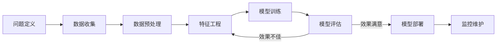

# 第四章：机器学习原理

## 4.1 机器学习的核心思想

机器学习代表了一种解决问题的新范式：不是由人类告诉计算机如何解决问题，而是让计算机自己从数据中学会如何解决问题。

### 4.1.1 从规则到学习

传统编程和机器学习解决问题的方式有本质区别。

**传统编程**

程序员分析问题，设计算法，编写规则。例如，识别垃圾邮件：

```
规则1: 如果标题包含"免费赠送"，则标记为垃圾邮件
规则2: 如果发件人不在联系人列表，且包含链接，则标记为垃圾邮件
规则3: ...
```

这种方法的问题：
- 规则难以穷尽所有情况
- 垃圾邮件发送者会找到规则的漏洞
- 维护规则库的成本随规模急剧增长

**机器学习**

给计算机大量已标记的邮件样本，让它自己学习区分规律：

```
输入: 10万封邮件（已标记正常/垃圾）
    ↓ 机器学习算法
输出: 一个能够预测新邮件类别的模型
```

这种方法的优势：
- 自动发现复杂规律
- 随新数据持续改进
- 可以学习人类难以表达的模式

### 4.1.2 机器学习的基本流程

一个典型的机器学习项目包含以下步骤：



**问题定义**

明确要解决什么问题：
- 这是分类问题还是回归问题？
- 有多少可用数据？数据质量如何？
- 业务目标是什么？如何衡量成功？

**数据收集与预处理**

收集相关数据并进行清洗：
- 处理缺失值
- 去除异常值和噪声
- 统一数据格式
- 划分训练集、验证集、测试集

**特征工程**

将原始数据转换为模型可用的特征：
- 特征提取：从原始数据中提取有意义的特征
- 特征选择：筛选最相关的特征
- 特征变换：标准化、归一化等处理

在深度学习中，模型可以自动学习特征，降低了人工特征工程的需求。

**模型训练与评估**

选择合适的算法，在训练数据上训练模型，用验证集调参，用测试集最终评估。如果效果不佳，需要回溯调整。

**部署与监控**

将模型部署到生产环境，持续监控性能，根据需要更新模型。

### 4.1.3 泛化：机器学习的核心目标

机器学习的终极目标不是在训练数据上表现好，而是能够很好地处理**新的、未见过的数据**。这种能力称为"泛化"（Generalization）。

**泛化的挑战**

- **过拟合**：模型"死记硬背"了训练数据，无法泛化到新数据
- **欠拟合**：模型过于简单，无法捕捉数据中的规律

类比考试：
- 过拟合 = 只会做练习题原题，换个数就不会
- 欠拟合 = 连练习题都做不好
- 良好泛化 = 掌握了解题方法，能举一反三

**促进泛化的方法**

- 使用足够多样的训练数据
- 控制模型复杂度（正则化）
- 使用验证集监控过拟合
- 数据增强
- 早停（Early Stopping）

### 4.1.4 偏差-方差权衡

机器学习中的一个基本权衡是偏差（Bias）和方差（Variance）之间的取舍。

**偏差**

模型对问题的简化假设导致的系统性误差。高偏差通常意味着欠拟合——模型过于简单，无法捕捉数据的复杂结构。

**方差**

模型对训练数据的敏感程度。高方差通常意味着过拟合——模型过于复杂，对训练数据的微小变化过度敏感。

**权衡**

| 模型复杂度 | 偏差 | 方差 | 典型表现 |
|------------|------|------|----------|
| 过低 | 高 | 低 | 欠拟合 |
| 适中 | 中 | 中 | 良好泛化 |
| 过高 | 低 | 高 | 过拟合 |

找到最佳平衡点是机器学习实践中的核心任务。

### 4.1.5 没有免费的午餐

机器学习领域有一个著名定理——"没有免费的午餐"（No Free Lunch Theorem）：不存在一个在所有问题上都最优的算法。

这意味着：
- 算法选择需要考虑具体问题的特点
- 需要在多种算法中进行实验和比较
- 领域知识和经验对选择算法很有价值
- 简单的算法不一定比复杂的差（取决于问题）

这也是为什么机器学习既是科学也是艺术——需要理论指导，也需要实践经验。
