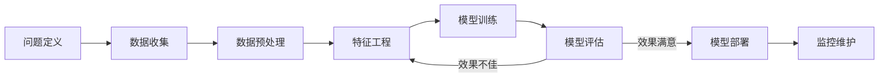

# 第四章：机器学习原理

## 4.1 机器学习的核心思想

机器学习代表了一种解决问题的新范式：不是由人类告诉计算机如何解决问题，而是让计算机自己从数据中学会如何解决问题。

### 4.1.1 从规则到学习

传统编程和机器学习解决问题的方式有本质区别。要理解机器为何能"自己学习"，我们可以从两个角度来看：**寻找函数**和**试错修正**。

**视角一：寻找那个"万能公式"**

在传统编程中，程序员是上帝，制定所有规则：
```python
def is_spam(email):
    if "免费赠送" in email.title: return True
    if "中奖" in email.body: return True
    return False
```
这种方法的问题是规则永远写不完，且无法应对变化。

在机器学习中，我们假设存在一个复杂的数学函数 $f(x)$，只要输入邮件 $x$，它就能计算出类别 $y$。机器学习的任务不是写规则，而是**猜出这个函数长什么样**。
- 一开始，机器全靠蒙（随机参数），预测一团糟。
- 然后，我们把大量数据喂给它，告诉它"这封是垃圾邮件，那封不是"。
- 机器通过对比自己的预测和真实答案，一点点微调函数里的参数。
- 经过成千上万次微调，这个函数就"学会"了区分规律。

**视角二：像孩子一样学习（试错与反馈）**

想象一个孩子学习认水果的过程：
1. **尝试**：孩子指着苹果叫"梨"。
2. **反馈**：妈妈纠正说"不对，这是苹果，圆圆的、红红的"。
3. **修正**：孩子记住了，下次看到圆圆红红的，就倾向于叫"苹果"。
4. **泛化**：下次看到一个**青苹果**，虽然没见过，但他发现也是圆圆的，于是试探性叫"苹果"——这就叫泛化。

机器学习也是如此：**预测 -> 比对答案 -> 修正参数 -> 减少误差**。机器之所以能"自己区分"，本质上是因为数学上有一种算法（如梯度下降），能够自动告诉模型："往哪个方向改，能让下次预测更准一点点"。当这种微小的修正累积亿万次，机器就拥有了"智能"。

**总结对比**

| 维度 | 传统编程 (Rule-based) | 机器学习 (Learning-based) |
|------|-----------------------|---------------------------|
| **核心** | 人类赋予规则 | 数据驱动规则 |
| **适合** | 逻辑清晰、规则固定的任务（如计算器） | 模糊、复杂、难以描述的任务（如人脸识别） |
| **维护** | 人工修改代码 | 喂入新数据重新训练 |

### 4.1.2 机器学习的四大流派

机器学习的核心区别在于**信息的来源**——即"模型从哪里获得指导"。根据这一维度，我们可以将机器学习划分为四大核心范式：

**1. 监督学习 (Supervised Learning)：良师益友的指导**
- **核心**：数据带有"标准答案"（标签）。
- **比喻**：**上辅导班**。老师出题（输入数据）并给出标准解法（标签），学生照着学，目标是做对类似的题目。
- **典型任务**：垃圾邮件分类（标签是"垃圾/正常"）、房价预测（标签是"价格"）。

**2. 无监督学习 (Unsupervised Learning)：自我探索的发现**
- **核心**：数据没有标签，完全靠自己找规律。
- **比喻**：**玩积木**。没有人告诉孩子怎么分，但他通过观察发现，有的积木是圆的，有的是方的，于是自己把它们分成了两堆。
- **典型任务**：用户分群（按行为习惯聚类）、异常检测（发现与众不同的数据）。

**3. 强化学习 (Reinforcement Learning)：试错中的成长**
- **核心**：通过与环境交互，根据反馈（奖励或惩罚）来优化策略。
- **比喻**：**训练宠物**。狗狗不知道"坐下"是什么意思，但它发现每次屁股着地就能吃到肉干（奖励），试错几次后就学会了。
- **典型任务**：AlphaGo 下围棋、机器人控制、游戏 AI。

**4. 自监督学习 (Self-Supervised Learning)：举一反三的智慧**
- **核心**：从数据本身挖掘信息，自己给自己造标签。
- **比喻**：**完形填空**。遮住文章的一句话，根据上下文猜这句话是什么。不需要老师教，只要书读得够多，语感自然就来了。
- **典型任务**：GPT 的预训练（预测下一个词）、BERT 的掩码训练。

---

**💡 历史演进视角：为什么会有这四种分类？**

这种分类体系并非一蹴而就，而是随着技术发展逐步形成的：

- **早期（1950s-80s）**：为了让机器模拟人类认知，最早确立了"带标签训练"的**监督学习**范式。
- **中期（1990s）**：随着互联网数据爆发，人们发现大量数据没有标签，催生了**无监督学习**；同时为了解决控制与博弈问题，**强化学习**独立成派。
- **近期（2018+）**：在大模型时代，人们发现利用海量未标记数据进行预训练（如 GPT）效果惊人，这种"自己监督自己"的方法被正式确立为**自监督学习**。

### 4.1.3 机器学习的基本流程



**问题定义**

明确要解决什么问题：
- 这是分类问题还是回归问题？
- 有多少可用数据？数据质量如何？
- 业务目标是什么？如何衡量成功？

**数据收集与预处理**

收集相关数据并进行清洗：
- 处理缺失值
- 去除异常值和噪声
- 统一数据格式
- 划分训练集、验证集、测试集

**特征工程**

将原始数据转换为模型可用的特征：
- 特征提取：从原始数据中提取有意义的特征
- 特征选择：筛选最相关的特征
- 特征变换：标准化、归一化等处理

在深度学习中，模型可以自动学习特征，降低了人工特征工程的需求。

**模型训练与评估**

选择合适的算法，在训练数据上训练模型，用验证集调参，用测试集最终评估。如果效果不佳，需要回溯调整。

**部署与监控**

将模型部署到生产环境，持续监控性能，根据需要更新模型。

### 4.1.3 泛化：机器学习的核心目标

机器学习的终极目标不是在训练数据上表现好，而是能够很好地处理**新的、未见过的数据**。这种能力称为"泛化"（Generalization）。

**泛化的挑战**

- **过拟合**：模型"死记硬背"了训练数据，无法泛化到新数据
- **欠拟合**：模型过于简单，无法捕捉数据中的规律

类比考试：
- 过拟合 = 只会做练习题原题，换个数就不会
- 欠拟合 = 连练习题都做不好
- 良好泛化 = 掌握了解题方法，能举一反三

**促进泛化的方法**

- 使用足够多样的训练数据
- 控制模型复杂度（正则化）
- 使用验证集监控过拟合
- 数据增强
- 早停（Early Stopping）

### 4.1.4 偏差-方差权衡

机器学习中的一个基本权衡是偏差（Bias）和方差（Variance）之间的取舍。

**偏差**

模型对问题的简化假设导致的系统性误差。高偏差通常意味着欠拟合——模型过于简单，无法捕捉数据的复杂结构。

**方差**

模型对训练数据的敏感程度。高方差通常意味着过拟合——模型过于复杂，对训练数据的微小变化过度敏感。

**权衡**

| 模型复杂度 | 偏差 | 方差 | 典型表现 |
|------------|------|------|----------|
| 过低 | 高 | 低 | 欠拟合 |
| 适中 | 中 | 中 | 良好泛化 |
| 过高 | 低 | 高 | 过拟合 |

找到最佳平衡点是机器学习实践中的核心任务。

### 4.1.5 没有免费的午餐

机器学习领域有一个著名定理——"没有免费的午餐"（No Free Lunch Theorem）：不存在一个在所有问题上都最优的算法。

这意味着：
- 算法选择需要考虑具体问题的特点
- 需要在多种算法中进行实验和比较
- 领域知识和经验对选择算法很有价值
- 简单的算法不一定比复杂的差（取决于问题）

这也是为什么机器学习既是科学也是艺术——需要理论指导，也需要实践经验。
