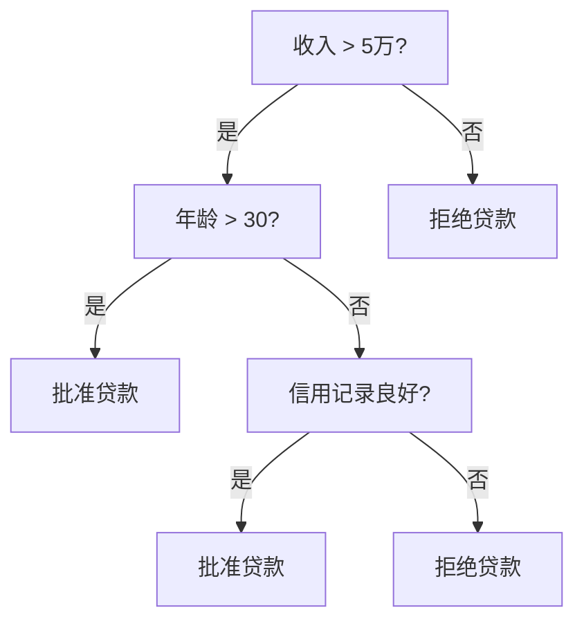

# 第四章：机器学习原理

## 4.2 监督学习

监督学习是机器学习中最常见、应用最广泛的范式。其核心特点是使用带标签的数据进行训练——每个训练样本都有一个正确答案。

### 4.2.1 监督学习的基本概念

**什么是监督学习**

监督学习的名称来源于"监督"的概念：就像学生在老师的监督下学习，每做完一道题就能得到正确答案的反馈。

在监督学习中：
- 输入：特征（Features），描述样本的属性
- 输出：标签（Label），样本的正确答案
- 目标：学习从输入到输出的映射关系

**类比理解**

想象教一个孩子认识动物：
- 展示猫的图片，告诉孩子"这是猫"
- 展示狗的图片，告诉孩子"这是狗"
- 重复多次后，孩子学会了区分猫和狗
- 看到新的猫/狗图片，能正确识别

这就是监督学习的过程：从带标签的样本中学习规律，然后应用到新样本上。

### 4.2.2 分类问题

分类是监督学习的一大类任务，目标是将样本划分到预定义的类别中。

**二分类**

只有两个类别的分类问题：
- 垃圾邮件检测：垃圾/正常
- 疾病诊断：阳性/阴性
- 信用评估：通过/拒绝

**多分类**

有多个类别的分类问题：
- 手写数字识别：0-9 共 10 个类别
- 图像分类：猫、狗、鸟... 多个类别
- 情感分析：积极、中性、消极

**多标签分类**

一个样本可能属于多个类别：
- 文章标签：一篇文章可能同时是"科技"和"商业"
- 图像识别：一张图可能同时包含"人""车""建筑"

**常见分类算法**

| 算法 | 特点 | 适用场景 |
|------|------|----------|
| 逻辑回归 | 简单快速，可解释性强 | 基准模型，线性可分问题 |
| 决策树 | 直观易理解 | 需要解释决策原因 |
| 随机森林 | 鲁棒性强，不易过拟合 | 通用分类问题 |
| 支持向量机 | 高维空间表现好 | 小样本，高维特征 |
| 神经网络 | 能学习复杂模式 | 大数据，复杂问题 |

### 4.2.3 回归问题

回归是另一大类监督学习任务，目标是预测连续数值。

**典型回归问题**

- 房价预测：根据房屋特征预测价格
- 销售预测：预测未来某段时间的销售额
- 股价预测：预测股票价格走势
- 年龄估计：根据人脸图像估计年龄

**分类 vs 回归的区别**

| 方面 | 分类 | 回归 |
|------|------|------|
| 输出类型 | 离散类别 | 连续数值 |
| 评估指标 | 准确率、F1 等 | MSE、MAE 等 |
| 示例 | 是否会下雨 | 明天降雨多少毫米 |

有时可以相互转换：预测"房价是否超过 500 万"是分类，预测"房价具体是多少"是回归。

**常见回归算法**

- **线性回归**：最基础的回归方法，假设输出与输入呈线性关系
- **多项式回归**：可以拟合曲线关系
- **决策树回归**：将决策树应用于回归问题
- **神经网络回归**：可以学习复杂的非线性关系

### 4.2.4 监督学习的典型流程

以房价预测为例：

**1. 数据准备**
```
特征：面积、卧室数、位置、建造年份、是否有车库...
标签：实际销售价格
```

**2. 数据划分**
- 训练集：80%，用于训练模型
- 测试集：20%，用于最终评估

**3. 特征处理**
- 数值特征标准化
- 类别特征编码
- 缺失值处理

**4. 模型训练**
```python
from sklearn.ensemble import RandomForestRegressor

model = RandomForestRegressor()
model.fit(X_train, y_train)  # 训练
```

**5. 模型评估**
```python
predictions = model.predict(X_test)
mse = mean_squared_error(y_test, predictions)
```

**6. 调优与部署**
- 调整超参数
- 交叉验证
- 部署到生产环境

### 4.2.5 决策树详解

决策树是一种直观且可解释的监督学习算法。

**工作原理**

决策树通过一系列问题将数据逐步分类。每个节点代表一个判断条件，每个分支代表条件的结果，叶子节点代表最终预测。



**优点**
- 直观，易于理解和解释
- 无需特征缩放
- 可以处理数值和类别特征
- 能自动进行特征选择

**缺点**
- 容易过拟合
- 对数据变化敏感
- 可能创建有偏树（如果某类别占主导）

**集成方法**

为了克服决策树的缺点，发展出了集成方法：
- **随机森林**：训练多棵决策树，投票决定结果
- **梯度提升**：顺序训练多棵树，每棵修正前一棵的错误

### 4.2.6 监督学习的挑战

**数据标注成本**

高质量标注数据的获取是主要瓶颈：
- 专业领域需要领域专家标注
- 大规模标注需要大量人力
- 标注质量难以完全保证

**类别不平衡**

当某些类别样本远多于其他类别时：
- 模型可能偏向多数类
- 少数类的识别效果差
- 解决方法：过采样、欠采样、调整权重

**特征工程**

传统机器学习依赖良好的特征设计：
- 需要领域专业知识
- 特征质量直接影响模型效果
- 深度学习可以减少但不能完全消除这一需求
