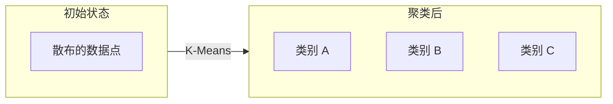

# 第四章：机器学习原理

## 4.3 无监督学习

与监督学习不同，无监督学习处理的是没有标签的数据。算法的任务是自行发现数据中的结构、模式和规律。

### 4.3.1 无监督学习的基本概念

**什么是无监督学习**

无监督学习面对的是未标注的数据，没有"正确答案"可供参考。算法需要自己发现数据中的内在结构。

类比理解：
- 监督学习：给你一堆已分类的邮件样本，学习如何分类
- 无监督学习：给你一堆邮件，自己找出有意义的分组方式

**与监督学习的区别**

| 方面 | 监督学习 | 无监督学习 |
|------|----------|------------|
| 数据 | 有标签 | 无标签 |
| 目标 | 预测标签 | 发现结构 |
| 评估 | 与真实标签比较 | 较难客观评估 |
| 典型任务 | 分类、回归 | 聚类、降维 |

### 4.3.2 聚类

聚类是无监督学习最常见的任务，目标是将相似的样本分到同一组。

**K-Means 聚类**

K-Means 是最经典的聚类算法：

1. 随机初始化 K 个聚类中心
2. 将每个样本分配到最近的聚类中心
3. 更新聚类中心为该类所有样本的均值
4. 重复步骤 2-3 直到收敛

**K-Means 的特点**
- 简单高效，适合大数据集
- 需要预先指定 K 值
- 假设类别是凸形，对异形类别效果差
- 对初始化敏感

**层次聚类**

不需要预先指定类别数，构建层次结构：
- 凝聚式：从每个样本各自一类开始，逐步合并
- 分裂式：从所有样本一类开始，逐步分裂

优点：不需要预设 K 值，可获得树状结构
缺点：计算复杂度高，不适合大数据集

**DBSCAN**

基于密度的聚类算法：
- 能发现任意形状的类别
- 自动识别噪声点
- 不需要预先指定类别数

**聚类应用场景**

- **客户分群**：将客户按行为模式分组，实现精准营销
- **文档主题发现**：将文档按内容相似性分组
- **异常检测**：不属于任何正常类别的样本可能是异常
- **图像分割**：将图像像素分组形成区域

### 4.3.3 降维

降维是另一类重要的无监督学习任务，目标是减少数据的维度，同时保留重要信息。

**为什么需要降维**

- **可视化**：高维数据无法直接可视化，降到 2D/3D 可以观察
- **去除噪声**：低信息量维度可能是噪声
- **减少计算量**：降低后续任务的计算复杂度
- **缓解维度灾难**：高维空间数据稀疏，学习困难

**主成分分析（PCA）**

PCA 是最经典的线性降维方法：
- 找到数据方差最大的方向
- 将数据投影到这些主方向上
- 根据需要保留前 N 个主成分

应用示例：将 100 维的特征降到 10 维，保留 95% 的信息量。

**t-SNE**

非线性降维方法，专为可视化设计：
- 擅长保留局部结构
- 将高维数据映射到 2D/3D
- 常用于探索数据分布

**自编码器（Autoencoder）**

用神经网络进行降维：
- 编码器：将高维输入压缩到低维表示
- 解码器：从低维表示重建原始输入
- 中间的低维表示就是降维结果

### 4.3.4 关联规则学习

发现数据项之间的有趣关联模式。

**经典案例：购物篮分析**

发现"经常一起购买的商品组合"：
- 买尿布的人经常买啤酒（著名但未经证实的案例）
- 买意大利面的人经常买番茄酱

**Apriori 算法**

经典的关联规则挖掘算法：
- 支持度：项集出现的频率
- 置信度：规则的可靠程度
- 提升度：规则比随机共现的提升程度

**应用场景**

- 商品推荐：购买 A 的用户可能也想买 B
- 医疗诊断：症状组合与疾病的关联
- 网页分析：页面访问的顺序模式

### 4.3.5 无监督学习的挑战

**评估困难**

没有正确答案，如何判断结果好坏？
- 使用领域专家判断
- 采用内部评估指标（如轮廓系数）
- 验证下游任务的效果

**结果解释**

- 聚类结果需要业务解释赋予意义
- 降维后的维度可能难以直观理解

**参数选择**

- 聚类数 K 的选择
- 距离度量的选择
- 算法超参数的调优

### 4.3.6 自监督学习

自监督学习是近年来发展迅速的方向，可以看作是无监督学习的一种特殊形式。

**核心思想**

从数据本身构造监督信号，不需要人工标注：
- 遮住图像的一部分，让模型预测被遮部分
- 打乱句子中的词序，让模型恢复原顺序
- 预测下一个词（语言模型的预训练方式）

**重要性**

GPT、BERT 等大语言模型的成功很大程度上归功于自监督学习：
- 可以利用海量无标注数据
- 学到的表示具有良好的迁移性
- 大幅降低了对标注数据的依赖
