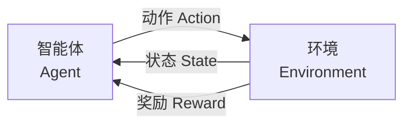

# 第四章：机器学习原理

## 4.4 强化学习

强化学习是机器学习的第三大范式，其学习方式与人类和动物的学习方式最为相似——通过与环境交互，根据反馈调整行为。

### 4.4.1 强化学习的基本概念

**核心思想**

强化学习中，智能体（Agent）在环境中采取行动，环境给予奖励或惩罚作为反馈。智能体的目标是学习一个策略，最大化长期累积奖励。

**基本要素**

- **智能体（Agent）**：做出决策的学习者
- **环境（Environment）**：智能体交互的对象
- **状态（State）**：环境的当前情况
- **动作（Action）**：智能体可以采取的行为
- **奖励（Reward）**：环境给予的反馈信号
- **策略（Policy）**：从状态到动作的映射

### 4.4.2 与其他范式的区别

| 方面 | 监督学习 | 无监督学习 | 强化学习 |
|------|----------|------------|----------|
| 数据 | 标注数据 | 无标注数据 | 交互产生 |
| 反馈 | 每个样本的正确答案 | 无反馈 | 延迟的奖励信号 |
| 目标 | 预测准确 | 发现结构 | 最大化奖励 |
| 学习方式 | 从示例学习 | 发现模式 | 试错学习 |

**强化学习的独特挑战**

- **延迟奖励**：行动的后果可能很久后才显现
- **探索与利用**：是尝试新策略还是使用已知好策略
- **信用分配**：哪个过去的决定导致了当前的奖励

### 4.4.3 主要算法类型

**基于值的方法**

学习评估状态或状态-动作对的价值：
- **Q-Learning**：学习 Q 值函数，表示在某状态采取某动作的预期收益
- **Deep Q-Network（DQN）**：用深度神经网络近似 Q 值函数

**基于策略的方法**

直接学习从状态到动作的映射策略：
- **REINFORCE**：经典的策略梯度算法
- **Actor-Critic**：结合值函数和策略的方法

**模型基础方法**

学习环境的模型，然后规划：
- 可以在模型中模拟，减少真实交互
- AlphaGo 就是模型基础方法的代表

### 4.4.4 经典应用案例

**游戏 AI**

强化学习在游戏中取得了标志性成就：

- **AlphaGo（2016）**：首次击败围棋世界冠军
  - 结合了深度学习和蒙特卡洛树搜索
  - 通过自我对弈不断提升

- **AlphaGo Zero（2017）**：完全从零开始自学
  - 不需要人类对局数据
  - 仅用 3 天自我对弈就超越了 AlphaGo

- **OpenAI Five（2019）**：在 Dota 2 中击败职业选手
  - 处理复杂的多智能体协作

- **AlphaStar（2019）**：达到星际争霸 2 大师水平
- **AlphaProof（2024）**：解决国际奥数金牌难度的几何题，展示了强化学习在逻辑推理上的突破

**机器人控制**

- 机械臂抓取和操作
- 自主导航
- 平衡和行走

**资源优化**

- 数据中心能耗优化（DeepMind 帮 Google 节省 40% 冷却能耗）
- 网络流量调度
- 库存管理

**推荐系统**

- 将用户与推荐系统的交互建模为强化学习问题
- 优化长期用户满意度，而非单次点击

**大模型对齐（RLHF）**
这是目前最重要的应用：
- 让 GPT-4/5 学会说"人话"
- 所谓"RLHF"（人类反馈强化学习），就是把人类当作环境，给模型的回答打分（奖励），模型为了高分而优化回答质量。
- 到了 2026 年，更流行的是 **RLAIF**（AI 给 AI 打分）。

### 4.4.5 深度强化学习

将深度学习与强化学习结合，用神经网络处理高维输入（如图像）。

**DQN 的突破**

2015 年，DeepMind 的 DQN 直接从像素学习玩 Atari 游戏：
- 输入：游戏画面
- 输出：操作按键
- 在多个游戏上达到或超越人类水平

**关键技术**

- **经验回放**：存储历史交互，打破数据相关性
- **目标网络**：稳定训练过程
- **优先经验回放**：重点学习重要经验

### 4.4.6 强化学习的挑战

**样本效率**

强化学习通常需要大量交互才能学好：
- AlphaGo 自我对弈了数百万局
- 在真实环境中（如机器人）代价高昂

**奖励设计**

设计合理的奖励函数是一门艺术：
- 奖励太稀疏：学习困难
- 奖励设计不当：可能学到奇怪的行为（奖励黑客）

**安全性**

在真实环境中的探索可能带来风险：
- 自动驾驶不能通过撞车来学习
- 需要安全约束下的探索方法

**现实应用有限**

相比监督学习，强化学习的商业应用仍相对有限：
- 训练成本高
- 环境交互难以模拟
- 泛化能力不足

然而，随着技术发展，强化学习在机器人、自动化决策等领域的应用正在加速。
