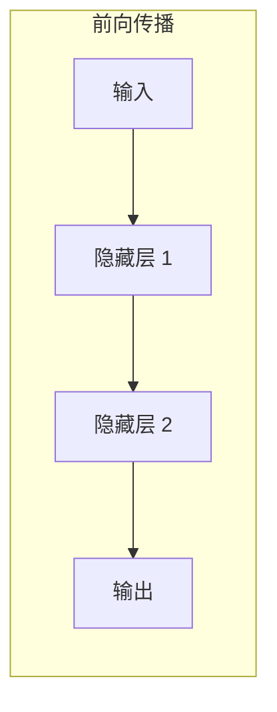

# 第五章：深度学习揭秘

## 5.1 神经网络基础

神经网络是深度学习的核心，灵感来源于人脑的神经系统结构。尽管人工神经网络与生物神经网络有本质区别，但这种类比有助于理解其基本概念。

### 5.1.1 从生物神经元到人工神经元

**生物神经元**

人脑由约 860 亿个神经元组成。每个神经元：
- 通过树突接收其他神经元的信号
- 在细胞体中整合信息
- 当信号强度超过阈值时，通过轴突发出信号
- 通过突触与其他神经元连接

**人工神经元**

人工神经元模拟了这一过程：
- 接收多个输入
- 对输入进行加权求和
- 通过激活函数进行非线性变换
- 输出结果

数学表达：
```
输出 = 激活函数(权重₁×输入₁ + 权重₂×输入₂ + ... + 偏置)
```

### 5.1.2 神经网络的层次结构

多个神经元组成层，多层组成网络：

**输入层**
- 接收原始数据
- 神经元数量等于输入特征数量
- 不进行计算，只传递数据

**隐藏层**
- 进行特征变换和提取
- 可以有多层（深度学习的"深度"来源于此）
- 每层神经元数量可以不同

**输出层**
- 产生最终结果
- 结构取决于任务类型
- 分类任务：每个类别一个神经元
- 回归任务：一个或多个数值输出

### 5.1.3 激活函数

激活函数引入非线性，使神经网络能够学习复杂模式。

**常用激活函数**

| 函数 | 公式 | 特点 | 使用场景 |
|------|------|------|----------|
| ReLU | max(0, x) | 简单高效 | 隐藏层首选 |
| Sigmoid | 1/(1+e⁻ˣ) | 输出 0-1 | 二分类输出 |
| Tanh | (eˣ-e⁻ˣ)/(eˣ+e⁻ˣ) | 输出 -1 到 1 | 需要负值时 |
| Softmax | eˣᵢ/Σeˣⱼ | 输出概率分布 | 多分类输出 |

**ReLU 的优势**

ReLU（Rectified Linear Unit）是目前最常用的激活函数：
- 计算简单高效
- 缓解梯度消失问题
- 稀疏激活，类似生物神经元

### 5.1.4 前向传播

前向传播是数据在网络中流动的过程：



每一层：
1. 接收上一层的输出
2. 进行加权求和
3. 应用激活函数
4. 传递给下一层

### 5.1.5 反向传播

反向传播是训练神经网络的核心算法，用于计算损失对各参数的梯度。

**基本思想**

1. 计算输出层的误差
2. 将误差沿网络反向传播
3. 计算每个参数对误差的贡献（梯度）
4. 根据梯度更新参数

**链式法则**

反向传播基于微积分中的链式法则：复合函数的导数等于各函数导数的乘积。

**梯度下降**

根据计算出的梯度，朝降低损失的方向更新参数：
```
新参数 = 旧参数 - 学习率 × 梯度
```

学习率控制每次更新的步长：
- 太大：可能错过最优解
- 太小：学习过慢

### 5.1.6 为什么"深度"很重要

**表示学习**

深层网络可以学习数据的层次化表示：
- 浅层：学习简单特征（边缘、颜色）
- 中层：学习组合特征（形状、纹理）
- 深层：学习高级概念（物体、语义）

**表达能力**

理论上，单隐藏层网络可以近似任意函数，但：
- 可能需要指数级的神经元数量
- 深层网络用更少参数达到相同效果
- 深层结构更符合现实世界问题的层次性
