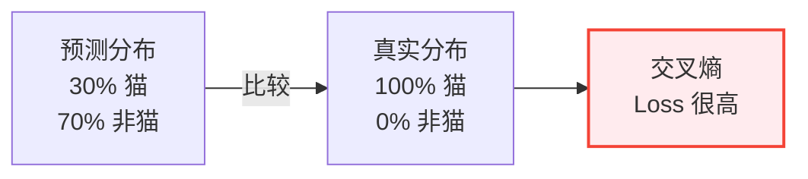

## 5.5 数学直觉：理解神经网络的灵魂（可选）

> 不需要你成为数学家。但你需要理解：为什么这些数学操作能把“垃圾进”变成“宝贝出”。

### 5.5.1 激活函数：为什么需要非线性？

假设你是个快递公司的经理。有一个最朴素的运营模式：

**只做线性操作**：
- 揽件数 × 2 = 派件效率
- 派件效率 × 3 = 收入
- 收入 × 0.1 = 你的奖金

这套公式再怎么组合（乘以 100 次），结果永远还是线性的——**收入永远和揽件数成正比**。你再聪明也逃不出这个魔咒。

但现实中，成功的快递公司是这样运作的：

```
揽件数 → 分拣（激活）→ 按区域优化 → 再激活 → 智能配车 → 收益爆炸
```

**中间那些“激活”步骤，就是引入非线性**。因为：
- 低揽件量时，分拣效率差。
- 达到临界点后，分拣流程变得非常高效。
- 这不是线性关系，而是 **如果...就...** 的逻辑。

**激活函数就是这个“如果...就...”**。

在神经网络中，最常见的激活函数是 **ReLU**：

$$f(x) = \max(0, x)$$

用白话说就是：
- 如果输入是负数，输出就是 0（这个神经元“睡着了”）。
- 如果输入是正数，输出就是输入本身（这个神经元“醒了”）。


**为什么这个简单的开关有魔力？**

因为当你把数百层这样的“开关”叠加起来时，每一层都能学会在特定条件下打开或关闭。

层层递进，最终：
- 第 1 层的开关：识别“是否有边缘”
- 第 10 层的开关：识别“是否像眼睛”
- 第 100 层的开关：识别“是否像猫脸”

就这样，通过无数个简单的非线性开关组合，神经网络获得了解决复杂问题的能力。

> [!TIP]
> **没有激活函数，神经网络就是一个线性回归器**。不论多深，都无法学会复杂的模式。激活函数就是给神经网络注入了“智能的种子”。

### 5.5.2 损失函数：用“考试分数”理解优化目标

训练 AI 就像教学生做题。

**损失函数（Loss Function）** 就是那张试卷。它衡量“你的答案离正确答案有多远”。

简单例子：预测房价。

**真实房价**：100 万
**你的模型说**：120 万

**损失** = 偏离程度 = 20 万

怎么量化这个偏离程度？有好几种方法：

#### 最简单的：绝对误差

$$L = |预测 - 真实|$$

就像评分：你说 100，实际是 120，扣 20 分。

#### 最常用的：均方误差（MSE）

$$L = (预测 - 真实)^2$$

特点是“惩罚犯大错”——偏离 20 万的代价是 400 万（20²），偏离 1 万的代价是 1 万（1²）。

这样设计有个好处：AI 会极力避免犯大错误，宁可均匀分散小错误。

#### 分类问题：交叉熵（Cross-Entropy）

如果你在做选择题（是猫 / 不是猫）：

```
模型说：30% 概率是猫，70% 概率不是猫
正确答案：100% 是猫
```

交叉熵会计算：“你在最确定的地方最不确定”的代价有多大。



**损失函数就是 AI 的“良心”。** 只要你给了它一个清晰的损失函数，它就会拼命地想办法降低这个数字。

> [!WARNING]
> **损失函数的设计决定了 AI 的行为。** 如果你教 AI“只要分类准确率高就给满分”，它可能会为了准确率而输出充满偏见的结果。这就是为什么 AI 的“伦理问题”，很多时候是“损失函数设计问题”。

### 5.5.3 梯度下降的直觉：下山找路

回到前面的登山类比，但这次我们讲清楚数学原理。

你在黑夜里被扔到山上，目标是到谷底（Loss 最小）。

**梯度（Gradient）** 就是“坡度的方向”。

具体来说，在任何一个点，梯度告诉你：
- **哪个方向最陡**（Loss 下降最快）
- **有多陡**（下降速率多快）

数学符号：

$$\nabla L = \left( \frac{\partial L}{\partial w_1}, \frac{\partial L}{\partial w_2}, \ldots \right)$$

读法：“L 对每个权重参数的偏导数”。

每次更新参数时，AI 会沿着这个“最陡下降”的方向走一小步：

$$w_{new} = w_{old} - \eta \cdot \nabla L$$

其中 $\eta$ 就是“学习率”（一步迈多远）。

**用地形比喻：**

```
第 1 步：你在山顶，梯度陡峭 → 快速下降
  ↓
第 10 步：你靠近山谷，梯度平缓 → 小心挪步
  ↓
第 100 步：你到达最低点，梯度接近 0 → 停止移动
```

**为什么叫“梯度下降”？** 因为每一步都是“沿着梯度的反方向”（opposite to gradient）。梯度指向最陡上升，所以反方向就是最陡下降。

> [!NOTE]
> **随机梯度下降（SGD）vs 批量梯度下降（BGD）**
>
> - **BGD**：一次看遍整个训练集，计算平均梯度，再更新。优点：方向准确；缺点：一次计算量巨大。
> - **SGD**：随机抽一个样本，计算那个样本的梯度，立刻更新。优点：快；缺点：方向有噪音，可能“左右摇晃”。
> - **Mini-batch**：折中方案。一次用 32/64 个样本，既快又稳定。这也是现在最常用的。

### 5.5.4 反向传播：错误是怎么回传的？

最后一个难点：一个神经网络有几十亿个参数，怎么知道每个参数该改多少？

这就是 **反向传播（Backpropagation）**。

**类比：一个制造工厂出了问题。**

假设你是工厂老板，发现最终产品质量不符合要求。

你需要追溯：
1. 最后一道工序（装配）有问题吗？
2. 有问题，那是因为零件（产品 A、产品 B）的规格不对吗？
3. 产品 A 规格不对，那是因为 A 的上游工序（焊接）出错了吗？
4. 不是。那是因为原材料（钢材）质量差吗？

通过这样层层反推，你最终找到了根源，并在那个环节修正。

**神经网络的反向传播也是这个逻辑：**

```
前向传播：输入 → 层1 → 层2 → ... → 层N → 输出 → 损失
            |                                    |
反向传播：输出 ← 层1 ← 层2 ← ... ← 层N ← 损失反推
```

在反向传播中，每一层都会计算：

$$\frac{\partial L}{\partial w_i}$$

（这一层的参数对总损失的贡献度是多少）

**一个简化例子：**

```
层 2 的梯度 = 层 3 的梯度 × 当前层对层 3 的影响程度
```

就像：
```
最后销售额没达成，那是因为：
  = 市场需求不足的影响 × 我们营销的贡献度
```

**链式法则（Chain Rule）就是这个原理。**

通过反向传播，AI 在一次前向推理之后，用一次反向推理，就能计算出每一个参数需要调整的方向和幅度。这是现代深度学习的核心。

> [!TIP]
> **反向传播的计算复杂度** 和前向传播差不多（也许慢 2 倍），但它解决了一个无法绕过的问题：**在深度网络中，怎么高效地找到每个参数的梯度。**

### 5.5.5 为什么是“梯度”而不是“坡度”？

最后一个数学细节。

在一维空间中（比如一条直线），“坡度”就够了。

但神经网络的参数空间是 **超高维的**（几百万维）。

在这种空间中：
- **偏导数**：沿着某一个参数方向的“斜率”。
- **梯度**：所有偏导数组合成的“方向向量”，指向最陡上升方向。

因为参数不止一个，所以要用“梯度”（向量）而不是“导数”（标量）。


就这样，通过梯度这个“指路灯”，AI 在无比高维的参数空间中，一步步逼近最优解。

### 5.5.6 思考题

现在你知道了：
- **激活函数** = 非线性开关
- **损失函数** = 教学目标
- **梯度下降** = 下山法则
- **反向传播** = 反向追责

那么问题来了：**为什么最简单的 “下山法则”，能训练出 GPT 这样的超级智能？**

是不是意味着，智能本身就是“朝着正确方向不停迭代”的结果？

换句话说，**会不会有一天，人类的“进化”也能被某种“损失函数”完美解释？**
