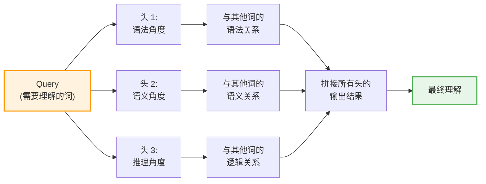

## 6.2b Transformer 的注意力机制详解

> 注意力机制就是 AI 的“聚焦能力”。当你同时看一句话和一张图，你的眼睛不是均匀扫过每个像素，而是集中在重要的部分——AI 也是这样。

### 6.2b.1 一个词的多重身份：歧义问题

在中文里，同一个字在不同上下文中有完全不同的含义。

**例子 1：苹果**
- “我吃苹果。”—— 苹果 = 水果。
- “苹果发布新品。”—— 苹果 = 公司名。

**例子 2：银行**
- “我在河岸边散步。”—— 岸 = 河的边缘。
- “我去银行取钱。”—— 行 = 金融机构。
- “不行，我不同意。”—— 行 = 可以。

相同的字/词，在不同句子里，角色完全改变。

**传统的方法有多笨？**

早期的 RNN 模型（如 LSTM）会这样处理：
1. 读第一个字 → 记住“苹”的某种特征。
2. 读第二个字“果”→ 根据之前的“苹”，逐步更新对整个词的理解。
3. 这种“逐个处理”的方式天生受限：当信息链条太长（比如 100 个字后才出现关键信息），之前的信息会被“遗忘”。

**Transformer 的聪慧方式：**

不是逐个处理，而是 **“一下子看遍全部”，然后根据上下文重新理解每个字**。

### 6.2b.2 注意力的三重奏：Query、Key、Value

Transformer 的核心是 **自注意力机制（Self-Attention）**。

**最简化的解释：在图书馆里找书。**

```
场景：你是图书馆员，有 100 本书在面前。

Visitor 走进来说："我要找关于'猫'的书。"
这句话叫 Query（查询）。

你的大脑里有一份书单记忆（索引），上面记着：
  - 第 1 本：关于"狗"
  - 第 2 本：关于"猫咪的故事"
  - 第 3 本：关于"猫科动物进化"
  - 第 4 本：关于"家具设计"
这份记忆叫 Key（索引）。

现在你根据 Query（找"猫"的书）去扫描 Key（书单），找出匹配度：
  - 第 2 本：匹配度 95%（就是讲猫的）
  - 第 3 本：匹配度 92%（也讲猫，但角度不同）
  - 第 1 本：匹配度 5%（讲的是狗，不是猫）
  - 第 4 本：匹配度 2%（讲家具，完全无关）

最后，你根据这些"匹配度权重"，把对应的书内容（Value）加权组合起来，递给 Visitor。
```

**用数学表达：**

$$\text{Attention}(Q, K, V) = \text{softmax}\left(\frac{QK^T}{\sqrt{d_k}}\right)V$$

翻译成白话：
1. $QK^T$ ：Query 和 Key 的匹配度（点积）。
2. $\text{softmax}$ ：把匹配度转成百分比（所有权重加起来 = 100%）。
3. $\sqrt{d_k}$ ：一个平衡因子（防止权重被冲击得太极端）。
4. $\times V$ ：用这些权重组合 Value（实际内容）。

**具体例子：处理“我吃苹果”**

```
原句：我 吃 苹 果
```

当处理“苹”字时：

| 词语 | Key（身份）| Query（“苹”看其他词） | 匹配度 | 权重 |
|------|----------|------------------|------|------|
| 我   | 主语     | 我和苹有关吗？    | 20%  | 20%  |
| 吃   | 动词     | 吃和苹有关吗？    | 90%  | 45%  |
| 苹   | 水果（需要理解）| 苹和苹有关吗？ | 100% | 35%  |
| 果   | 水果的补充| 果和苹有关吗？   | 95%  | 最后权重调整到 100% |

最后，模型根据这些权重的组合，理解“苹”在这个句子中特指“苹果（水果）”。

### 6.2b.3 自注意力 vs 交叉注意力

**自注意力（Self-Attention）：** 一句话内部的各个字/词相互看对方。

```
句子：我 吃 了 一 个 红 苹 果

自注意力：
  "我" 看其他词 → "吃"很重要，"苹果"是宾语，与我有关
  "苹" 看其他词 → "红"是修饰我的，"吃"是动词，我是被吃的
```

**交叉注意力（Cross-Attention）：** 一句话的部分去看另一句话。

```
中文："我吃苹果"
英文："I eat an apple"

交叉注意力：
  中文的"我" 去看英文的每个词 → 最匹配"I"
  中文的"吃" 去看英文的每个词 → 最匹配"eat"
```

**Transformer 在不同任务中的用法：**

| 任务 | 自注意力 | 交叉注意力 |
|------|---------|----------|
| 语言模型（GPT） | 用。上下文理解 | 不用。只需要前文 |
| 机器翻译 | 用。理解原句结构 | 用。对齐原文和目标文 |
| 图像 + 文字（多模态） | 用。图像内部和文字内部各自理解 | 用。让文字去“看”图像 |

### 6.2b.4 多头注意力：听不同的声音

一个 Query 对 Key 的关注，可能有多种角度。

**比如看一个人：**
- 头 1：从“长相”的角度看，这个人像我朋友 A。
- 头 2：从“气质”的角度看，这个人像我朋友 B。
- 头 3：从“身高”的角度看，这个人像我朋友 C。

**三个不同的“关注视角”，给了模型更丰富的信息。**



在实践中，现代 LLM 用的多头注意力通常有 64、96 甚至 128 个“头”，每个头都从不同的特征空间去理解。

### 6.2b.5 为什么 Transformer 击败了 RNN？

这是个扭转整个 AI 历史的问题。

**RNN（如 LSTM）的悲剧：**
- 必须从左到右逐个处理字。
- 第 1 个字处理时，还不知道第 100 个字是什么。
- 当要用第 100 个字的信息来修正第 1 个字的理解时，可能“来不及”或“信息衰减”。
- **结果：长距离依赖（Long-range Dependency）很难学。**

**Transformer 的优势：**
- 一次性看遍全部词。
- 每个词都能直接“看到”所有其他词。
- 注意力权重会自动学会“哪些词对这个词重要”。
- **结果：再远的距离依赖，也只要一步“注意力距离”。**

**性能对比：**
- RNN/LSTM：可以处理相对长的序列，但超过几百个词时，长距离依赖开始失效。
- Transformer：能处理数百万 token 的上下文（当然，显卡要很贵）。

**计算效率：**
- RNN：必须逐个处理，无法并行。
- Transformer：所有词可以并行处理。

所以，**Transformer 用“并行计算”换来了“全局感知”**，这笔生意太划算了。

### 6.2b.6 位置编码：让 AI 知道“顺序”

有个细节很容易被忽视：**Transformer 没有“顺序”的概念。**

它一次性处理全部词，完全是平行的。那它怎么知道“第 1 个词在最前面，第 10 个词在中间”？

答案：**位置编码（Positional Encoding）**。

最简单的方法就是：给每个位置加一个“ID”。

```
词 1：[词向量] + [位置 ID: 1]
词 2：[词向量] + [位置 ID: 2]
词 3：[词向量] + [位置 ID: 3]
```

这样，模型就知道了“顺序”。

原始 Transformer 用的是三角函数编码（Sinusoidal Positional Encoding）：

$$PE_{(pos, 2i)} = \sin(pos / 10000^{2i/d})$$
$$PE_{(pos, 2i+1)} = \cos(pos / 10000^{2i/d})$$

（数学细节不重要，只需知道：每个位置都有独特的“编码指纹”）

> [!TIP]
> **一个小秘密：** 现在很多 LLM 已经放弃了固定的位置编码，改用“相对位置”或“旋转位置编码（RoPE）”。原因是：如果你用了固定位置编码，模型就无法处理比训练时更长的序列（比如，你用长度 2K 的文本训练，突然来了 4K 的输入，模型就懵了）。

### 6.2b.7 思考题

现在你理解了注意力机制的核心逻辑。

那么问题来了：

**1. 人类的“注意力”和 AI 的“注意力”有什么本质区别吗？**

你读这段文字时，你的视觉和理解，是不是也在“权衡”每个词的重要性？

**2. 如果 Transformer 能处理数百万 token，为什么不能处理“无限”的上下文？**

（提示：想想内存和计算成本。注意力矩阵的大小是 $O(n^2)$ 的——token 数量翻倍，计算量就翻四倍）

**3. 会不会有更高效的“注意力”替代品？**

（实际上，这是当前 AI 研究的热门方向。Mamba、Hyena Network 等新模型都在尝试挑战 Transformer）
