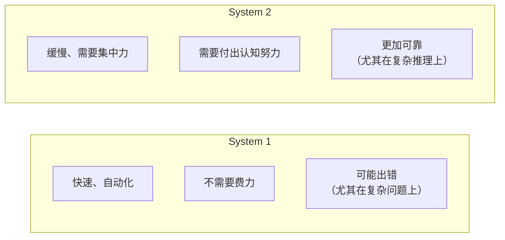
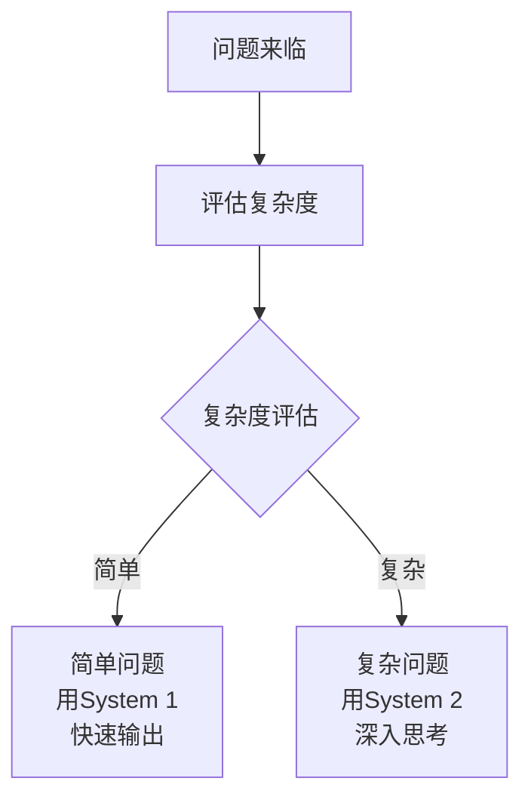

## 7.1 两种思维方式：System 1 vs System 2

> 心理学启示：为什么有些问题需要冷静思考，而有些可以快速判断？

### 7.1.1 你的大脑有两套系统

想象一下，你在驾车时突然看到一个红灯。你马上踩刹车——这是快速的、本能的、几乎不需要“思考”。

现在想象一下，你要计算：“23 × 47 等于多少？”你需要停顿一下，在脑子里做乘法。这需要你集中注意力，一步步推导。

认知心理学家丹尼尔·卡尼曼用两个术语描述这种现象：



### 7.1.2 System 1：快速反应的能力

System 1 处理的任务包括：
- **识别物体**：“这是一只猫”
- **理解简单的句子**：“天空是蓝色的”
- **应对熟悉的情况**：“红灯就是停止”
- **快速反应**：你见到老朋友，立即认出他

想象一下一个聊天机器人只有 System 1 的能力。它可以快速、流畅地和你聊天。它学过数百万条对话样本，所以能够很好地预测下一个词。但是，当面对一个需要深入推理的问题时，比如：

**问题**：“一个房间里有 100 只鸡和 3 个农民。每个农民拿走 10 只鸡，但其中一个农民把 3 只鸡放回来了。最后有多少只鸡在房间里？”

传统的大语言模型（只依赖 System 1）可能会快速输出一个错误的答案，因为它只是在基于模式匹配来预测词序列。

### 7.1.3 System 2：深入思考的能力

System 2 需要：
- **分解问题**：这道题有几个步骤？
- **追踪逻辑**：每一步的推导是否正确？
- **反思与验证**：答案合理吗？有其他的理解方式吗？
- **多步推理**：前面的步骤如何影响后续的计算？

回到那道鸡的问题。使用 System 2 的思维方式：

```text
步骤1：初始状态有100只鸡
步骤2：3个农民各拿走10只
      → 100 - (3 × 10) = 100 - 30 = 70只鸡
步骤3：其中一个农民把3只放回来
      → 70 + 3 = 73只鸡
答案：73只鸡
```

这需要的不仅是“预测下一个词”，而是真正地 **建立一个思维模型** 来追踪问题的状态变化。

### 7.1.4 为什么 System 2 更难实现？

在传统的神经网络中，所有的计算都是 **并行且即时的**。当你输入一个提示，模型从左到右、一次一个 token 地生成文本。这很快，但也意味着：

1. **没有“思考空间”**：模型没有时间在一个中间步骤上“停顿”和“反思”
2. **错误传播**：第一步出错，后续所有推理都可能受到影响
3. **无法回溯**：模型不能说“等等，让我重新思考这个问题”

就像一个人在脑子里快速说话一样——他说出的第一句话可能有问题，但没有改正的机会。

### 7.1.5 System 1 vs System 2 在 AI 中的体现

| 能力 | System 1 LLM | System 2 推理模型 |
|------|------------|--------------|
| 生成速度 | 极快（<1 秒） | 较慢（3-60 秒） |
| 处理问题复杂度 | 简单、直接 | 复杂、多步骤 |
| 可解释性 | “给出答案” | “显示思考过程” |
| 推理能力 | 受限（依赖训练数据中的模式） | 强（可以组合已知概念） |
| 错误类型 | 快速但可能不准确 | 慢但更准确 |
| 适合场景 | 聊天、摘要、分类 | 数学、代码、逻辑推理 |

### 7.1.6 现实中的例子

#### 7.1.6.1 例 1：写一封邮件

```text
用户：帮我写一封感谢邮件给我的老板
```

这时 System 1 就足够了。邮件不需要深入逻辑推理，只需要：
- 理解感谢的语境
- 生成得体、真诚的表达
- 符合邮件的格式约定

传统 LLM 在这里表现很好，瞬间完成。

#### 7.1.6.2 例 2：解决一个复杂的算法问题

```text
用户：给定一个整数数组，找到乘积最大的连续子数组
```

这时需要 System 2：
1. 理解问题的约束条件
2. 想到可能的方法（暴力搜索、动态规划等）
3. 分析为什么某些方法更优
4. 推导算法的每一步
5. 验证边界情况（负数、零等）

推理模型会“思考”这些步骤，而不是直接给答案。

### 7.1.7 混合的未来

聪明的 AI 系统不会只依赖其中一种。实际上：

- **快速问题用 System 1 处理**：聊天、翻译、摘要
- **复杂问题用 System 2 处理**：数学、编程、深度分析

现代推理模型正在学习一种 **自适应** 能力——判断什么时候该快速反应，什么时候该深入思考。但目前做得并不好：7.5 节会看到它在“1+1 等于几”这种问题上照样想很久。



### 7.1.8 本节小结

- **System 1** 是快速、直觉的处理方式——适合日常交互
- **System 2** 是缓慢、深思的处理方式——适合复杂推理
- 传统 LLM 更像 System 1，而推理模型开始融合两者
- 理解这个区别是理解为什么 2024-2026 年会出现推理模型革命的关键

下一节，我们将深入看看推理模型具体是如何实现 System 2 能力的。

### 7.1.9 与其他章节的联系

📖 **延伸阅读**：
- 想了解传统大语言模型的工作原理？请参阅《第六章 大语言模型详解》和《第 6.2 大模型原理》
- 想了解推理模型如何实现 System 2？请参阅《第 7.2 推理模型的工作原理》
- 想了解不同 AI 模型的实际应用？请参阅《第十章 主流 AI 工具使用指南》

### 7.1.10 思考题

1. 在你日常使用 ChatGPT 或 Claude 的经历中，哪些问题需要 System 2 的思考？哪些可以用 System 1 快速解决？

2. 如果你是一名学生，你会用什么方式区分何时需要“让 AI 快速帮你”，何时需要“让 AI 深入思考后再回答”？

3. 人类有时候会犯 System 1 的错误（比如快速判断）。那么推理模型也可能犯 System 2 的“过度思考”错误吗？
