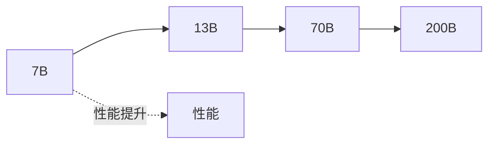
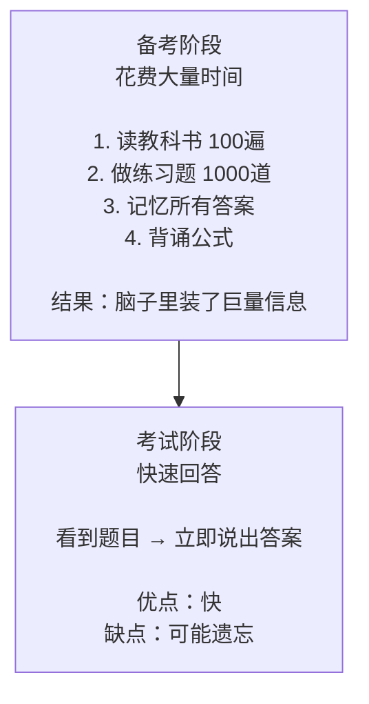
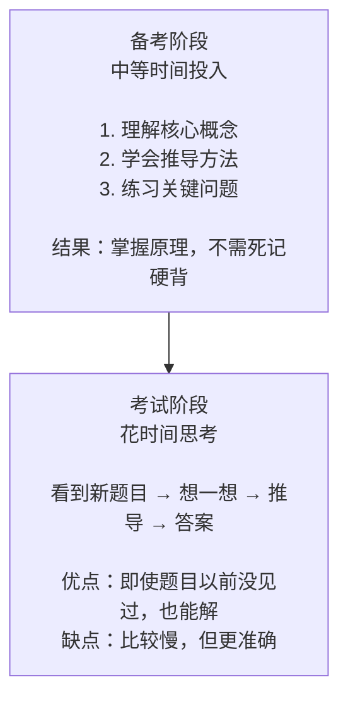
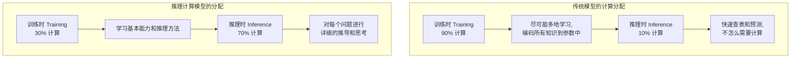
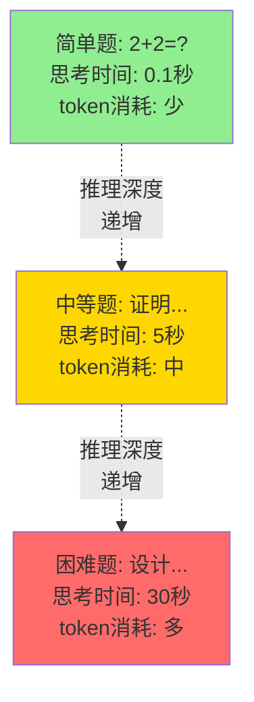
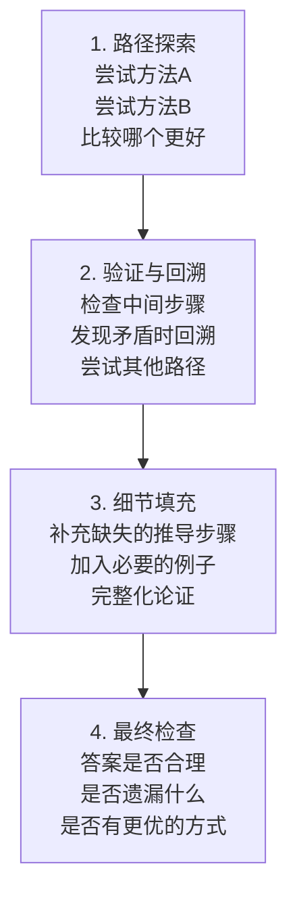
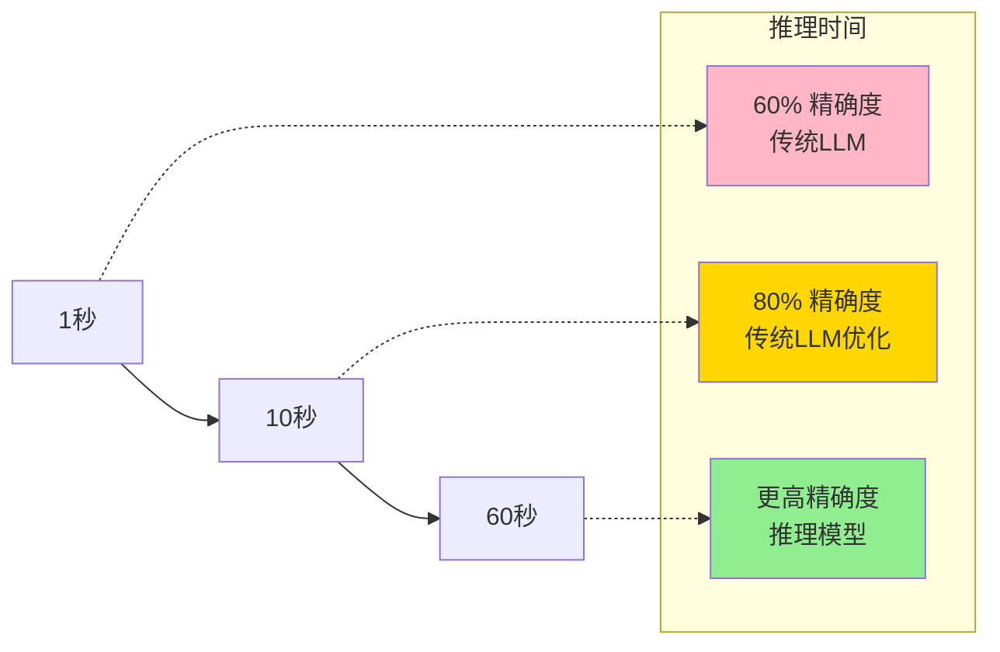
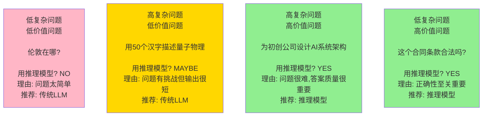
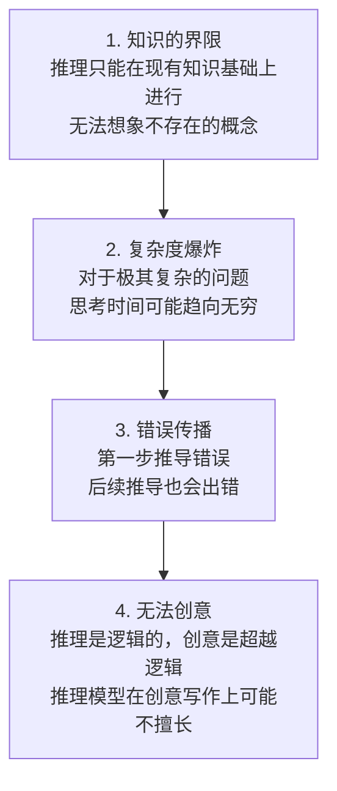

## 7.3 推理计算：新的 AI 范式

> 从固定参数到动态计算：为什么在推理时多花时间是件好事

### 7.3.1 问题：为什么我们一直只在乎“模型大小”？

在过去的十年，AI 发展遵循一个简单的规律：



这就是所谓的“扩展法则”（Scaling Law）。为了让模型更聪明，研究人员就训练更大的模型。

**但是**，2024 年开始，一个新的想法出现了：

> 与其训练一个超级大的模型，不如让一个足够大的模型花更多时间思考问题。

这就是推理计算的核心思想。

### 7.3.2 一个生活类比：考试的两种方式

想象一下两个学生在备考：

### 学生 A：死记硬背所有内容（传统方法）



### 学生 B：掌握原理，考试时推导（推理计算方法）



学生 A 代表传统 LLM，学生 B 代表推理模型。

### 7.3.3 推理计算的三个维度

### 1. 计算在何时分配



这是一个 **范式转变**。

### 2. 计算的深度

不同问题需要不同的计算深度：



### 3. 计算的方式

推理模型在推理时进行的计算包括：



### 7.3.4 推理计算的经济学

### 成本-效益分析



### 什么时候推理计算是值得的？



### 7.3.5 推理计算的天花板

虽然推理计算很强大，但也有局限：



### 7.3.6 推理计算 vs. 参数扩展

现在 AI 界有一个重要的讨论：

> 未来应该继续训练更大的模型，还是让现有模型花更多时间思考？

```text
两条发展路线：

路线A：参数扩展（Scaling Parameters）
模型参数：70B → 300B → 1T
训练成本：持续增加
部署成本：巨大（需要大显卡集群）
推理速度：快
适合：需要快速响应的场景

     vs

路线B：推理计算扩展（Scaling Compute）
模型参数：固定（70B或100B）
训练成本：相对稳定
部署成本：可控（普通显卡也能跑）
推理速度：较慢但更准确
适合：对准确性要求高的场景
```

目前的共识是：**两条路线同时推进**

- **快速应用场景**：用传统的参数扩展（更大的模型）
- **精确应用场景**：用推理计算扩展（推理时间更长）

### 7.3.7 本节小结

推理计算是 AI 发展的新范式：
- 从“训练时的大量投入 + 推理时的快速查表”转变
- 到“训练时学习基础方法 + 推理时深入思考”

这意味着：
- 推理时间变得和准确度一样重要
- 用户需要在“快速”和“准确”之间做选择
- 成本结构发生了变化（更多 token 消耗在思考上）

### 7.3.8 思考题

1. 在你的日常工作中，有哪些任务可以受益于推理计算？哪些任务不需要？

2. 如果推理模型在推理时要消耗 10 倍的 token，这会如何改变 AI 的商业模式？

3. 未来是否会出现“推理时间太长”反而成为劣势的场景？什么时候？
