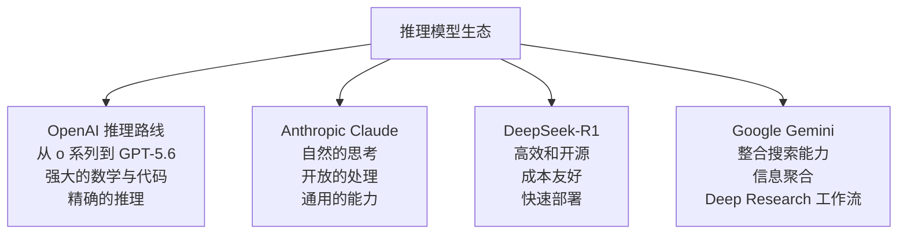
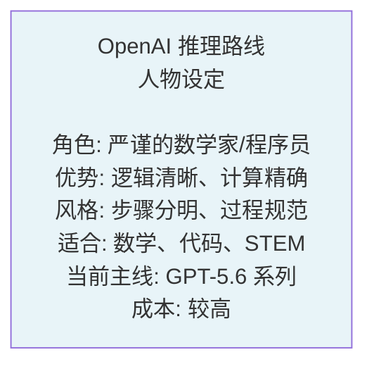
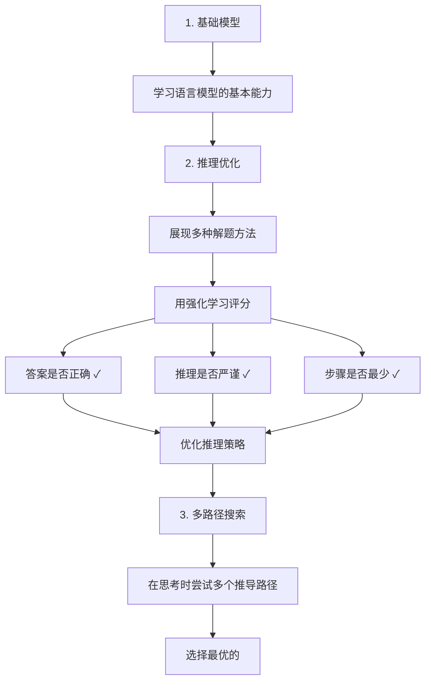
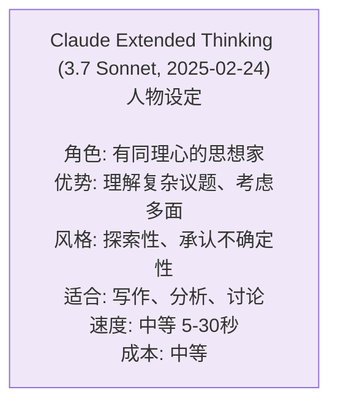
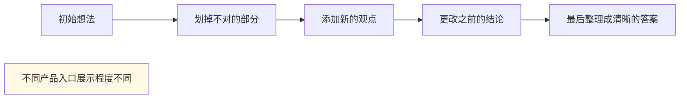
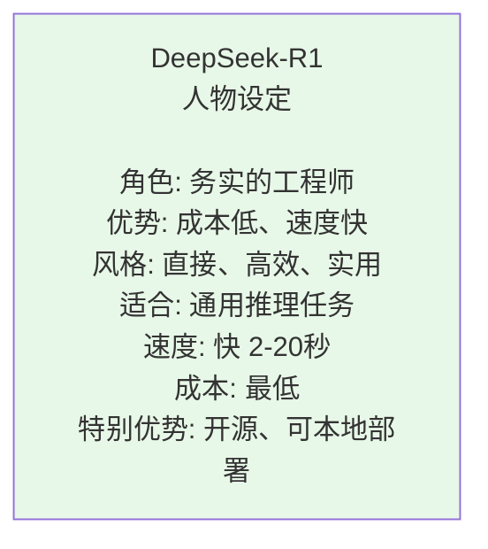
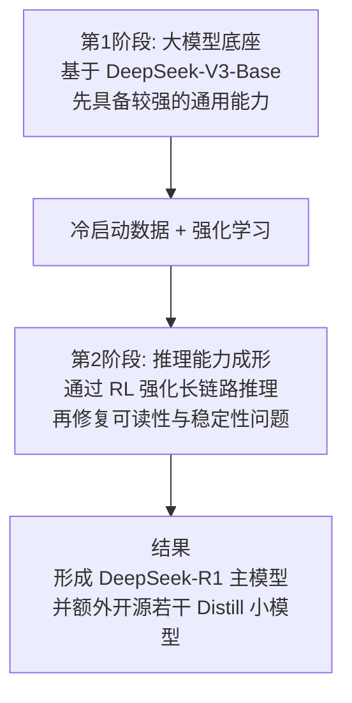
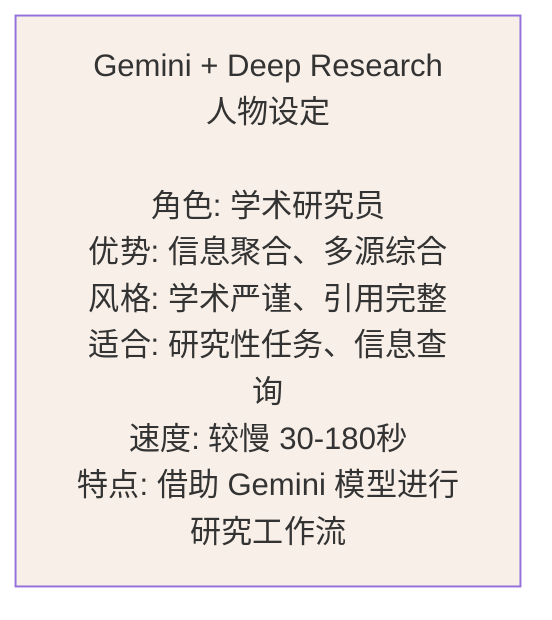
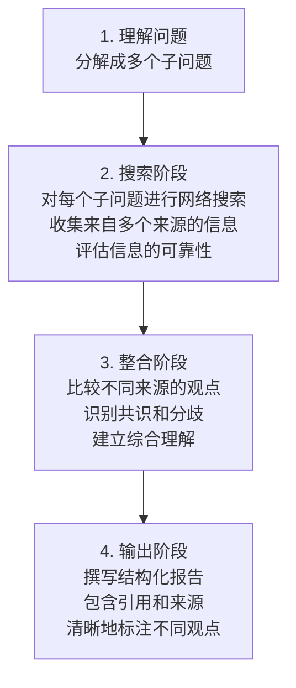

## 7.4 主流推理模型深度对比

> OpenAI 推理路线、Claude 的扩展思考、DeepSeek-R1，以及 Gemini 的 Deep Research 工作流：各有绝技

模型与 thinking 支持矩阵会变化；本节的版本性描述以[快变事实核验表](../appendices/appendix_f_volatile_facts.md)及其官方来源为准。

### 7.4.1 四条代表性推理路线的风景线

2024-2026 年，四条主要的推理/研究路线各自占据了一席之地。让我们从初学者的角度看看它们的区别：



### 7.4.1.1 OpenAI 推理路线：从 o 系列到 GPT-5.6

#### 特点速览



#### 工作原理

OpenAI 的 o 系列率先把 **强化学习** 推到了推理产品线上——从 o1（2024-12）到 o3-mini（2025-01）、o3（2025-04）、o4-mini（2025-04-16，已于 2026-02 退役），推理能力逐步增强。与此同时，OpenAI 主线模型从 GPT-4 演进到 GPT-5（2025-08）及其迭代版本（GPT-5.5 于 2026-04-23 发布，2026-07-09 起 GPT-5.6 系列接替前沿位置）：



#### 具体例子：数学题

**题目**：求解方程 x² - 5x + 6 = 0

```text
面向用户可见的“推理摘要”通常更接近下面这种形式：

问题识别：
- 这是一个标准二次方程

候选方法：
- 因式分解
- 配方法
- 求根公式

比较结果：
- 三种方法都能得到一致答案
- 因式分解最直接

最终结论：
- x = 2 或 x = 3
```

注意：OpenAI 的公开产品和 API 通常不会直接暴露**原始推理 tokens**；你更常见到的是经过整理后的摘要、步骤说明或最终答案。

#### 何时选择 OpenAI 推理路线

```text
✓ 适合场景
├─ 复杂数学问题
├─ 算法设计
├─ 物理/化学计算
├─ 代码调试
└─ 正式推导

✗ 不适合场景
├─ 创意写作
├─ 一般对话
├─ 快速查询
└─ 开放性讨论
```

### 7.4.1.2 Anthropic Claude Extended Thinking：富有同情心的思想家

#### 特点速览



#### 工作原理

Claude 的 Extended Thinking 采用的是 **内部状态管理**：



#### 具体例子：开放性问题

**题目**：在家工作的利弊是什么？

```text
在部分 Claude 产品入口中，用户可能看到更丰富的过程性说明。一个更稳妥的教学示例如下：

【过程性说明】
- 先分别梳理效率、通勤、工作生活边界、社交和协作成本
- 再补充“个人性格”和“工作性质”两个影响变量
- 最后整理成平衡分析

【答案】
在家工作的优点包括灵活性和省时间，但也面临隔离感和工作-生活边界模糊的挑战。最终的效果取决于你的工作类型和个人性格。
```

#### 何时选择 Claude Extended Thinking

```text
✓ 适合场景
├─ 写作和编辑
├─ 复杂议题分析
├─ 开放性讨论
├─ 批评性思考
├─ 伦理两难问题
└─ 内容策划

✗ 不适合场景
├─ 快速计算
├─ 正式数学证明
├─ 标准化测试
└─ 简单事实查询
```

> 💡 **演进提示**：Extended Thinking 是 Claude 推理能力的一条早期产品路线。当前官方比较表中，Claude Fable 5 的 Adaptive Thinking 常开；Claude Opus 5 与 **Claude Sonnet 5** 使用 Adaptive Thinking；Claude Haiku 4.5 使用 Extended Thinking。Fable 5 面向广泛用户，Mythos 5 为受限可用。不要把旧型号的开关或预算参数直接套到新型号；使用前查看[快变事实核验表](../appendices/appendix_f_volatile_facts.md)。

### 7.4.1.3 DeepSeek-R1：经济高效的工程师

#### 特点速览



#### 工作原理

DeepSeek-R1（2025-01-20 发布）的核心路线是先在大模型上通过 **冷启动数据 + 强化学习** 获得推理能力，再额外发布若干**蒸馏版小模型**给社区使用：



#### 成本对比

```text
推理任务的成本不要死记“每题多少钱”，因为它会被三件事强烈影响：

1. 厂商当前的 token 单价是否调整
2. 你是否命中了缓存
3. 这个问题实际消耗了多少推理 token

以 DeepSeek 为例，官方 API 当前是按百万 token 计价，而不是按“每道难题固定几美元”计价；并且 `deepseek-reasoner` 对应的也是当前 API 上线的 reasoning 模式，而不是把论文里的 R1 主模型价格直接写死成一个数字。
```

#### 何时选择 DeepSeek-R1

```text
✓ 特别适合
├─ 预算有限的团队
├─ 需要本地部署
├─ 需要可定制化
├─ 高频调用的应用
├─ 对延迟不太敏感
└─ 开源爱好者

✗ 不太适合
├─ 对生成速度要求极高
├─ 需要最前沿的性能
└─ 企业级支持需求
```

### 7.4.1.4 Google Gemini 的 Deep Research 模式：知识的聚合家

#### 特点速览



#### 工作原理

这里要特别区分：**Gemini 是模型家族，Deep Research 是建立在 Gemini 之上的研究工作流/功能模式**。它的工作方式不同于前三者：



#### 具体例子：研究问题

**题目**：2026 年 AI 芯片行业的最新进展是什么？

```text
Gemini Deep Research 模式的处理方式：

[搜索分解]
子问题1：主要的AI芯片制造商在2026年推出了什么？
子问题2：这些芯片的性能提升是什么？
子问题3：价格和可用性如何变化？
子问题4：对AI产业有什么影响？

[搜索执行]
→ 搜索NVIDIA、AMD、Intel最新新闻
→ 搜索AI芯片性能基准测试
→ 搜索行业分析报告
→ 搜索学术论文

[信息整合]
根据搜索结果，综合出当前的芯片景观...
对比来自不同来源的观点...
识别核心趋势...

[输出]
完整的研究报告，包括：
- 执行摘要
- 主要发现
- 数据支撑
- 引用清单
- 我的分析限制（什么信息不确定）
```

#### 何时选择 Gemini 的 Deep Research 模式

```text
✓ 特别适合
├─ 需要最新信息的研究
├─ 需要多来源验证
├─ 学术或专业写作
├─ 行业趋势分析
├─ 政策研究
└─ 综合性报告撰写

✗ 不太适合
├─ 需要快速回答
├─ 隐私敏感的问题（会搜索）
├─ 本地离线使用
└─ 涉及专有信息
```

### 7.4.2 快速选择指南

```text
┌─────────────────────────────────────┐
│ 我应该用哪个推理模型？             │
├─────────────────────────────────────┤
│                                     │
│ 问题类型          首选        备选  │
│ ─────────────────────────────────  │
│ 数学/代码        GPT-5.6    R1      │
│ 写作/创意        Claude     GPT-5.6 │
│ 信息研究         Gemini（Deep Research） Claude  │
│ 日常聊天         R1         Claude  │
│ 部署受限         R1(本地)   无      │
│ 预算有限         R1         无      │
│                                     │
└─────────────────────────────────────┘
```

### 7.4.3 四大模型的评测对比

```text
各维度对比（满分5分，基于各平台公开基准与社区实测，仅供参考）：

                 OpenAI   Claude  DeepSeek  Gemini（研究模式）
数学推理能力         5      4       4.5       3
代码生成质量         5      4.5     4.5       3
写作自然度           4      5       4         4
信息聚合能力         2      3       2         5
成本效率             1      2       5         3
部署灵活性           1      1       5         2
推理速度             2      3       4         2
通用性               4      5       4         4

注：跨厂商评分存在多重变量影响（评测版本、提示词设置、采样方法等），
仅反映当前大致印象，非严格的科学评判，不宜作为最终采购依据。
```

### 7.4.4 本节小结

四条主流推理路线各有所长：

- **OpenAI 推理路线（主线已到 GPT-5.6 系列，GPT-5.5 仍可用）**：逻辑和计算能力强，适合复杂专业任务
- **Claude thinking 路线（当前包含 Claude Fable 5、Opus 5、Claude Sonnet 5 与 Haiku 4.5）**：不同型号使用 Adaptive 或 Extended Thinking，适合按能力、速度和成本选择
- **DeepSeek-R1**：最经济的选择，可本地部署
- **Gemini + Deep Research 模式**：擅长多来源检索、信息整合与研究型输出

**选择的原则**：
1. 优先看 **问题类型**
2. 其次考虑 **成本约束**
3. 最后看 **部署环境**

### 7.4.5 思考题

1. 如果你是一个初创公司，只有有限的 API 预算，你会选择哪个推理模型？为什么？

2. DeepSeek-R1 的成本优势会如何改变 AI 应用的商业模式？

3. 五年后，这四个推理模型中哪个可能会“消亡”或被新模型取代？为什么？
