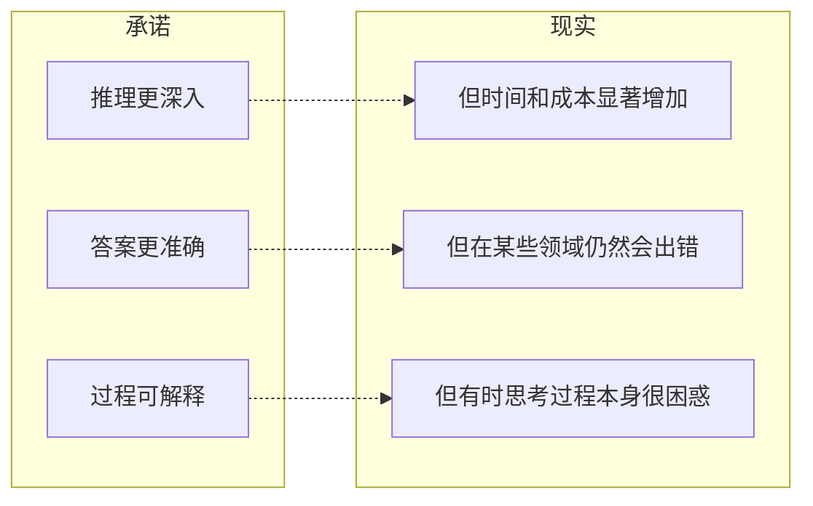
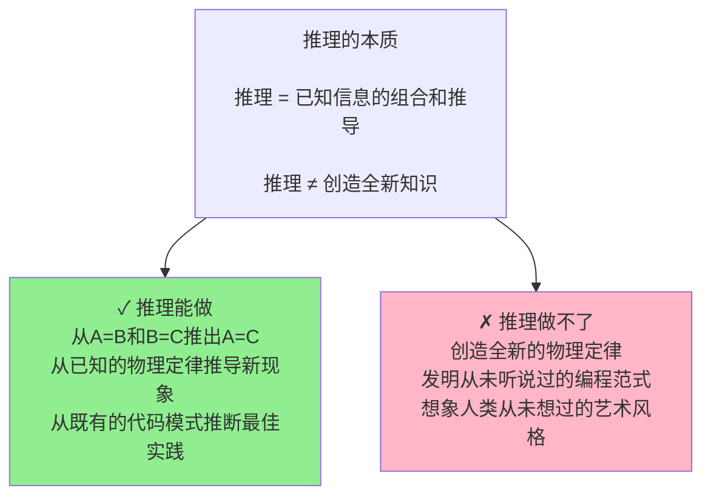
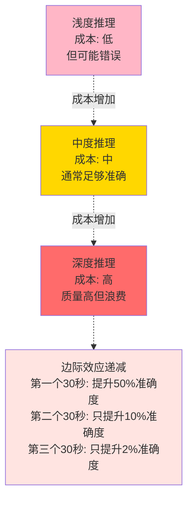
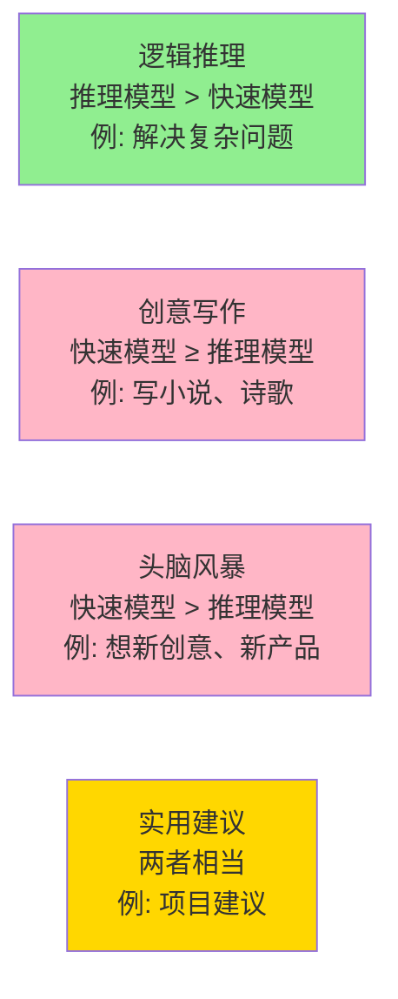

## 7.5 推理模型的局限与成本

> 没有完美的模型：理解推理模型为什么不是万能的

### 7.5.1 现实检查：推理模型不是解决所有问题的良药

在深入了解了推理模型的强大能力之后，是时候诚实地面对它们的局限了。



### 7.5.2 局限 1：时间成本

### 7.5.2.1 推理需要时间，而时间就是金钱

```text
推理时间分布：

简单问题（"巴黎在哪？"）
时间：1-2秒
用户体验：✓ 可以接受

中等问题（"解释量子纠缠"）
时间：10-15秒
用户体验：△ 有点长，但还能接受

复杂问题（"设计分布式系统"）
时间：30-60秒
用户体验：✗ 很长，用户可能会不耐烦

极难问题（"证明新的数学定理"）
时间：可能数分钟
用户体验：✗✗ 不现实，用户会离开
```

### 7.5.2.2 实际例子

你在使用 Claude 的 Extended Thinking 处理一个复杂的合同分析：

```text
等待中..............................（30秒）
Claude正在思考您的问题...

实际发生的情况：
0-5秒：理解问题
5-15秒：搜索相关条款
15-25秒：分析法律含义
25-30秒：综合结论

用户的感觉：
"为什么这么慢？我的网络有问题吗？"
"我可能应该用别的工具..."
"还没好吗？算了，我先做别的..."
```

### 7.5.2.3 何时时间成本不可接受

```text
✗ 不适合的场景

1. 实时交互
   └─ 聊天界面、客服系统
   └─ 用户期望：<2秒回应

2. 高频调用
   └─ 处理大量请求的API
   └─ 每个请求等待30秒 = 极大延迟

3. 移动应用
   └─ 电池消耗、网络可靠性
   └─ 长等待时间 = 糟糕的UX

4. 流式需求
   └─ 需要显示进度条
   └─ 思考阶段不能流式输出
```

### 7.5.3 局限 2：知识的边界

### 7.5.3.1 推理不能创造知识，只能组织知识

这是最根本的限制：



### 7.5.3.2 知识缺口的问题

```text
情景1：推理模型被问到过时信息

问：2024年GPT-4的最新性能如何？
推理模型的思考：
"我的训练数据只到2024年4月...
现在是2026年...
我无法知道最新的性能数据...
我只能基于旧数据推断...
这可能会给出错误的答案"

结果：
虽然推理过程逻辑清晰
但答案仍可能不准确（因为基础信息过时）
```

### 7.5.3.3 幻觉仍然存在

即使是推理模型，也可能出现幻觉：

```text
幻觉的两种形式：

形式1：基础事实幻觉
推理基础本身就错了
即使推理逻辑正确，结论也是错的

例子：
[思考]
据我所知，法国首都是伦敦
伦敦在英国
所以法国的首都在英国
等等...这不对...
[输出]
法国的首都是伦敦
（虽然推理过程逻辑清晰，但基础事实错误）

形式2：推理创造
推理过程中"凭空创造"了不存在的信息

例子：
"这个Python库提供了XYZ功能"
（实际上这个库从没有这个功能）
```

### 7.5.4 局限 3：推理可能过度或低效

### 7.5.4.1 “想太多”的危险

推理模型有时会陷入循环：

```text
问题：1+1等于多少？

合理的推理：
1+1 = 2 ✓

过度推理：
[思考]
1表示什么？
1是一个整数
1等于0.9999... 吗？
1是否依赖于计数系统？
在不同的进制中...
在虚数域中...
从集合论的角度...
从范畴论的角度...

[10分钟后]
经过全面分析...
[输出]
在标准十进制整数系统中，1+1=2

用户反应：
"我只是想要一个简单的答案..."
```

### 7.5.4.2 计算成本的爆炸



### 7.5.5 局限 4：无法处理某些类型的任务

### 7.5.5.1 创意和发散思维

推理模型在严格的逻辑问题上很强，但在需要创意的任务上可能不如快速模型：



### 7.5.5.2 语调和风格

推理过程中，模型可能更关注“正确”而不是“优雅”：

```text
问题：用两句话形容一下春天

快速模型的答案（富有诗意）：
春天是大地的苏醒，
万物竞相展现绿色的欢歌。

推理模型的答案（严谨但生硬）：
春天是四季中温度升高、降水增加的季节。
此时植物恢复生长，动物苏醒，光照时间延长。

哪个更好？
取决于用途！
```

### 7.5.6 局限 5：成本结构的问题

### 7.5.6.1 Token 成本的上升

```text
成本对比（处理一个困难问题）

传统LLM：
→ 输出token：300个
→ 成本：$0.015（很便宜）

推理模型：
→ 思考token：8000个
→ 输出token：300个
→ 总成本：$0.50（30倍！）

大规模应用的后果：

日处理1000个询问的应用

传统LLM：
1000 × $0.015 = $15/天

推理模型：
1000 × $0.50 = $500/天

年成本：
传统：$5,475
推理：$182,500

差别巨大！
```

### 7.5.6.2 企业预算的限制

```text
成本与选择的关系：

初创企业（预算：$1000/月）
└─ 能处理：2000个推理查询/月
└─ 意味着：60个/天

大企业（预算：$100000/月）
└─ 能处理：200000个推理查询/月
└─ 意味着：6600个/天

小企业无法像大企业一样频繁使用推理模型
```

### 7.5.7 实际问题：何时推理模型不是最佳选择？

```text
场景1：客服聊天机器人
为什么不用推理模型：
✗ 30秒延迟无法接受
✗ 高并发会导致成本爆炸
✓ 快速模型 + 检索增强足够了

场景2：内容创意工作
为什么不用推理模型：
✗ 创意不需要长时间思考
✗ 反而可能"想死"想出不来
✓ 快速模型更灵活、成本低

场景3：代码补全
为什么不用推理模型：
✗ IDE中等待10秒无法接受
✗ 大多数代码补全很直接
✓ 快速模型就足够，只在调试时用推理

场景4：学生作业
为什么应该用推理模型：
✓ 准确性至关重要
✓ 时间约束不是实时的
✓ 看思考过程能帮助学习
✓ 相对低频使用
```

### 7.5.8 推理模型的最佳实践

既然推理模型有局限，那么如何最大化其价值？

```text
最佳实践清单：

1. 选对问题类型
   ├─ 只用于：复杂、高价值、逻辑密集
   └─ 避免：简单、低价值、创意类

2. 设置合理的期望
   ├─ 预期：思考时间会很长
   ├─ 预期：成本会显著增加
   └─ 不预期：完美答案、实时反应

3. 混合使用模型
   ├─ 简单问题 → 快速模型
   ├─ 复杂问题 → 推理模型
   └─ 混合 → 两者配合

4. 监控和验证
   ├─ 检查思考过程
   ├─ 验证基础事实
   └─ 不要盲目信任

5. 成本管理
   ├─ 设置配额
   ├─ 定期审计使用
   └─ 考虑本地部署（如DeepSeek）
```

### 7.5.9 未来的改进方向

推理模型虽然有局限，但这些局限正在被逐步解决：

```text
问题              正在进行的改进

时间成本    → 更高效的推理算法
            → 更聪明的早停策略

知识过时    → 推理模型+实时搜索
            → 动态知识库整合

幻觉问题    → 更好的事实验证
            → 与检索系统集成

创意不足    → 混合系统架构
            → System 1+System 2融合

成本高昂    → 模型压缩和蒸馏
            → 开源模型竞争
```

### 7.5.10 本节小结

推理模型很强大，但也有明确的边界：

- **时间成本**：30 秒的思考对实时应用来说太长
- **知识局限**：推理不能创造新知识
- **过度思考**：有时候想太多反而浪费资源
- **任务局限**：不适合创意和发散任务
- **经济成本**：大规模使用成本极高

**关键洞察**：
最优的 AI 系统不是“永远用推理模型”，而是“在合适的时候用推理模型”。

这就像你做工作一样——有些任务快速处理就行，有些任务需要深入思考。聪明人知道什么时候该快，什么时候该慢。

### 7.5.11 思考题

1. 如果推理模型的成本能降低到与快速模型相同，是否所有任务都应该用推理？为什么或为什么不？

2. 推理模型可能在什么情况下会给出“逻辑上完美但事实上错误”的答案？

3. 如果一个推理模型用 50 秒思考一个问题，最终答案仍然是错的，这反映了什么问题？
