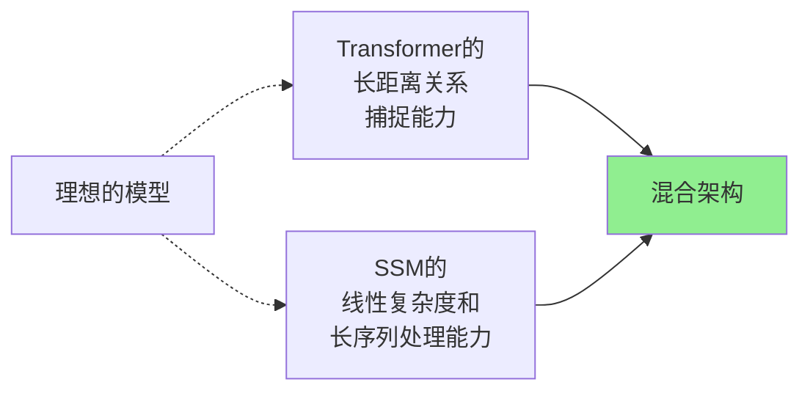
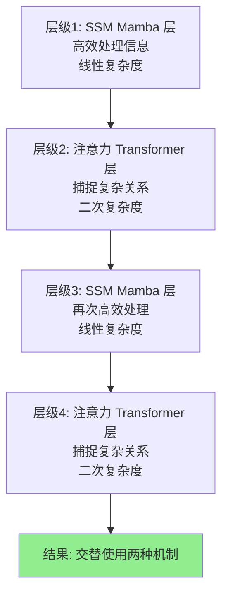
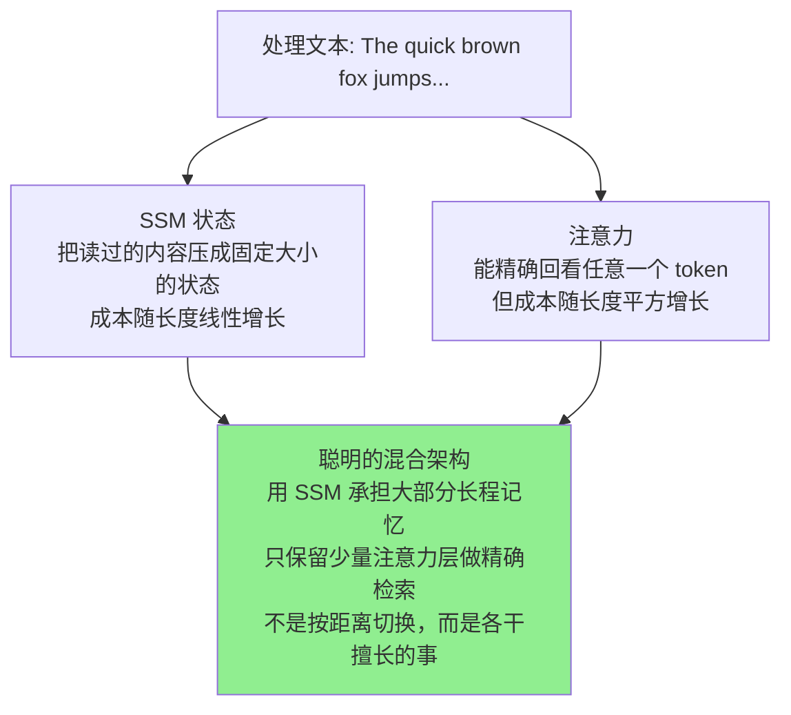

## 8.3 混合架构的未来：Jamba、Bamba、Titans

> 为什么最好的解决方案不是“选择 Transformer 或 SSM”，而是“同时用两者”

### 8.3.1 问题：为什么不能都要？

既然 Transformer 和 SSM 各有优缺点，为什么不在同一个模型中结合两者的优势？



### 8.3.2 Jamba：AI21 的混合方案

#### 什么是 Jamba？

Jamba 是 AI21 在 2024 年发布的一个模型，它同时融合了 Transformer 和 SSM（Mamba）。



#### Jamba 的优势

```text
混合的好处：

1. 兼顾两个世界
   SSM层处理高效的"流处理"
   注意力层处理复杂的关系

2. 长上下文支持
   AI21 官方资料给 Jamba 系列标注了 256K token 窗口
   这适合长文档和 RAG 场景，但不是所有任务都会自动受益

3. 仍然很快
   在长序列场景中有潜在效率优势
   实际速度取决于实现、硬件、batch、上下文长度和服务配置

4. 成本更低
   处理长文本时可能更有性价比
   但价格会随厂商、日期、缓存和部署方式变化

成本判断应看：
├─ 当前官方价格页
├─ 输入/输出 token 拆分
├─ 是否命中缓存
├─ 是否需要私有部署
└─ 长上下文是否真的减少了检索、摘要和人工返工
```

#### Jamba 的实际性能

```text
在不同任务上的表现要按评测集看，不能用一个固定分数概括：

长文本理解：
Jamba 的 256K 窗口适合长材料任务，但仍要看具体 benchmark 和提示设置

快速推理：
长序列效率可能是优势，短任务未必占优

代码生成：
代码任务通常还受工具、上下文、测试和模型家族特化影响

总体性能：
不要写成 85/100、90/100 这类无来源总分；生产选型应自己跑样本集

关键优势：长上下文 + 成本
```

### 8.3.3 Bamba：IBM 的企业级混合方案

#### IBM 的不同想法

IBM 发布的 Bamba 与 Jamba 同属分层混合，但配比和工程目标不同：

```text
Bamba-9B 的实际结构（见官方 config.json）：
共 32 层，其中只有第 9、18、27 层是注意力层
其余 29 层都是 Mamba-2 层

也就是说：以 SSM 为主干，每隔约 9 层插一层注意力
```

#### Bamba 的特点

```text
Bamba相比Jamba的差异：

Jamba：
├─ 架构：分层混合（一些层是SSM，一些是注意力）
├─ 复杂度：中等
└─ 性能：全能

Bamba：
├─ 架构：同为分层交替，但注意力层占比极低（32 层中仅 3 层）
├─ 复杂度：相对更低
└─ 性能：主打推理吞吐（KV 缓存更小）

适用场景：
Jamba：需要顶尖性能 + 长上下文的通用用途
Bamba：企业级应用，需要稳定性 + 效率的平衡
```

### 8.3.4 Google Titans + MIRAS：学术界的融合

#### Google 的研究方向

Google 的研究团队提出了“Titans”，思路与上面几种都不同。

```text
Titans的核心创新：
1. 注意力负责"短期记忆"——把眼前这段上下文看准
   （论文原话：注意力上下文有限但依赖建模准确，充当短期记忆）
2. 新增的"神经记忆模块"负责长期记忆——记住更早的历史内容
3. 关键在于这个记忆模块会在使用过程中临场学习该记住什么

所以它不是"按距离切换 SSM 和注意力"，
而是给注意力配了一个会自己学习的长期记忆
```

#### MIRAS

Google 还在研究 MIRAS，这是一个更高级的混合概念：

```text
MIRAS的想法：
不是固定地混合Transformer和SSM
而是让模型自己学会什么时候用哪个

伪代码：
def process_token(token, context):
    if token 关系到长距离信息:
        使用 Transformer 的注意力
    else if token 可以用局部信息处理:
        使用 SSM 的高效状态更新
    else:
        两者都用，权衡考虑

这样的模型可以根据具体情况自适应，可能是未来的方向。
```

### 8.3.5 混合架构的实际架构对比

```text
┌─────────────────────────────────────────────┐
│ 混合方案的对比（2024-2025）                 │
├─────────────────────────────────────────────┤
│                                             │
│ Jamba（AI21）                               │
│ ├─ 混合方式：层级混合（层级交替）           │
│ ├─ 上下文窗口：256K                         │
│ ├─ 速度：快                                 │
│ ├─ 成本：低                                 │
│ └─ 适合：需要长上下文的通用任务            │
│                                             │
│ Bamba（IBM）                                │
│ ├─ 混合方式：分层交替（29 Mamba2 + 3 注意力）│
│ ├─ 上下文窗口：基础权重 4K，另有长上下文版本 │
│ ├─ 速度：中等                               │
│ ├─ 成本：中等                               │
│ └─ 适合：企业应用和稳定性要求               │
│                                             │
│ Titans/MIRAS（Google）                      │
│ ├─ 混合方式：动态自适应                     │
│ ├─ 上下文窗口：研究目标是更好扩展长序列     │
│ ├─ 速度：取决于具体实现和硬件               │
│ ├─ 成本：需要实际部署后评估                 │
│ └─ 适合：未来研究方向                       │
│                                             │
│ Llama 4 Scout（Meta, 2025-04）             │
│ ├─ 架构：MoE 混合（109B/16专家/17B激活）  │
│ ├─ 上下文窗口：10M token                   │
│ ├─ 速度：高效                               │
│ ├─ 成本：中等（相比大模型）                 │
│ └─ 适合：超长上下文任务，边缘部署           │
│                                             │
│ Llama 4 Maverick（Meta, 2025-04）          │
│ ├─ 架构：MoE 混合（400B/128专家/17B激活） │
│ ├─ 上下文窗口：1M token                    │
│ ├─ 速度：高效（MoE 稀疏激活）              │
│ ├─ 成本：中高（参数量大但激活参数少）       │
│ └─ 适合：高质量生成，开源模型标杆           │
│                                             │
└─────────────────────────────────────────────┘
```

### 8.3.6 混合架构为什么是未来？

#### 问题 1：你不需要同一个机制处理所有问题



#### 问题 2：为什么不是所有情况都用 Transformer？

成本和规模的现实：

```text
GPU内存限制（单张A100 GPU）：

纯Transformer处理不同长度：
4K token：可以
16K token：勉强
32K token：需要优化
64K token：基本不行
128K token：根本不行

混合架构处理不同长度：
4K token：可以（且比Transformer快）
16K token：可以（且快得多）
64K token：可以（Transformer无法处理）
256K token：可以（Transformer无法做到）
```

### 8.3.7 长上下文能力的实际意义

有了长上下文能力后，什么应用变成了可能？

```text
新的应用场景：

1. 完整代码库分析
   之前：无法同时理解整个项目
   现在：可以用256K窗口装下整个中型项目
   影响：更好的代码补全 + 自动重构

2. 完整的书籍理解
   之前：只能处理几个章节
   现在：可以处理整本书（假设在256K之内）
   影响：真正的"通读"能力

3. 法律文件库搜索
   之前：无法同时看多个长文档
   现在：可以同时处理多个长合同
   影响：更好的法律文件分析

4. 对话记忆
   之前：长对话中记忆逐渐丢失
   现在：可以记得整个对话历史（数小时）
   影响：更连贯的长期助手体验
```

### 8.3.8 本节小结

混合架构代表了 AI 模型设计的新方向：
- **不是** 选择 Transformer 或 SSM，而是两者兼取
- **利用** 不同机制的优势处理不同情况
- **成本和性能** 都能得到优化

主要参与者：
- **Jamba**：最早的商用混合方案，成熟且平衡
- **Bamba**：企业级选项，强调稳定性
- **Titans/MIRAS**：未来方向，动态自适应

这表明 AI 模型设计的未来不再是“一种机制统治全部”，而是“聪慧的多元方案”。

### 8.3.9 与其他章节的联系

📖 **延伸阅读**：
- 想了解 Transformer 的基本限制？请参阅《第 8.1 Transformer 的二次复杂度问题》
- 想了解 SSM 的工作原理？请参阅《第 8.2 状态空间模型基础》
- 想了解长上下文能力的实际意义？请参阅《第 8.4 长上下文时代》

### 8.3.10 思考题

1. 如果你正在设计一个混合架构，你会在什么深度进行混合（层级、块级、还是单个注意力头）？

2. 混合架构的缺点是什么？它是否变得太复杂了？

3. 五年后，会有全新的架构出现来替代 Transformer 和 SSM 的混合吗？会是什么？
