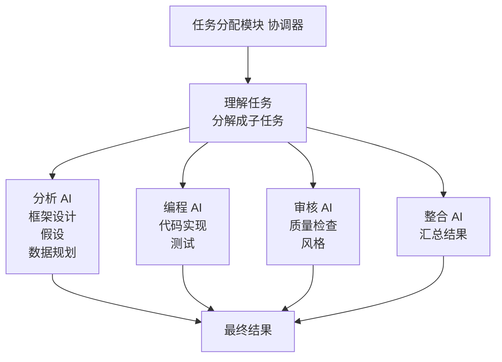
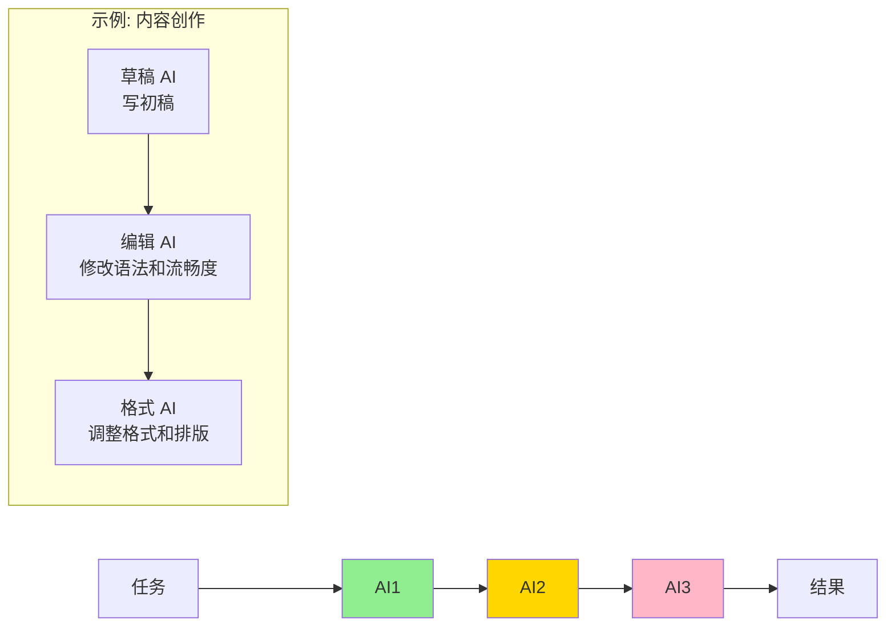
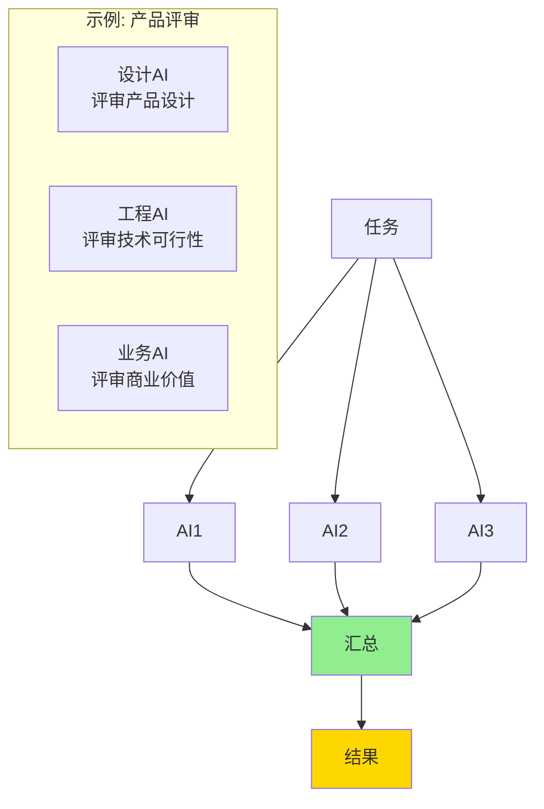
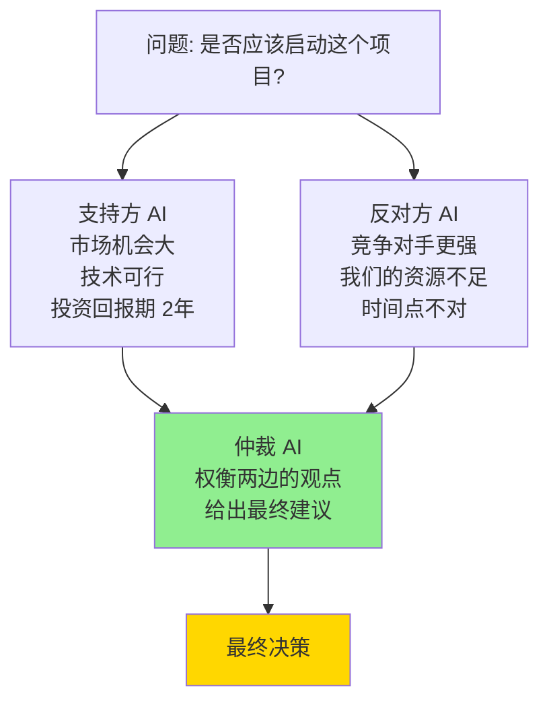
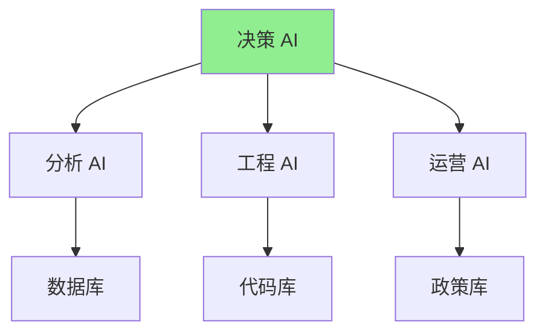

## 14.4 多智能体协作系统：从独奏到交响乐

> 一个乐手再厉害，也不如一个管弦乐团

### 14.4.1 单个 AI 的局限

单个强大的 AI 看起来什么都能做，但在复杂任务上仍有明显局限；多智能体也不是天然更好，只有分工、评审和交接设计清楚时才有优势：

```text
问题类型          单个 AI    多智能体
───────────────────────────────────
简单问题          ✓✓✓       ✓✓✓
需要专业判断      ✓✓        ✓✓✓
复杂多步骤工作    ✓         ✓✓✓
需要反复修改      ✓         ✓✓✓
需要多个视角      ✗         ✓✓✓
质量要求极高      ✗         ✓✓✓
```

具体的限制：

1. **没有人质疑它**
   - 单个 AI 的所有决定都是最终的
   - 没有“代码审查”的过程
   - 错误决策也会被执行

2. **没有分工的精专**
   - 要求一个 AI 既懂写作又懂代码又懂设计
   - 结果：什么都会，什么都不精
   - 多智能体：每个 AI 可以做自己最擅长的

3. **没有深度验证**
   - 用户信任 AI 的输出
   - 但用户可能自己也不懂这个领域
   - 结果：错误信息被当作事实

4. **单次模型调用的推理能力有上限**
   - 超过一定复杂度，单个 AI 就开始犯错
   - 多个角色协作有机会通过分工和复核降低错误，但也会带来沟通成本

### 14.4.2 多智能体如何解决这些问题



### 14.4.3 多智能体的协作模式与案例

#### 14.4.3.1 例子 1：代码项目的设计和实现

**单体 AI 模式：**
```text
用户："帮我用 Python 实现一个 Web 爬虫"

单个 AI：
1. 思考：怎么实现？
2. 编码：写出500行代码
3. 完成！

问题：
- 架构设计没有人评审
- 没有考虑安全隐患（IP被封禁、过度爬取）
- 没有考虑性能（如何并发？）
- 没有写测试代码
- 代码风格可能不一致

用户需要：自己检查、测试、修改
```

**多智能体模式：**
```text
用户："帮我用 Python 实现一个 Web 爬虫"

架构师 AI：
- 设计爬虫系统的整体架构
- 建议：使用队列 + 线程池
- 建议：添加速率限制和 User-Agent 轮转

编程 AI：
- 实现架构师设计的代码
- 编写各个模块

测试 AI：
- 编写单元测试
- 测试边界情况（什么如果网站不可达？）
- 性能测试

安全 AI：
- 检查是否有安全漏洞
- 验证是否会被服务器封禁
- 检查是否遵守 robots.txt

最终：一个生产级的、经过多重检查的爬虫实现
```

#### 14.4.3.2 例子 2：市场分析报告

**单体 AI：**
```text
时间：1 分钟
步骤：
1. 用户给出需求
2. AI 写出分析
3. 完成！

问题：
- 没有验证数据来源
- 可能有遗漏的重要因素
- 可能有偏见的解释
- 建议的可行性没有评估
- 质量：取决于模型能力、提示词和人工复核
```

**多智能体：**
```text
时间：3 分钟
步骤：
1. 用户给出需求
2. 框架 AI：设计分析框架（SWOT、Porter 五力等）
3. 研究 AI：收集市场数据和竞争对手信息
4. 分析 AI：进行深度分析（基于框架和数据）
5. 批评 AI：质疑分析的假设和逻辑
6. 可行性 AI：评估建议的实际可执行性
7. 整合 AI：汇总意见，生成最终报告

多个 AI 讨论，得出共识
质量：更容易覆盖不同视角，但仍需要人工核验来源和结论
```

### 14.4.4 多智能体的协作模式

#### 14.4.4.1 模式 1：串行流程



#### 14.4.4.2 模式 2：并行执行



#### 14.4.4.3 模式 3：辩论式协作



#### 14.4.4.4 模式 4：分层决策



### 14.4.5 Agent-to-Agent 协议

#### 14.4.5.1 什么是 A2A？

A2A（Agent-to-Agent）是 Google 于 2025 年 4 月发布的一个标准化协议，让不同的 AI 智能体能互相通信和协作。

类比：
```text
人类团队：都说同一种语言（英文、中文等）
所以能有效沟通

AI 团队（没有 A2A）：每个 AI 用不同的"语言"
- Claude：想用一种格式
- GPT-4：想用另一种格式
- 开源模型：又是第三种
结果：很难协作

AI 团队（有 A2A）：统一的通信协议
所有 AI 都用同样的格式交流
结果：无缝协作
```

#### 14.4.5.2 A2A 的核心内容

```text
以下是便于入门理解的“概念化”协作消息，并非 A2A 规范的真实字段。真实 A2A 会围绕 Agent Card 发现、Message、Part、Task，以及 JSON-RPC `message/send` 等方法组织通信。

1. 消息格式
   {
     "from": "分析 AI",
     "to": "批评 AI",
     "message_type": "request_review",
     "content": "我完成了初步分析...",
     "context": {...},
     "priority": "high"
   }

2. 职责声明
   {
     "agent_name": "编程 AI",
     "capabilities": ["代码实现", "测试编写", "性能优化"],
     "constraints": ["不做安全审查"],
     "required_inputs": ["设计文档"]
   }

3. 结果反馈
   {
     "agent": "批评 AI",
     "review_of": "分析",
     "verdict": "accepted_with_changes",
     "issues": [...],
     "suggestions": [...]
   }
```

#### 14.4.5.3 A2A 的实际好处

```text
使用 A2A 的系统：
- 可以轻松替换某个 AI（用更好的 AI 替换）
- 可以轻松添加新的 AI 角色
- 可以让来自不同供应商的 AI 协作
- 可以复用已有的 AI（不用重新训练）

示例：升级一个 AI
之前：需要重新设计整个系统
现在：只需更换那一个 AI，其他 AI 不受影响
```

### 14.4.6 实际应用场景

#### 14.4.6.1 场景 1：企业内部咨询

```text
用户：CEO，需要制定明年的战略

多智能体系统：

市场分析 AI：
- 分析外部市场趋势
- 识别机会和威胁
- 输出：市场报告

内部评估 AI：
- 评估公司的能力
- 识别强项和弱点
- 输出：公司评估

战略 AI：
- 基于上述报告制定战略
- 设计具体的行动计划
- 输出：战略文档

风险 AI：
- 评估战略的风险
- 提出应对方案
- 输出：风险评估

最终输出：CEO 既有战略建议，也有风险评估
价值：减少单一视角遗漏，但不能替代负责人决策
```

#### 14.4.6.2 场景 2：软件开发团队

```text
一个项目的不同阶段：

需求阶段：需求 AI、用户研究 AI 协作
设计阶段：架构 AI、安全 AI 协作
开发阶段：编程 AI、测试 AI 协作
发布阶段：部署 AI、监控 AI 协作

结果：每个阶段都有专用的 AI 参与
价值：更容易把需求、设计、测试和发布检查拆开验证
成本：会增加 API 调用、上下文传递和调试成本
```

#### 14.4.6.3 场景 3：内容创作

```text
创作一篇深度文章：

研究 AI：搜集资料
框架 AI：设计文章结构
写作 AI：写出初稿
编辑 AI：修改语法、提升可读性
事实核查 AI：验证数据准确性
格式 AI：调整排版和插图位置

最终：一篇经过多角色草拟、编辑和事实核查的文章
价值：降低遗漏和风格不一致的风险
限制：最终是否可发布，仍取决于来源核验和人工编辑
```

### 14.4.7 多智能体系统的设计原则

#### 14.4.7.1 原则 1：角色明确

```text
不好的设计：
- AI1：帮我做任何事情
- AI2：帮我做其他事情

好的设计：
- 分析 AI：只做市场分析和数据研究
- 策略 AI：只做战略规划和建议
- 批评 AI：只做质量审查和批判性思考
```

#### 14.4.7.2 原则 2：输入输出清晰

```text
每个AI应该有：
- 明确的输入格式（期望接收什么）
- 明确的输出格式（会产生什么）
- 明确的职责范围（只做这些）
- 明确的失败模式（如果失败怎么办）

示例：
编程 AI：
- 输入：设计文档（JSON 格式）
- 输出：实现的代码（Python 格式）
- 职责：代码实现和基本测试
- 失败：如果代码有 bug，返回错误信息并重试
```

#### 14.4.7.3 原则 3：逐步组合

```text
不要一下子构建 10 个 AI 协作系统
而是：
1. 先构建 2 个 AI 的系统，验证它有效
2. 加入第 3 个 AI，验证
3. 逐步扩展

这样做的好处：
- 发现问题时容易定位
- 可以测试不同的 AI 组合
- 成本可控
```

### 14.4.8 成本与性能

#### 14.4.8.1 成本分析

```text
场景：企业市场分析

方案 A：不用 AI
- 成本主要来自人工时间
- 优点是责任边界清楚，缺点是资料整理慢

方案 B：单个 AI
- 成本主要来自一次或少数几次模型调用和人工修改
- 优点是启动快，缺点是容易遗漏来源核验和反方观点

方案 C：多智能体系统
- 成本包括多次模型调用、角色编排、上下文传递和人工审核
- 优点是能显式加入研究、批评、可行性评估和事实核查
- 是否更划算，要用返工率、错误率、耗时和人工验收结果衡量
```

#### 14.4.8.2 什么时候用多智能体？

```text
✓ 值得考虑：
- 对质量要求高
- 任务复杂（需要多个步骤）
- 需要验证/质量控制
- 可以承担额外的API成本

✗ 不需要：
- 简单的一次性问题
- 对质量要求不高
- 时间非常紧张（多智能体需要协调时间）
- 预算严格限制
```

### 14.4.9 实现多智能体系统

#### 14.4.9.1 工具选择

```text
开源框架：
- LangChain：最流行，支持多语言
- AutoGen：微软出品，专门针对多智能体
- Crew AI：专门为多智能体设计，较新但迅速增长
- OpenAI Agents SDK（前身 Swarm）：基于 GPT 的多智能体编排，2024 年 10 月以实验性 Swarm 发布，2025 年由 Agents SDK 接替为生产可用版
- OpenAI Symphony（2026-04 开源）：将项目管理看板变为持续运行的 Agent 编排系统
- Claude Agent SDK：Anthropic 官方 SDK，支持构建自定义智能体与多智能体工作流

商用平台：
- Anthropic Claude API：支持多轮对话与工具调用，可构建多智能体
- OpenAI Workspace Agents（2026-04）：ChatGPT 中的工作区代理，支持团队协作

自建方案：
- 用 API 直接调用，中间用队列系统（如 Redis）管理
```

#### 14.4.9.2 快速开始（3 步）

```text
第 1 步：定义你的 AI 角色
例如：分析 AI、编程 AI、测试 AI

第 2 步：定义它们之间的通信
- AI1 的输出 → AI2 的输入
- 定义数据格式

第 3 步：实现和测试
- 用 LangChain 或 AutoGen 搭建
- 用简单的例子测试
- 逐步增加复杂度
```

### 14.4.10 更多实际应用案例

#### 14.4.10.1 场景 4：数据分析与报告生成

```text
场景：企业需要快速生成周度数据分析报告

单体 AI 方式（30 分钟）：
1. 用户说："帮我分析本周的销售数据"
2. AI 生成一份报告
3. 用户发现有些数字看起来不对
4. 需要手动验证和修改

多智能体方式（8 分钟）：
1. 数据验证 AI：检查数据质量和异常值
2. 数据处理 AI：计算各项 KPI 和趋势
3. 视觉化 AI：决定用什么图表展示最清楚
4. 洞察 AI：发现隐藏的商业价值
5. 文案 AI：用有说服力的语言呈现
6. 审核 AI：检查逻辑、数字和语法

结果：
- 速度：8 分钟 vs 30 分钟
- 质量：通过多角色检查降低计算、图表和文案遗漏
- 可信度：来自可追踪的数据来源和人工审核，而不是“多个 AI 背书”
```

#### 14.4.10.2 场景 5：产品发布前的完整评审

```text
场景：科技创业公司准备发布新产品

单体 AI 分析（20 分钟）：
1. AI 审视整个产品
2. 给出一份意见
3. 完成

问题：单个视角，可能遗漏风险

多智能体协作（25 分钟）：

产品设计 AI：
- 评审 UI/UX 设计
- 用户体验流程是否流畅
- 是否符合行业最佳实践

技术架构 AI：
- 系统是否可扩展
- 是否有性能隐患
- 数据安全是否充分

市场 AI：
- 是否有市场机会
- 竞争对手在做什么
- 定价策略是否合理

安全风险 AI：
- 数据隐私是否保护充分
- 是否有安全漏洞
- 合规性是否达标

商业可行性 AI：
- 成本投入与收益的关系
- 融资/现金流的影响
- 是否符合商业目标

综合协调 AI：
- 汇总所有意见
- 识别关键风险
- 给出最终建议清单

结果：
- 发现了技术 AI 没有发现的安全漏洞
- 发现了市场 AI 预测的竞争风险
- 有 5 个不同角度的意见，而不是 1 个
- 最终风险清单更完整，是否降低上市风险还要看团队后续修复和验证
```

### 14.4.11 动手试试（动手实践）

#### 14.4.11.1 简单项目：构建你的第一个多智能体系统

#### 项目需求

你想为一个餐厅设计一个“完美的菜单”。单个 AI 可能想到的菜随意，但多智能体可以考虑很多方面。

#### 步骤 1：定义 AI 角色（5 分钟）

```text
列出至少 4 个不同的 AI 角色：
1. 营养学家 AI
   - 职责：确保菜单营养均衡
   - 输出：推荐的菜品营养比例

2. 成本控制 AI
   - 职责：控制食材成本
   - 输出：推荐的可盈利菜品

3. 美食家 AI
   - 职责：确保菜品好吃、创意足
   - 输出：推荐的特色菜

4. 客户需求 AI
   - 职责：理解顾客的需求
   - 输出：推荐的受欢迎的菜

5. （可选）厨房技能 AI
   - 职责：确保菜可以被实际做出来
   - 输出：推荐的容易制作的菜

你可以用一张表格写下每个 AI 的输入和输出。
```

#### 步骤 2：定义通信方式（5 分钟）

```text
选择一种协作模式：
- 并行模式：5 个 AI 同时给出建议
- 串行模式：AI1 → AI2 → AI3...
- 辩论模式：支持者 AI vs 反对者 AI

例如：
我建议用"并行+协调"模式：
1. 所有 AI 并行给出建议
2. 协调 AI 综合意见，生成最终菜单
```

#### 步骤 3：具体实施（10 分钟）

```text
用 ChatGPT/Claude 重新角色扮演每个 AI：

提示词示例：
"你是一个营养学专家 AI。
我要给一个中等收入水平的餐厅设计菜单。
请建议 5 道营养均衡的菜品。
输出格式：
菜品名称 | 蛋白质/脂肪/碳水 | 建议"

然后对其他 4 个 AI 重复相同的过程，只改变角色。
```

#### 步骤 4：融合意见（10 分钟）

```text
用一个协调 AI 的提示词：
"我收集了来自 5 个不同专家 AI 的菜单建议：
[贴上 5 个 AI 的输出]

请根据这些意见，设计一份包含 8 道菜的最终菜单。
必须满足：
1. 营养均衡
2. 成本可控（人均成本 < 50 元）
3. 有创意特色菜
4. 容易制作
5. 顾客喜欢

输出：最终 8 道菜的菜单 + 为什么选这些菜"
```

#### 步骤 5：评估效果（5 分钟）

```text
对比结果：
- 单个 AI 生成的菜单 vs 多智能体生成的菜单
- 哪个更平衡？
- 哪个考虑的因素更多？
- 多智能体费了多少额外时间？

思考题：
在这个例子中，多智能体的收益是什么？
如果这是一个真实的餐厅，这个额外的 5 分钟值得吗？
```

#### 升级挑战（可选）

```text
如果你想更进一步，可以尝试：

1. 使用工具/框架：
   - 用 LangChain 或 AutoGen 实现自动化
   - 让 AI 自动协调，而不是手动

2. 复杂度升级：
   - 添加"菜品库存管理 AI"
   - 添加"季节性食材 AI"
   - 添加"文化饮食偏好 AI"

3. 真实应用：
   - 选择你工作中的一个问题
   - 设计多个 AI 角色
   - 实施这个多智能体系统
   - 对比效果
```

### 14.4.12 驭具工程：让智能体真正可靠

在前面几节中，我们学习了多智能体协作的各种模式。但有一个关键问题：**无论是单智能体还是多智能体，如何让它们在真实业务中稳定可靠地运行？**

这就是 **驭具工程（Harness Engineering）** 要解决的问题。

#### 14.4.12.1 什么是驭具（Harness）？

用一个直观的类比：

```text
大脑（模型）：负责思考和推理
工具箱（框架）：提供代码库和基础组件（如 LangChain）
身体和环境（Harness）：决定大脑如何感知世界、获取权限、储存记忆，并限定行为边界
```

Harness 不是 AI 模型本身，而是包围、承载并驾驭模型的那一套**运行环境和工程保障系统**。

#### 14.4.12.2 为什么需要驭具？

仅靠“写好提示词”，智能体在生产环境中会遇到三大挑战：

```text
挑战一：非确定性灾难
大模型有幻觉，调用 API 时容易出错，甚至陷入死循环

挑战二：环境复杂性
模型自身无法管理企业权限、无法持久化任务状态、没有错误重试机制

挑战三：可靠性要求
生产环境需要可审计、可控制、高稳定性的运行能力
```

#### 14.4.12.3 驭具的四大核心职能

```text
1. 工具与权限编排
   → 管理模型可以调用哪些 API，拦截不合法的调用

2. 上下文动态管理
   → 在正确的时间把正确的信息“喂”给模型，避免信息过载

3. 反馈与纠错闭环
   → 模型犯错时自动捕获错误，转化为提示让模型自我纠正

4. 安全守卫（Guardrails）
   → 定义硬性规则限制模型行为底线（如：绝不外发财务数据）
```

#### 14.4.12.4 核心公式

```text
生产级 AI Agent = 模型（基础能力） + Harness（可靠性保障与执行环境）
```

这就是从“调词”到“调环境”的转变：不把希望完全寄托于模型自身变得完美，而是通过工程化手段，给模型构建一个“无法犯大错”且“犯错后能自我纠正”的强韧环境。

> 💡 **延伸阅读**：关于驭具工程的系统讲解，请参阅《智能体 Harness 工程指南》。

### 14.4.13 关键要点

1. **单个 AI 的限制是真实的**
   - 没有人质疑它
   - 没有深度验证
   - 无法处理超复杂任务

2. **多智能体不等于自动更好**
   - 适合拆解清晰、可并行验证、需要多视角审查的复杂任务
   - 会增加 API、编排、调试和一致性成本
   - 是否值得采用，应通过质量、耗时、返工率和人工验收结果衡量

3. **有标准化的协议（A2A）**
   - 让不同 AI 能协作
   - 类似于人类团队的共同语言

4. **这是未来的方向**
   - 不是“单个超级 AI”
   - 而是“AI 团队”
   - 学会设计 AI 团队的工程师很值钱

### 14.4.14 与其他章节的联系

📖 **延伸阅读**：
- 想理解为什么需要多个专用 AI 而不是一个通用 AI？请参阅《第五章 深度学习揭秘》中 5.4 节“深度学习的局限性”的讨论
- 想了解推理模型如何在多智能体中充当“批评家”角色？请参阅《第七章 推理模型》
- 想学习如何给 AI 注入必要的上下文以便更好地协作？请参阅《第 12.5 节 上下文工程》
- 对多智能体系统的硬件需求好奇？请参阅《第十六章 AI 硬件与量子计算入门》中关于 GPU 集群的部分

### 14.4.15 思考题

1. 你工作中的某个复杂任务，如果用多智能体系统会怎样？会节省多少时间和提升多少质量？

2. 在设计多智能体系统时，最难的部分是什么？（提示：不是技术，而是清楚地定义每个 AI 应该做什么）

3. 如果 A2A 协议标准化，会对 AI 产业产生什么影响？

4. 从你刚才做的“餐厅菜单”实践中，你学到了什么关于多智能体系统的东西？
