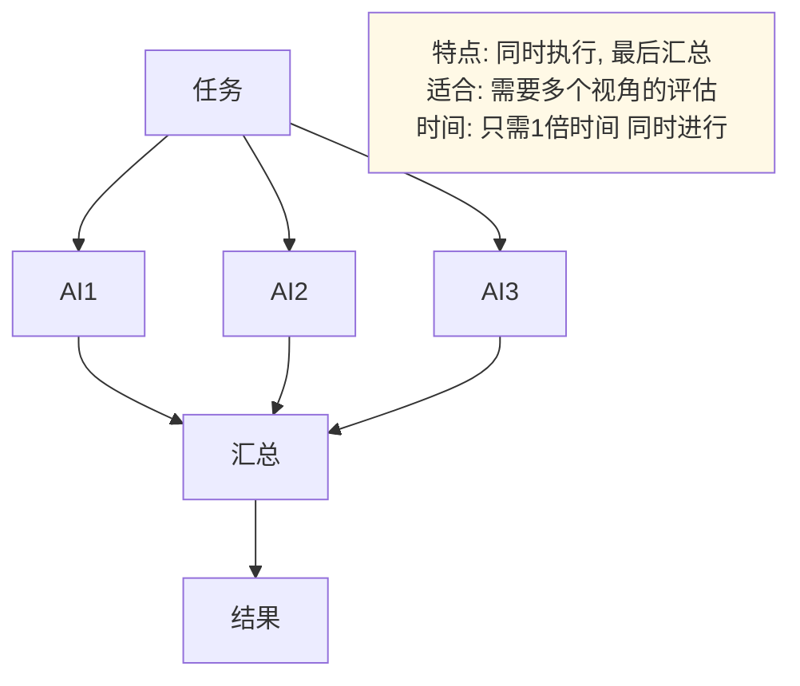
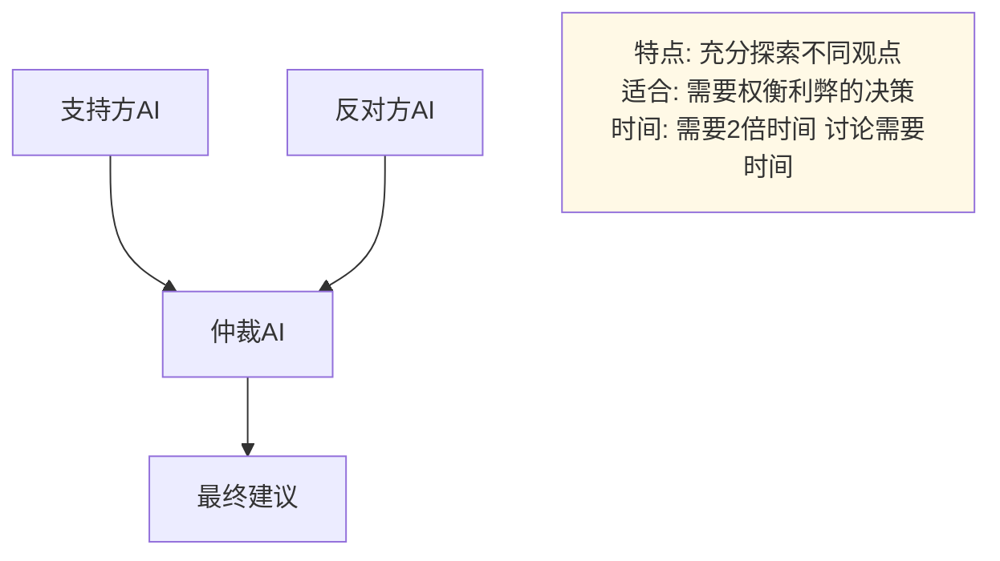
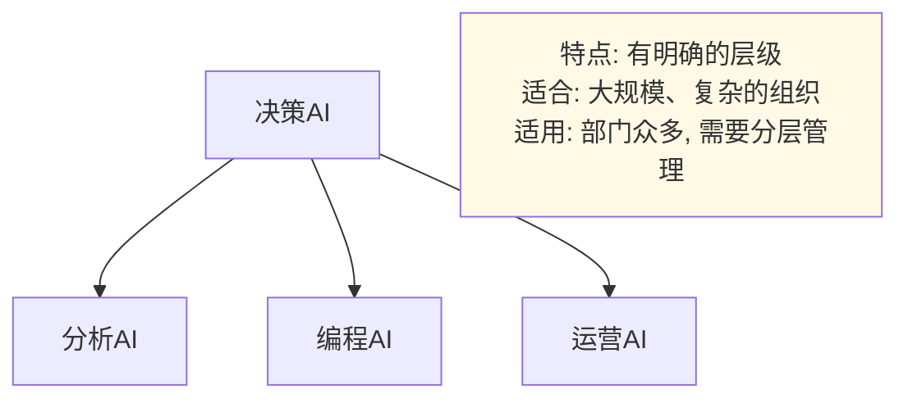

## 本章小结

本章我们解开了 AI 进化的下一个形态——智能体（Agent）。

### 核心要点回顾

1. **从“说”到“做”**：智能体不仅是大脑，还装上了感官（感知）和手脚（工具），能主动改变世界。
2. **ReAct 模式**：智能体像人一样，遵循“思考-行动-观察-再思考”的逻辑闭环。
3. **多智能体协作**：让 AI 扮演不同角色（产品、开发、测试），组成虚拟团队解决复杂问题。
4. **工程化是分水岭**：评测（Evals）、防护（Guardrails）、可观测（Observability）决定智能体能否从 Demo 走向生产。驭具工程（Harness Engineering）通过构建包围模型的运行环境和保障系统，让智能体具备生产级的可靠性。
5. **人人可造智能体**：通过 Coze、Dify 等平台，普通人不需要写代码，通过拖拽流程图就能开发自己的 AI 应用。

### 下章预告

讲完了 AI 有多强，我们必须冷静下来思考一个严肃的问题：**AI 会失控吗？**

- AI 会抢走我的工作吗？
- AI 生成的假视频（Deepfake）会毁灭真相吗？
- 终结者里的天网会成真吗？

下一章，我们将探讨 **AI 的伦理、安全与未来**，帮助你在拥抱技术的同时，保持清醒的头脑。

---

> 📝 **发现错误或有改进建议？** 欢迎提交 [Issue](https://github.com/yeasy/ai_beginner_guide/issues) 或 [PR](https://github.com/yeasy/ai_beginner_guide/pulls)。

---

### 延伸回顾：多智能体协作系统

#### 核心概念回顾

### 什么是多智能体系统？

多智能体系统 = 多个 AI 角色，分工协作完成复杂任务

关键点：
- 不是一个强大的 AI
- 而是多个专用的 AI
- 它们互相检查、互相补充
- 在适合拆解和复核的任务上，可能比单个 AI 更稳

### 什么时候可能比单个 AI 好？

单个 AI 的问题：
- 没人质疑它 → 可能做错而不知道
- 不够专业 → 什么都做，什么都不精
- 能力有上限 → 超过一定复杂度就崩溃

多智能体的优势：
- 互相检查 → 可能减少遗漏，但需要评测验证
- 专业分工 → 每个 AI 都是该领域的专家
- 能力可叠加 → 更适合多步骤、多视角、可拆解的问题

### 具体的效果对比

```text
质量：
- 人工：依赖个人经验和时间投入
- 单个 AI：适合快速起草，但容易缺少复核
- 多智能体：适合需要分工、交叉检查和多视角评估的任务

时间：
- 简单任务：单个 AI 通常更快
- 复杂任务：多智能体可能减少返工，但会增加协调时间

成本：
- 多智能体会增加 API 调用、编排和调试成本
- 是否划算，要用质量、耗时、返工率和人工验收来实测
```

#### 协作的 4 种模式

### 1. 串行流程

```text
任务 → AI1 → AI2 → AI3 → 结果

特点：顺序执行，每个AI处理一个阶段
适合：明确的工作流程（写作、开发、设计）
时间：需要3倍的时间（因为依次执行）
```

### 2. 并行执行



### 3. 辩论式



### 4. 分层决策



#### Agent-to-Agent 协议

### 为什么需要 A2A？

```text
没有A2A：
- Claude想用JSON格式
- GPT-4想用XML格式
- 开源模型想用纯文本
- 结果：互相听不懂

有A2A：
- 统一的通信标准
- 所有AI都用同样的格式
- 结果：无缝协作
```

### A2A 的关键内容

```text
1. 统一的消息格式
{
  "from": "分析AI",
  "to": "批评AI",
  "message_type": "request_review",
  "content": "...",
  "context": {...}
}

2. 明确的角色声明
{
  "agent_name": "编程AI",
  "capabilities": ["代码", "测试"],
  "constraints": ["不做安全审查"]
}

3. 标准的反馈格式
{
  "verdict": "accepted_with_changes",
  "issues": [...],
  "suggestions": [...]
}
```

#### 实际应用场景

### 1. 企业决策分析

- 框架 AI：分析框架（SWOT、Porter 五力）
- 研究 AI：数据搜集和验证
- 分析 AI：深度分析
- 批评 AI：质疑和风险识别
- 结果：更完整的决策依据，但仍需要人类负责人审核

### 2. 软件开发

- 架构 AI：系统设计
- 编程 AI：代码实现
- 测试 AI：质量验证
- 安全 AI：安全审查
- 结果：更完整的实现草案，但仍需要人类 review、自动化测试和安全检查

### 3. 内容创作

- 研究 AI：资料搜集
- 框架 AI：结构设计
- 写作 AI：内容产出
- 编辑 AI：语言优化
- 事实核查 AI：准确性验证
- 结果：更接近可发表稿件，最终仍要人工确认事实、版权和语气

### 4. 客户服务

- 意图 AI：理解用户需求
- 知识 AI：搜索相关知识库
- 建议 AI：提供解决方案
- 验证 AI：确保方案有效
- 结果：更一致的答复流程，但高风险工单仍需要升级给人工

#### 设计原则

### 1. 角色清晰

```text
✓ 好：编程AI只做代码实现和测试
✗ 坏：编程AI什么都做
```

### 2. 接口明确

```text
每个AI应该定义：
- 输入：期望接收什么格式
- 输出：会产生什么格式
- 职责：只做这些工作
- 失败处理：出错时怎么办
```

### 3. 逐步构建

```text
不要一下子5个AI
而是：
1. 2个AI的系统，验证有效
2. 加第3个AI，验证
3. 逐步扩展到5个AI
```

#### 成本分析

### 每任务成本对比

```text
场景：企业分析任务

需要比较的成本：
- 人工时间：需求澄清、资料核验、最终审核
- API 调用：多个角色会消耗更多 token
- 编排成本：任务拆分、上下文传递、失败重试
- 质量成本：错误、遗漏和返工

结论：多智能体不是天然更便宜。只有当分工和复核显著减少返工、遗漏或风险时，才值得引入。
```

### 什么时候值得用多智能体？

```text
✓ 值得考虑：
- 质量要求高
- 任务复杂（多步骤）
- 需要质量控制
- 重复执行多次

✗ 不需要：
- 一次性简单任务
- 质量要求不高
- 非常时间紧张
- 预算非常有限
```

#### 实现技术

### 可用工具

```text
开源：
- LangChain：最成熟，易上手
- AutoGen（微软）：专为多智能体
- Crew AI：新兴，快速发展

商用：
- OpenAI Agents SDK：OpenAI 多智能体官方框架（2025-03 接替实验性 Swarm）
- Claude Agent SDK（Anthropic）：构建与运行 Claude 智能体的官方 SDK

自建：
- 直接调用API + Redis队列
```

### 快速开始（3 步）

```text
第1步：定义角色
→ 分析AI、编程AI、测试AI、安全AI

第2步：定义通信
→ 谁给谁发什么消息

第3步：实现
→ 用工具搭建系统
→ 用例子测试
→ 逐步优化
```

#### vs 其他技术的对比

### 多智能体 vs 微调

```text
微调：改变模型本身
- 成本高（需要GPU、时间）
- 效果：取决于数据质量、任务边界和评测方式
- 时间：几小时到几天

多智能体：改变如何使用模型
- 成本低（只需API）
- 效果：取决于任务是否适合拆解、协作和交叉验证
- 时间：几分钟到几小时

建议：先用最小可行的单智能体流程做基线；只有当任务需要并行、多角色审查或工具分工时，再引入多智能体
```

### 多智能体 vs 单体 LLM

```text
单体LLM：
- 一个模型做所有事
- 简单，便宜
- 但质量有限

多智能体：
- 多个模型分工
- 复杂，成本稍高
- 但在适合拆解和复核的任务中，可能显著降低遗漏
```

#### 关键外卖

1. **多智能体 > 单个超级 AI**
   - 前提是任务适合拆解、交叉检查和合并
   - 成本未必更低，需要实测

2. **有标准化协议（A2A）**
   - 让不同 AI 能协作
   - 相关标准仍在演进，落地时要核对当前规范和实现成熟度

3. **四种主要模式**
   - Pipeline、Parallel、Debate、Hierarchical
   - 选择适合你任务的模式

4. **这是值得掌握的工程方法**
   - 适合高复杂度、高风险、需要复核的任务
   - 先建立单智能体基线，再判断是否需要多智能体

#### 学习资源

### 技术文档

- AutoGen 官方文档：关于多智能体架构
- LangChain Docs：多智能体实现
- OpenAI Agents SDK：官方 agent 框架与实际例子

### 实践项目

- 构建一个简单的 2-AI 系统：1-2 小时
- 扩展到 3-4 个 AI：2-4 小时
- 在实际项目中应用：1-2 周

### 学习路线

```text
1. 理解概念（当前章节）
2. 尝试简单的2-AI系统
3. 学习A2A协议
4. 实现第一个生产系统
5. 优化和扩展
```

#### 思考题

1. **你的工作中，哪个复杂任务如果用多智能体会显著改进？**
   - 提示：想想需要多个步骤或多个视角的任务

2. **设计一个多智能体系统最难的部分是什么？**
   - 提示：不是技术，而是人（如何让 AI 角色清晰、高效协作）

3. **如果 A2A 协议成为行业标准，会发生什么？**
   - 提示：想想 API 生态、AI 市场、企业采购...

#### 下一步

- [ ] 理解多智能体的基本概念
- [ ] 读懂四种协作模式
- [ ] 用 AutoGen 或 LangChain 实现一个简单系统
- [ ] 在自己的项目中尝试

---

> 📝 **发现错误或有改进建议？** 欢迎提交 [Issue](https://github.com/yeasy/ai_beginner_guide/issues) 或 [PR](https://github.com/yeasy/ai_beginner_guide/pulls)。
