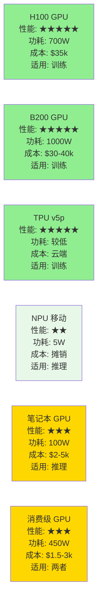

## 16.1 AI 芯片基础：GPU、TPU、NPU

> 如果说算法是 AI 的大脑，那么芯片就是让大脑工作的心脏。

### 16.1.1 一个简单的类比：为什么需要专门的芯片？

想象你要做一个任务：计算 1000 万个数字的平方。

**用通用的 CPU（如笔记本里的）：**
```text
CPU 的做法：一个一个数字计算
第 1 个数字：1 * 1 = 1（花时间 T）
第 2 个数字：2 * 2 = 4（花时间 T）
...
第 1000 万个：10000000 * 10000000 = ...（花时间 T）

总时间：1000 万 × T = 很长很长
```

**用专门的 GPU（显卡）：**
```text
GPU 的做法：同时计算成千上万个数字
第 1-10000 个数字：同时计算（花时间 T）
第 10001-20000 个数字：同时计算（花时间 T）
...

总时间：从 1000 万次串行计算，变成许多批次的并行计算
实际能快多少，取决于核心数量、内存带宽、调度开销和数据搬运成本

为什么？GPU 有成千上万的"小计算单元"（核心）
每个单元做同样的事，但处理不同的数据
就像工厂里有 10000 个工人，而不是 1 个人
```

### 16.1.2 三种 AI 芯片：各有所长

#### 16.1.2.1 1. GPU（图形处理器）

**来源：** NVIDIA（美国，市场占有率 ~80%）

**主要产品线：**
- 消费级：GeForce RTX 4090（游戏用，也能做 AI）
- 专业级：A100、L40S（数据中心）
- 上一代主流：H100、H200（2024-2025 年的选择）
- 当前在售旗舰：B200 / GB200 与 B300 / GB300（Blackwell 与 Blackwell Ultra；相对 H100，训练性能约 2.5 倍，LLM 推理吞吐可达 15 倍以上）
- 下一代：Vera Rubin（NVIDIA 2026 年 1 月宣布已进入量产，合作伙伴产品 2026 年下半年上市）

**性能（以 H100 SXM 为例）：**
```text
峰值性能：
- FP32（单精度）：67 TFLOPS
- TF32 Tensor Core：989 TFLOPS
- FP16/BF16 Tensor Core：1,979 TFLOPS
（NVIDIA 官方规格表中的 Tensor Core 数值均标注为「开启稀疏加速」口径）

简单理解：
AI 训练和推理主要使用低精度（TF32/FP16/BF16）
Tensor Core 在这些精度下能达到接近 2000 万亿次/秒
这是 CPU 的数百倍

内存：80GB HBM3（超高速内存，带宽约 3.35 TB/s）
功耗：700W
成本：约 $25,000-40,000
```

**优点：**
- 通用性强：可以做任何 AI 任务（训练、推理、科学计算）
- 成熟生态：所有 AI 框架都优化得很好
- 性能强劲：单卡算力足以支撑主流训练与推理（新一代 Blackwell 旗舰更快，见上文）
- 采购渠道成熟：但仍会受供需、预算、地区政策和出口管制影响

**缺点：**
- 昂贵：一块 H100 要 $25,000-40,000，服务器成本是 CPU 的 10 倍
- 功耗高：700W，需要强大的电源和散热
- 面积大：需要大型数据中心
- 不适合手机：太大太耗电

**应用场景：**
- 训练超大模型（GPT、Claude）
- 云端 AI 推理服务
- 科学计算、气候模型等

#### 16.1.2.2 2. TPU（张量处理器）

**来源：** Google（谷歌自主设计）

**主要产品线：**
- TPU v2（2017）- 已淘汰
- TPU v3（2018）- 仍在用
- TPU v4（2021）- 主流
- TPU v5e（2023）- 效率版 / TPU v5p（2023）- 性能版
- TPU v6 Trillium（2024）- 峰值算力比 v5e 提升 4.7 倍，大模型训练性能最高提升约 4 倍
- TPU v7 Ironwood（2025）- 第七代推理优化 TPU，相比 v6 单芯片性能提升 4 倍，HBM 容量 192GB（v6 的 6 倍），单 superpod 可扩展至 9216 芯片
- TPU 8t / TPU 8i（2026，coming soon）- 第八代 TPU，分别面向大规模训练和低延迟推理，具体可用区、定价和 GA 时间以 Google Cloud 发布页为准

**性能（以 TPU v5p 为例）：**
```text
峰值性能：
- BF16：459 TFLOPS（万亿次浮点运算/秒）
- 相比 TPU v4，FLOPS 提升超过 2 倍

内存：95GB HBM（高带宽内存，是 v4 的 3 倍）

功耗：比同级别 GPU 更省电

成本：不单独销售芯片，仅通过 Google Cloud 按需租用
云端使用成本：按需计费（如 TPU v5p 约 $4.20/芯片·小时），具体费率参见 Google Cloud 官网
```

**优点：**
- 专为 AI 优化：从芯片设计到软件栈都是为 AI 定制
- 更省电：同等性能下功耗通常低于 GPU
- 成本效率高：Google 云端使用成本更低
- 能耗比优秀：每瓦性能表现突出

**缺点：**
- 只能通过 Google Cloud 使用：不能自己买
- 生态较小：官方主推 JAX，PyTorch 与 TensorFlow 也有官方指南，但第三方库和算子覆盖不如 CUDA
- 创业公司难以使用：需要 Google 数据中心的支持
- 不适合实验：因为不是自己的硬件

**应用场景：**
- Google 自身 AI 模型训练
- Google Cloud 上的 AI 服务
- 大规模推理（YouTube 推荐等）

#### 16.1.2.3 3. NPU（神经处理器）

**来源：** Apple、高通、华为等（各家独立设计）

**主要产品线：**
- Apple Neural Engine（在 iPhone 17（A19）、M5 芯片内）
- 高通 Hexagon（骁龙芯片内）
- 华为 NPU（麒麟芯片内）
- 中国的昆仑芯等

**性能（以 Apple Neural Engine 为例）：**
```text
峰值性能：
- 不同代际公开指标不同；Apple M5 官方强调更快的 16 核 Neural Engine 和 GPU 神经加速器，
  但未在发布稿中给出统一 TOPS 数字

内存：共享系统内存（不单独计）

功耗：仅几瓦（相比 GPU 的 700W）

成本：已经集成在芯片里（iPhone 每部多花 ~$5）
```

**优点：**
- 超省电：几瓦到几十瓦，适合手机和笔记本
- 集成度高：和 CPU、GPU 集成在一块芯片
- 隐私保护：推理在本地进行，数据不上云
- 成本低：已经摊入设备成本
- 响应快：毫秒级延迟，不需要网络

**缺点：**
- 性能有限：远不如 GPU/TPU
- 不能训练：只能做推理（用预训练模型）
- 生态碎片化：每家都不一样，适配困难
- 功能不足：无法处理超大模型

**应用场景：**
- 手机上的 AI 功能（拍照识别、语音助手）
- 笔记本本地 AI 工具
- 边缘 AI 推理（在本地运行小模型）
- 隐私敏感的应用

### 16.1.3 硬件性能对比



#### 16.1.3.1 2026 年的芯片战争

##### 美国队伍

- NVIDIA：H100、B200/GB200 Blackwell、B300/GB300 Blackwell Ultra、Vera Rubin（2026 下半年上市）
- Google：TPU v6 Trillium / v7 Ironwood / TPU 8t、8i
- AMD：MI300（GPU 竞争者）

##### 中国队伍

- 华为：昇腾 Ascend 系列（如 910B/910C 及后续路线）
- 百度：昆仑芯
- 阿里：含光芯
- 腾讯：自研 AI 芯片
- 小米等：自研 NPU（手机端推理）

##### 挑战

```text
为什么中国芯片难以与 NVIDIA 竞争？

1. 工艺制程：
   - NVIDIA H100：4nm（TSMC 4N）工艺；B200 起为 4NP
   - 中国：先进制程仍受出口管制约束，性能差距正在缩小（如华为 Ascend 910C 已规模部署）
   - 芯片制造涉及复杂的国际管制

2. 生态成熟度：
   - NVIDIA：15 年积累，优化完美
   - 中国：AI 加速器已有多年积累，但 CUDA 级别的软件生态、算子优化、开发者习惯和迁移工具仍在追赶

3. 性能对标：
   - 理论性能可能接近
   - 实际效率还有差距

4. 但突破在加速：
   - 2025-2026 年会看到更多中国芯片的实际应用
   - 性能差距在逐步缩小
```

### 16.1.4 AI 推理的硬件选择

#### 16.1.4.1 场景 1：大规模云端推理（如 ChatGPT）

**最佳选择：** GPU 集群（H100/B200）或 TPU 集群

```text
为什么？
- 吞吐量要求高：每秒要处理数百万个请求
- 灵活性要求高：模型可能经常更新
- 成本次要：用户为服务付费
```

#### 16.1.4.2 场景 2：本地推理（笔记本/手机）

**最佳选择：** NPU 或消费级 GPU

```text
为什么？
- 功耗很重要：要维持续航时间
- 成本很重要：不能加硬件成本
- 隐私很重要：数据不能上云
```

#### 16.1.4.3 场景 3：企业内部推理（如 100 员工的公司）

**最佳选择：** 消费级 GPU 或小型 GPU 服务器

```text
为什么？
- 吞吐量需求中等
- 成本是重要因素（H100 太贵）
- RTX 4090（$1600）可能足够
- 或者用 Google Cloud 的 TPU（按使用付费）
```

### 16.1.5 生活中的类比

```text
如果把数据处理比作做菜：

CPU 就像：一个厨师，专业但只有一个人
→ 做得好但太慢

GPU 就像：有 1000 个厨师的食堂
→ 快但占地大，成本高

NPU 就像：小型厨房的多功能料理机
→ 特定菜做得快，但功能有限

TPU 就像：Google 设计的专业厨房
→ 最优化但只有一个地方有

选哪个？取决于你的需求：
- 要做全世界人的菜？→ GPU
- 只是自己吃？→ NPU
- 能用 Google 的厨房？→ TPU
```

### 16.1.6 关键要点

1. **GPU 是当前的统治者**
   - NVIDIA H100/B200 是最强硬件
   - 但成本极高，功耗极高
   - 适合大规模训练和云端推理

2. **TPU 是效率之王**
   - 如果能用 Google 云端，TPU 是最优选择
   - 省电、性能强，仅通过 Google Cloud 提供

3. **NPU 是隐私和省电之王**
   - 手机、笔记本上已经有
   - 推理能力有限，但足够日常使用

4. **芯片选择很关键**
   - 错的芯片会让 AI 应用变得不可行或太贵
   - 工程师理解硬件约束很重要

5. **中国正在追赶**
   - 性能差距在缩小
   - 2-3 年内可能出现“差不多好用”的国产芯片
   - 但完全超越还需要 5 年以上

### 16.1.7 思考题

1. 如果你要训练一个 AI 模型，H100 ($35k) 和 Google Cloud TPU（$8/小时）怎么选？（提示：取决于你要训练多久）

2. 为什么 NVIDIA 的 GPU 在 AI 时代这么值钱？如果我是中国政府，我会做什么来改变这个局面？

3. 未来 5 年，你认为哪种芯片（GPU/TPU/NPU）会获胜？为什么？
