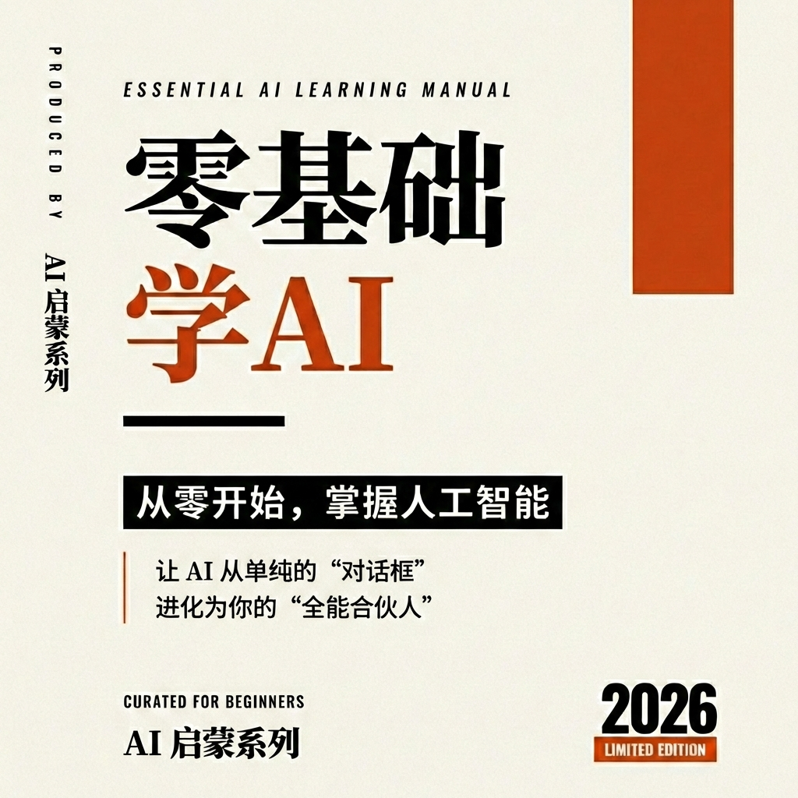

# 普通人看的AI入门

> 从零开始，掌握人工智能的核心知识与实践技能



---

## 关于本书

人工智能（AI）正在深刻地改变我们的生活和工作方式。从智能手机上的语音助手，到能够与人流畅对话的聊天机器人，再到自动驾驶汽车和医疗诊断系统——AI 技术已经渗透到各行各业。

然而，对于许多人来说，AI 仍然是一个神秘而遥远的概念。什么是机器学习？深度学习和机器学习有什么区别？ChatGPT、Claude、Gemini 这些工具背后的技术原理是什么？如何才能有效地使用这些 AI 工具来提升工作效率？

本书正是为解答这些问题而写。作为一本面向完全零基础读者的入门指南，本书将带领你从 AI 的基本概念开始，逐步深入到核心技术原理，最终掌握实际应用技能。无论你是好奇 AI 世界的普通用户，还是希望将 AI 技术应用于工作的职场人士，这本书都能为你提供清晰、实用的学习路径。

## 目标读者

本书适合以下读者：

- **AI 初学者**：对人工智能充满好奇，但缺乏技术背景的普通读者
- **职场人士**：希望了解 AI 如何提升工作效率，寻找实际应用场景的专业人员
- **学生**：正在学习相关专业或对 AI 领域感兴趣的在校学生
- **创业者**：希望了解 AI 技术趋势和商业机会的创业者和管理人员
- **跨界学习者**：来自其他专业领域，希望快速掌握 AI 基础知识的人士

## 你将学到什么

通过阅读本书，你将能够：

### 理解核心概念
- 掌握人工智能、机器学习、深度学习之间的关系与区别
- 理解神经网络、大语言模型等核心技术的工作原理
- 了解 AI 发展的历史脉络和未来趋势

### 掌握实践技能
- 熟练使用 ChatGPT、Claude、Gemini 等主流 AI 工具
- 学会编写高质量的提示词（Prompt），最大化 AI 输出效果
- 了解如何将 AI 应用于写作、编程、数据分析等实际场景

### 理解技术前沿
- 认识多模态 AI、智能体（Agent）等前沿技术方向
- 了解 AI 安全、伦理和监管的最新发展
- 洞察 AI 技术的发展趋势和潜在影响

### 培养批判思维
- 学会辨别 AI 生成内容的质量与可靠性
- 理解 AI 的能力边界和局限性
- 建立负责任使用 AI 的意识和习惯

## 本书特色

- **由浅入深**：从最基础的概念讲起，逐步深入到专业知识，确保零基础读者也能轻松理解
- **理论与实践结合**：不仅解释"是什么"和"为什么"，更注重"怎么做"的实操指导
- **案例丰富**：通过大量真实案例和应用场景，帮助读者建立直观认知
- **紧跟前沿**：内容基于 2025-2026 年最新的技术发展和行业动态
- **结构清晰**：章节设计合理，便于读者按需选择性阅读或系统学习

## 如何阅读本书

本书共分为四个部分：

1. **第一部分：AI 基础入门**（第一至三章）
   - 介绍 AI 的基本概念、发展历史和应用场景，为后续学习打下基础

2. **第二部分：核心技术解析**（第四至七章）
   - 深入解析机器学习、深度学习和大语言模型的技术原理

3. **第三部分：实战应用技巧**（第八至十一章）
   - 详细讲解主流 AI 工具的使用方法、提示词工程技术以及实战场景

4. **第四部分：进阶与展望**（第十二至十四章）
   - 探讨智能体（Agent）开发、AI 安全伦理以及未来学习路径

建议初学者按顺序阅读，有一定基础的读者可直接跳到感兴趣的章节。每章末尾设有"本章小结"，帮助巩固所学内容。

## 在线阅读

本书支持在线阅读，请访问：https://yeasy.gitbook.io/ai_beginner_guide/

## 本地开发与预览

本书支持使用 HonKit 进行本地开发和预览。

1. **安装依赖**
   ```bash
   npm install
   ```

2. **启动本地服务器**
   ```bash
   npm run serve
   ```
   启动后，访问 `http://localhost:4000` 即可阅读本书。

---

*让我们一起开启 AI 学习之旅，探索这个令人兴奋的技术新世界！*
