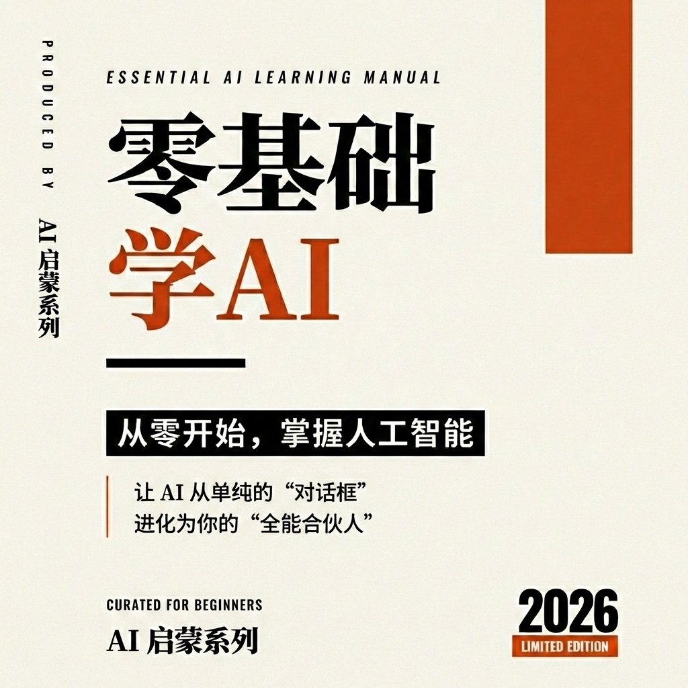
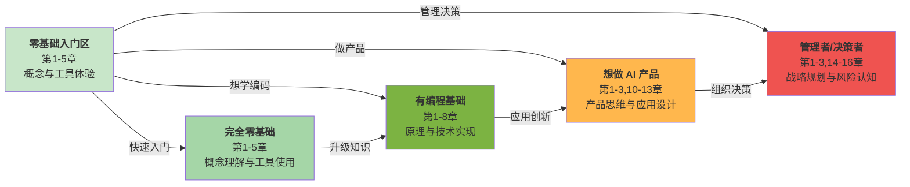

<div align="center">

# 零基础学 AI

[](https://creativecommons.org/licenses/by-nc-sa/4.0/)
[](https://github.com/yeasy/ai_beginner_guide)
[](https://github.com/yeasy/ai_beginner_guide/releases)
[](https://yeasy.gitbook.io/ai_beginner_guide)
[](https://github.com/yeasy/ai_beginner_guide/releases/latest)

> 普通人看的 AI 入门。从零开始，掌握人工智能的核心知识与实践技能



</div>

---

## 关于本书

人工智能（AI）正在深刻地改变我们的生活和工作方式。从智能手机上的语音助手，到能够与人流畅对话的聊天机器人，再到自动驾驶汽车和医疗诊断系统——AI 技术已经渗透到各行各业。

然而，对于许多人来说，AI 仍然是一个神秘而遥远的概念。*什么是机器学习？深度学习和机器学习有什么区别？ChatGPT、Claude、Gemini 这些工具背后的技术原理是什么？如何才能有效地使用这些 AI 工具来提升工作效率？*

这本书试图用最朴素的语言回答这些问题。它面向完全零基础的读者，从 AI 的基本概念出发，逐步走向核心技术原理，最后落到实际应用技能。无论你是好奇 AI 世界的普通用户，还是希望将 AI 技术应用于工作的职场人士，都能在这里找到一条清晰的学习路径。

## 目标读者

本书适合以下读者：

- **AI 初学者**：对人工智能充满好奇，但缺乏技术背景的普通读者
- **职场人士**：希望了解 AI 如何提升工作效率，寻找实际应用场景的专业人员
- **学生**：正在学习相关专业或对 AI 领域感兴趣的在校学生
- **创业者**：希望了解 AI 技术趋势和商业机会的创业者和管理人员
- **跨界学习者**：来自其他专业领域，希望快速掌握 AI 基础知识的人士

## 你将学到什么

通过阅读本书，你将能够：

### 理解核心概念

- 掌握人工智能、机器学习、深度学习之间的关系与区别
- 理解神经网络、大语言模型等核心技术的工作原理
- 了解 AI 发展的历史脉络和未来趋势

### 掌握实践技能

- 熟练使用 ChatGPT、Claude、Gemini 等主流 AI 工具
- 学会编写高质量的提示词（Prompt），最大化 AI 输出效果
- 了解如何将 AI 应用于写作、编程、数据分析等实际场景

### 理解技术前沿

- 认识多模态 AI、智能体（Agent）等前沿技术方向
- 了解 AI 安全与伦理的最新发展
- 洞察 AI 技术的发展趋势和潜在影响

### 培养批判思维

- 学会辨别 AI 生成内容的质量与可靠性
- 理解 AI 的能力边界和局限性
- 建立负责任使用 AI 的意识和习惯

## 本书特色

- **由浅入深**：从最基础的概念讲起，逐步深入到专业知识，确保零基础读者也能轻松理解
- **理论与实践结合**：不仅解释“是什么”和“为什么”，更注重“怎么做”的实操指导
- **案例丰富**：通过大量真实案例和应用场景，帮助读者建立直观认知
- **紧跟前沿**：内容基于近年的技术发展和行业动态（工具与产品更新很快，建议以官方信息为准）
- **结构清晰**：章节设计合理，便于读者按需选择性阅读或系统学习

## 如何阅读本书

为满足不同背景读者的需求，本书采用**双轨制学习路线**。两轨不是身份标签，而是有明确入口、产出和验收标准的学习契约。

### A 轨：基础使用者

**前置条件**

- 无需编程或高等数学基础
- 可使用浏览器和任一对话式 AI 工具
- 准备一个不含敏感信息的真实任务

**可交付物**

- 一份三轮提示词迭代记录
- 一份事实核验清单
- 一张个人场景工作流卡

**验收标准**

- 能用自己的话区分 AI、机器学习与深度学习
- 能比较三轮输出并说明改动理由
- 能为关键事实给出来源，并标出不确定项
- 能识别隐私、幻觉与自动化越权风险

### B 轨：工程师增强

**前置条件**

- 达到 A 轨验收标准或具备同等基础
- Python 3.11+
- 会在命令行运行 Python 文件
- 一台可进行 CPU 计算的电脑

**可交付物**

- 五份实验结果字典与自评记录
- 一份失败案例与排障记录
- 一份最小 AI 工作流设计

**验收标准**

- 能复现实验的固定输入与预期范围
- 能解释每项评估为何通过或失败
- 能在不使用在线 API 和密钥的情况下完成五个实验
- 能把评估结果映射回对应章节的核心概念

完整路线和实验映射见[附录 D](appendices/appendix_d_learning_path.md)，运行方法见 [labs/ 目录](labs/README.md)。

本书主体内容共分为四个部分：

1. **第一部分：AI 基础入门**（第一至三章）
   - 介绍 AI 的基本概念、发展历史和应用场景，为后续学习打下基础

2. **第二部分：核心技术解析**（第四至九章）
   - 深入解析机器学习、深度学习、大语言模型、推理模型、新架构与多模态技术

3. **第三部分：实战应用技巧**（第十至十三章）
   - 详细讲解主流 AI 工具的使用方法、提示词与上下文工程技术以及实战场景

4. **第四部分：进阶与展望**（第十四至十六章）
   - 探讨智能体与多智能体系统、AI 安全伦理与未来展望，以及 AI 硬件与量子计算入门

建议初学者按顺序阅读，有一定基础的读者可直接跳到感兴趣的章节。每章末尾设有“本章小结”，帮助巩固所学内容。

## 十分钟快速上手

10 分钟认识 AI 的核心能力，只需这 3 个步骤：

1. **读懂第一章：什么是 AI**：通过生活化类比理解机器学习、深度学习、大语言模型的基本概念（5 分钟）
2. **动手第十一章：写出你的第一个提示词**：在 ChatGPT 或 Claude 中尝试与 AI 对话，感受提示词的神奇效果（3 分钟）
3. **体验第十章：AI 工具演示**：浏览各类 AI 工具实际应用，从写作、编程到数据分析，看看 AI 如何改变工作（2 分钟）

完成这 3 步，你将从理论和实践两个维度认识到 AI 的价值！

## 学习路线图


```mermaid
graph LR
    A["<b>零基础入门区</b><br/>第1-5章<br/>概念与工具体验"] -->|快速入门| B["<b>完全零基础</b><br/>第1-5章<br/>概念理解与工具使用"]
    A -->|想学编码| C["<b>有编程基础</b><br/>第1-8章<br/>原理与技术实现"]
    A -->|做产品| D["<b>想做 AI 产品</b><br/>第1-3,10-13章<br/>产品思维与应用设计"]
    A -->|管理决策| E["<b>管理者/决策者</b><br/>第1-3,14-16章<br/>战略规划与风险认知"]
    B -->|升级知识| C
    C -->|应用创新| D
    D -->|组织决策| E

    style A fill:#c8e6c9
    style B fill:#a5d6a7
    style C fill:#7cb342
    style D fill:#ffb74d
    style E fill:#ef5350
```

### 学习角色对比

| 角色 | 推荐章节 | 学习重点 | 预期成果 |
|------|---------|---------|---------|
| **完全零基础** | 第 1-5 章 | AI 基本概念、大语言模型原理、常见工具使用 | 理解 AI 是什么，能基础使用 ChatGPT/Claude |
| **有编程基础** | 第 1→6-8 章 | 技术原理、神经网络、编程实现、API 集成 | 能够开发简单的 AI 应用程序 |
| **想做 AI 产品** | 第 1-3→10-13 章 | 产品思维、提示词工程、应用场景、伦理考虑 | 设计并规划 AI 产品方案 |
| **管理者/决策者** | 第 1-3→14-16 章 | AI 战略、商业价值、安全风险、伦理影响 | 做出明智的 AI 投资决策 |
| **文科生** | 第 1-3 章、第 10-13 章、第 15 章 | 核心概念理解、实际应用场景、AI 伦理与影响 | 掌握 AI 在文化、教育、传媒等领域的应用，能有效使用 AI 工具辅助写作、分析与创意工作 |
| **职场人士** | 第 1-2 章、第 10-13 章、第 14-15 章 | 工具使用、提示词工程、实战应用案例、AI 与工作 | 快速掌握常用 AI 工具，提升工作效率，了解 AI 对行业的影响和机遇 |

#### 针对不同背景读者的学习建议

**文科生学习路线（“跳过数学、聚焦应用”）**

文科生无需掌握复杂的数学原理和算法细节。建议学习路径如下：

- **第一步**：读完第 1-3 章，建立 “AI 是什么、大模型如何工作” 的基本认知
  - 关键概念：机器学习、深度学习、大语言模型的直观理解（借助类比而非公式）
  - 跳过内容：第 6-9 章中的数学推导、神经网络细节描述

- **第二步**：重点学习第 10-13 章
  - 第 10 章：探索 ChatGPT、Claude 等工具的实际能力，感受它们在写作、分析中的应用
  - 第 11 章：掌握提示词工程，学会与 AI 对话获得高质量输出（这是文科生最有用的技能）
  - 第 12 章：了解上下文工程，如何给 AI 提供足够背景信息
  - 第 13 章：学习实战案例，特别是写作、教学、文案创意等文科相关场景

- **第三步**：选读第 15 章
  - 理解 AI 的伦理问题、社会影响与未来趋势，培养批判性思维
  - 了解 AI 可能带来的机遇与风险

**职场人士学习路线（“快速上手、聚焦实用”）**

职场人士面临的核心需求是 “如何用好 AI 提升工作效率” 和 “理解 AI 对行业的影响”。建议学习路径如下：

- **第一步**：快速扫读第 1-2 章（1-2 小时）
  - 理解 AI、机器学习、大语言模型的基本概念（无需深入细节）
  - 了解当前 AI 发展现状和技术能力范围

- **第二步**：重点学习第 10-13 章（5-10 小时）
  - 第 10 章：快速了解 ChatGPT、Claude、Gemini 等工具的优势和局限
  - 第 11 章：**最关键部分** —— 学会写出有效的提示词，最大化 AI 输出价值
    - 学习为不同工作场景设计提示词（报告撰写、数据分析、方案策划、代码辅助等）
    - 练习一些实战例子
  - 第 12 章：理解上下文管理，如何组织信息让 AI 更好地理解需求
  - 第 13 章：深入学习行业应用场景
    - 找到与自己工作相关的案例，学习他人如何使用 AI
    - 思考如何在自己的工作中应用类似的方法

- **第三步**：选读第 14-15 章（2-3 小时）
  - 第 14 章：了解智能体（Agent）的概念，认识 AI 发展方向
  - 第 15 章：理解 AI 的偏见与伦理、安全与隐私、就业影响和长期走向，建立负责任使用 AI 的意识
  - 关键问题：AI 会不会替代我的工作？我的行业将如何被 AI 改变？

**学习节奏建议**

- 文科生：可用 20-30 小时系统学习（第 1-3 章：4 小时，第 10-13 章：12-16 小时，第 15 章：4 小时）
- 职场人士：可用 10-15 小时快速上手（第 1-2 章：2 小时，第 10-13 章：8-10 小时，第 14-15 章：2 小时）
  - 如有时间压力，最少也要学习“第 1-2 章 + 第 11 章”，时间约 3-4 小时

## 在线阅读

本书支持在线阅读，请访问：[GitBook](https://yeasy.gitbook.io/ai_beginner_guide/)

## 下载离线版本

本书提供 PDF 版本供离线阅读，可前往 [GitHub Releases](https://github.com/yeasy/ai_beginner_guide/releases/latest) 页面下载最新版本。

如需获取默认分支自动更新的预览版，可直接下载 [ai_beginner_guide.pdf](https://github.com/yeasy/ai_beginner_guide/releases/download/preview-pdf/ai_beginner_guide.pdf)。该文件会随主线更新覆盖，不代表正式发布版本。

## 本地开发与预览

先安装 [mdPress](https://github.com/yeasy/mdpress)：

```bash
brew tap yeasy/tap && brew install mdpress
mdpress serve
```

启动后，访问 [本地阅读地址](http://localhost:9000) 即可阅读本书。

## 参与贡献

欢迎对本书内容提出意见和建议！你可以通过以下方式参与：

- 在 GitHub 上提交 Issue 报告错误或提出建议
- 提交 Pull Request 改进内容
- 分享本书给更多需要的人

## 进阶阅读

读完本书后，你可以根据兴趣方向选择以下进阶读物：

| 书名 | 说明 |
|------|------|
| [《大模型提示词工程指南》](https://yeasy.gitbook.io/prompt_engineering_guide) | 系统掌握与 AI 高效对话的提示词技术 |
| [《大模型上下文工程权威指南》](https://yeasy.gitbook.io/context_engineering_guide) | 从提示词工程进阶到上下文工程 |
| [《Claude 技术指南》](https://yeasy.gitbook.io/claude_guide) | 深入掌握 Claude 的核心能力与最佳实践 |
| [《智能体 AI 权威指南》](https://yeasy.gitbook.io/agentic_ai_guide) | 全面学习智能体架构、多智能体协作与工程实践 |
| [《大模型安全权威指南》](https://yeasy.gitbook.io/ai_security_guide) | 了解大语言模型安全攻防之道 |
| [《OpenClaw 从入门到精通》](https://yeasy.gitbook.io/openclaw_guide) | 开源智能体框架的实践入门 |
| [《大模型原理与架构》](https://yeasy.gitbook.io/llm_internals) | 深入理解大语言模型底层逻辑与架构 |
| [《智能体 Harness 工程指南》](https://yeasy.gitbook.io/harness_engineering_guide) | 深入智能体系统的工程基础设施设计与实现 |

> 💡 **推荐路径**：零基础学 AI → 提示词工程 → 上下文工程 / Claude 技术指南 → 智能体 AI → 大模型安全

---

> **📚 延伸阅读**：学完基础后，推荐按以下路径深入：[《大模型提示词工程指南》](https://yeasy.gitbook.io/prompt_engineering_guide) → [《智能体 AI 权威指南》](https://yeasy.gitbook.io/agentic_ai_guide) → [《OpenClaw 从入门到精通》](https://yeasy.gitbook.io/openclaw_guide)。

## 许可证

本书采用 [CC BY-NC-SA 4.0](https://creativecommons.org/licenses/by-nc-sa/4.0/) 许可证。

---

*让我们一起开启 AI 学习之旅，探索这个令人兴奋的技术新世界！*
